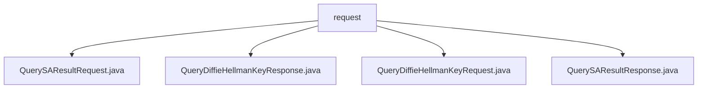

# Basic Information

|      |      |
|------|------|
| Name | request |
| Language | .java |
| Code Path | WeFe/mpc/mpc-common/src/main/java/com/welab/wefe/mpc/sa/request |
| Package Name | docs.mpc.mpc-common.src.main.java.com.welab.wefe.mpc.sa.request |
| Brief Description | The QuerySAResultRequest class is used to query secure aggregation results and includes attributes such as uuid and a list of public keys. The QueryDiffieHellmanKeyResponse class encapsulates the key exchange response, containing fields like uuid and key value. The QueryDiffieHellmanKeyRequest class encapsulates the key exchange request, including parameters such as requestId, p, and g. The QuerySAResultResponse class encapsulates the query result response, with fields like uuid and result. |

# Description

## Overview  
The core responsibility of this module is to implement request/response encapsulation for Secure Aggregation and Diffie-Hellman key exchange, akin to an envelope mechanism in encrypted communication. The interface specification includes four types of data transfer objects: QuerySAResultRequest/Response for handling aggregation results, and QueryDiffieHellmanKeyRequest/Response for managing key exchange.  

Key data structures include: request identifier (uuid), Diffie-Hellman parameters (p/g/public key list), operator, weight, etc. External dependencies are limited to JSON processing libraries (e.g., JSONField annotations). For instance, QueryDiffieHellmanKeyRequest uses JSONObject to store query parameters.  

## Primary Business Scenarios  
The module supports multi-party secure computation scenarios, with a typical workflow as follows: 1) Initiate a key exchange request (QueryDiffieHellmanKeyRequest) 2) Exchange public keys (QueryDiffieHellmanKeyResponse) 3) Submit an aggregation computation (QuerySAResultRequest) 4) Retrieve the result (QuerySAResultResponse).  

The interaction model follows a request-response pattern, such as linking request chains via uuid. Functional completeness is demonstrated through support for aggregation parameters like the ADD operator and weight adjustment. All API types are POJO-encapsulated, e.g., QuerySAResultResponse employs code/message for status feedback.

### Package Internal Structure View

This flowchart illustrates the hierarchical relationships among four Java files under the `request` directory. All files are directly subordinate to the `request` directory with no deeper nesting structure. These files include two request classes (QuerySAResultRequest and QueryDiffieHellmanKeyRequest) and two response classes (QuerySAResultResponse and QueryDiffieHellmanKeyResponse), collectively forming the foundational communication protocol for the secure computation module.

# File List

| Name   | Type  | Description |
|-------|------|-------------|
| [QuerySAResultRequest.java](QuerySAResultRequest.md) | file | The QuerySAResultRequest class includes fields such as request identifier, DH public key list, operator, weight, participant serial number, and DH mode, providing getter and setter methods for each field. |
| [QueryDiffieHellmanKeyResponse.java](QueryDiffieHellmanKeyResponse.md) | file | Query the Diffie-Hellman key response class, which includes fields such as uuid, key value, message, and status code, along with their getter/setter methods. |
| [QueryDiffieHellmanKeyRequest.java](QueryDiffieHellmanKeyRequest.md) | file | The QueryDiffieHellmanKeyRequest class contains fields such as requestId, uuid, p, g, and queryParams, and provides corresponding getter and setter methods. |
| [QuerySAResultResponse.java](QuerySAResultResponse.md) | file | Java class QuerySAResultResponse, containing fields uuid, result, code, message, and their corresponding getter and setter methods. |

