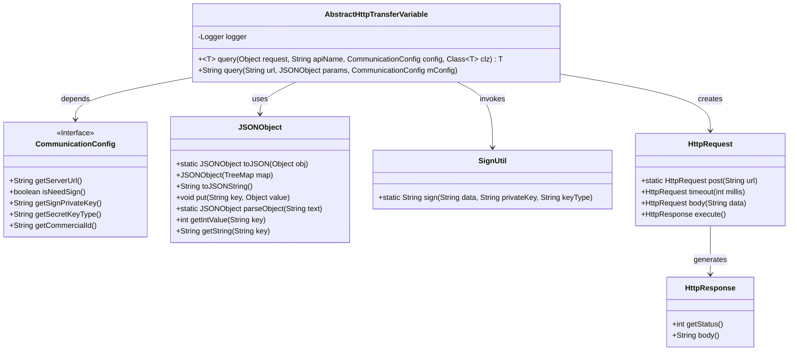
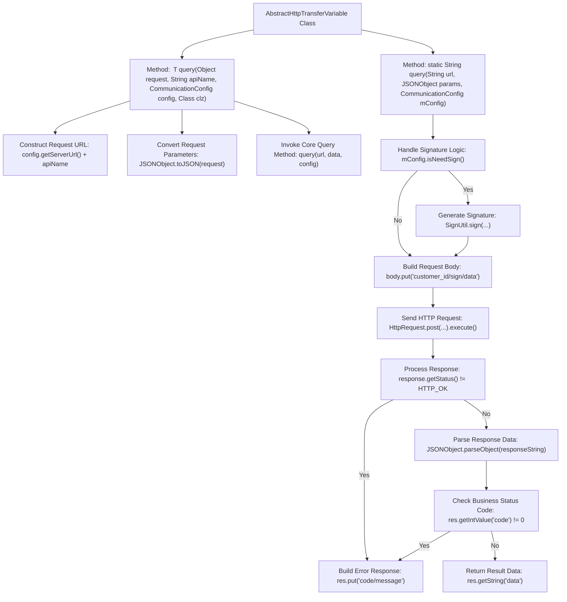

# Basic Information

|      |      |
|------|------|
| Name | AbstractHttpTransferVariable |
| Language | .java |
| Code Path | WeFe/mpc/mpc-common/src/main/java/com/welab/wefe/mpc/trasfer/AbstractHttpTransferVariable.java |
| Package Name | com.welab.wefe.mpc.trasfer |
| Dependencies | ['java.util.TreeMap', 'org.slf4j.Logger', 'org.slf4j.LoggerFactory', 'com.alibaba.fastjson.JSON', 'com.alibaba.fastjson.JSONObject', 'com.welab.wefe.mpc.config.CommunicationConfig', 'com.welab.wefe.mpc.util.SignUtil', 'cn.hutool.http.HttpGlobalConfig', 'cn.hutool.http.HttpRequest', 'cn.hutool.http.HttpResponse', 'cn.hutool.http.HttpStatus'] |
| Brief Description | The abstract class AbstractHttpTransferVariable provides HTTP query functionality, supporting signature and error handling, and returns data in JSON format. |

# Description

AbstractHttpTransferVariable is an abstract class that provides HTTP request processing functionality. The core method `query` supports two overloads: a generic method that converts the request object to JSON and invokes the underlying query, and a static method that handles the actual HTTP request. The request processing includes signature verification logic—if a signature is required by configuration, it generates the signature and encapsulates the request body. After sending the request, it checks the response status; if the status is not 200 or a business error code is present, it returns JSON containing error information. For successful responses, it extracts and returns the `data` field. Logging is performed throughout the entire request process, capturing key information such as the URL and response status.

# Class Summary

| Name   | Type  | Description |
|-------|------|-------------|
| AbstractHttpTransferVariable | class | The abstract class AbstractHttpTransferVariable provides HTTP query functionality, supporting signature and error handling, and returns responses in JSON format. |

## Class AbstractHttpTransferVariable

|      |      |
|------|------|
| Access Modifier | public abstract |
| Type | class |
| Name | AbstractHttpTransferVariable |
| Description | The abstract class AbstractHttpTransferVariable provides HTTP query functionality, supporting signature and error handling, and returns responses in JSON format. |

### UML Class Diagram

Class diagram description: This diagram illustrates an HTTP transfer abstract class AbstractHttpTransferVariable and its related dependencies. The core class retrieves configuration via CommunicationConfig, processes JSON data using JSONObject, invokes SignUtil for signing, initiates requests through HttpRequest, and receives HttpResponse responses. It primarily implements signed HTTP POST request functionality with exception handling and logging, supporting generic return type conversion.

### Internal Method Call Graph

Flowchart Description: This flowchart illustrates the HTTP request processing flow of the AbstractHttpTransferVariable class. Starting with constructing the request URL, it proceeds through parameter conversion to the core query method. Based on configuration, it determines whether to perform signature verification, builds the request body, and sends the HTTP request. When processing the response, it first checks the HTTP status code, then verifies the business status code, and finally returns valid data or error messages. The entire process includes comprehensive exception handling and logging mechanisms.

### Field List

| Name  | Type  | Description |
|-------|-------|------|
| logger = LoggerFactory.getLogger(AbstractHttpTransferVariable.class) | Logger | Define a private static constant logger, associated with the AbstractHttpTransferVariable class. |

### Method List

| Name  | Type  | Description |
|-------|-------|------|
| query | String | The static method `query` sends JSON data via an HTTP POST request and determines whether to sign it based on the configuration. It processes the response status and error messages, returning either the result or an error JSON. |
| query | T | This is a Java generic method designed to query an API via HTTP. It takes a request object, API name, configuration, and target class as inputs, constructs the URL, converts the request to JSON, and finally returns the parsed response object. |

