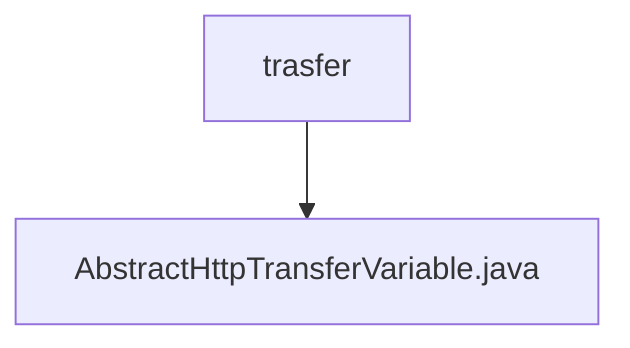

# Basic Information

|      |      |
|------|------|
| Name | trasfer |
| Language | .java |
| Code Path | WeFe/mpc/mpc-common/src/main/java/com/welab/wefe/mpc/trasfer |
| Package Name | docs.mpc.mpc-common.src.main.java.com.welab.wefe.mpc.trasfer |
| Brief Description | The abstract class AbstractHttpTransferVariable provides HTTP query functionality, supports signature and error handling, and returns data in JSON format. |

# Description

AbstractHttpTransferVariable is an abstract class that provides HTTP request processing functionality. The core method `query` supports two overloads: a generic method that converts the request object to JSON and invokes the underlying query, and a static method that handles the actual HTTP request. The request processing includes signature verification logic—if configured to require a signature, it generates the signature and encapsulates the request body. After sending the request, it checks the response status; if the status is not 200 or a business error code is present, it returns JSON containing error information. For successful responses, it extracts and returns the `data` field. Logging is performed throughout the entire request process, capturing key information such as URLs and response statuses.

### Package Internal Structure View

This flowchart illustrates the directory structure of the trasfer module in the mpc-common component of the WeFe project. The parent node "trasfer" contains a child node, the file AbstractHttpTransferVariable.java, indicating that this is an abstract class implementation related to transfer. The entire structure is concise and clear, reflecting the typical hierarchical relationship between packages and class files in Java projects.

# File List

| Name   | Type  | Description |
|-------|------|-------------|
| [AbstractHttpTransferVariable.java](AbstractHttpTransferVariable.md) | file | The abstract class AbstractHttpTransferVariable provides HTTP query functionality, supporting signature and error handling, and returns data in JSON format. |

