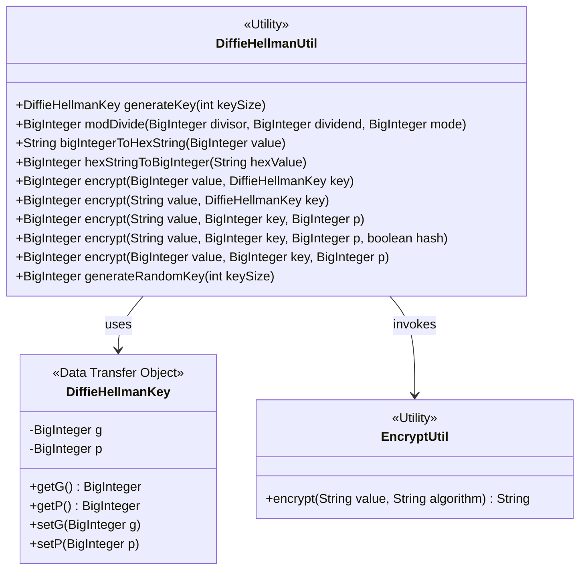

# Basic Information

|      |      |
|------|------|
| Name | DiffieHellmanUtil |
| Language | .java |
| Code Path | WeFe/mpc/mpc-common/src/main/java/com/welab/wefe/mpc/util/DiffieHellmanUtil.java |
| Package Name | com.welab.wefe.mpc.util |
| Dependencies | ['com.welab.wefe.mpc.commom.AccountEncryptionType', 'com.welab.wefe.mpc.key.DiffieHellmanKey', 'javax.crypto.interfaces.DHPublicKey', 'java.math.BigInteger', 'java.security.KeyPair', 'java.security.KeyPairGenerator', 'java.security.NoSuchAlgorithmException', 'java.util.Random'] |
| Brief Description | The DiffieHellmanUtil class provides DH key generation, modular division operations, large integer to hexadecimal conversion, and modular exponentiation encryption functionality, supporting MD5 hash preprocessing. |

# Description

DiffieHellmanUtil is a utility class that provides functionalities related to the Diffie-Hellman key exchange. Its main features include generating DH key pairs, modular division operations, conversion between large integers and hexadecimal strings, and encryption operations. The `generateKey` method can generate a DH key pair of a specified length and return a `DiffieHellmanKey` object containing the G and P parameters. The encryption methods support modular exponentiation for large integers or strings, with an option to perform MD5 hashing before encrypting strings. Additionally, it provides a method for generating random large integer keys. All methods are static and can be called directly. In terms of exception handling, a runtime exception is thrown if the algorithm does not exist.

# Class Summary

| Name   | Type  | Description |
|-------|------|-------------|
| DiffieHellmanUtil | class | The DiffieHellmanUtil class provides DH key generation, modular division operations, large integer to hexadecimal conversion, and modular exponentiation encryption functions, supporting random key generation and multiple encryption methods. |

## Class DiffieHellmanUtil

|      |      |
|------|------|
| Access Modifier | public |
| Type | class |
| Name | DiffieHellmanUtil |
| Description | The DiffieHellmanUtil class provides DH key generation, modular division operations, large integer to hexadecimal conversion, and modular exponentiation encryption functions, supporting random key generation and multiple encryption methods. |

### UML Class Diagram

This diagram illustrates the interaction relationships between the DiffieHellmanUtil utility class and its associated components. As a core encryption utility class, it relies on DiffieHellmanKey to store key parameters and invokes EncryptUtil during hash processing. The class diagram clearly presents 7 encryption-related method signatures and critical data flow paths, including key generation, modular arithmetic, and base conversion functional modules, reflecting the implementation framework of the Diffie-Hellman key exchange algorithm.

### Internal Method Call Graph

```mermaid
graph TD
    A["Class DiffieHellmanUtil"]
    B["Method: generateKey(int keySize)"]
    C["Method: modDivide(BigInteger divisor, BigInteger dividend, BigInteger mode)"]
    D["Method: bigIntegerToHexString(BigInteger value)"]
    E["Method: hexStringToBigInteger(String hexValue)"]
    F["Method: encrypt(BigInteger value, DiffieHellmanKey key)"]
    G["Method: encrypt(String value, DiffieHellmanKey key)"]
    H["Method: encrypt(String value, BigInteger key, BigInteger p)"]
    I["Method: encrypt(String value, BigInteger key, BigInteger p, boolean hash)"]
    J["Method: encrypt(BigInteger value, BigInteger key, BigInteger p)"]
    K["Method: generateRandomKey(int keySize)"]
    L["Internal call: KeyPairGenerator.getInstance('DH')"]
    M["Internal call: generator.initialize(keySize)"]
    N["Internal call: generator.generateKeyPair()"]
    O["Internal call: pair.getPublic()"]
    P["Internal call: publicKey.getParams().getG()"]
    Q["Internal call: publicKey.getParams().getP()"]
    R["Internal call: dividend.modInverse(mode)"]
    S["Internal call: divisor.multiply(inv)"]
    T["Internal call: multi.mod(mode)"]
    U["Internal call: value.toString(16)"]
    V["Internal call: new BigInteger(hexValue, 16)"]
    W["Internal call: encrypt(key.getG(), value, key.getP())"]
    X["Internal call: encrypt(key.getG(), hexStringToBigInteger(value), key.getP())"]
    Y["Internal call: encrypt(value, key, p, true)"]
    Z["Internal call: EncryptUtil.encrypt(value, AccountEncryptionType.md5.name())"]
    AA["Internal call: hexStringToBigInteger(value)"]
    AB["Internal call: value.modPow(key, p)"]
    AC["Internal call: new BigInteger(keySize, new Random())"]

    A --> B
    A --> C
    A --> D
    A --> E
    A --> F
    A --> G
    A --> H
    A --> I
    A --> J
    A --> K
    B --> L
    B --> M
    B --> N
    B --> O
    B --> P
    B --> Q
    C --> R
    C --> S
    C --> T
    D --> U
    E --> V
    F --> W
    G --> X
    H --> Y
    I --> Z
    I --> AA
    J --> AB
    K --> AC
```

This code implements a Diffie-Hellman key exchange utility class, containing functionalities such as key generation, modular arithmetic, and encryption conversion. The flowchart illustrates the invocation relationships between all methods in the class, including the KeyPairGenerator-related methods called during key generation, the modular inverse and multiplication operations in modular arithmetic, and the mutual calling relationships between encryption methods with different parameter types. The core encryption operation is ultimately implemented through the modPow method, while supporting both String and BigInteger input formats.

### Field List

| Name  | Type  | Description |
|-------|-------|------|

### Method List

| Name  | Type  | Description |
|-------|-------|------|
| bigIntegerToHexString | String | This method converts the BigInteger object into a hexadecimal string by directly calling its toString(16) method. |
| generateKey | DiffieHellmanKey | Generate Diffie-Hellman keys, including parameters G and P, and handle exceptions. |
| hexStringToBigInteger | BigInteger | Convert a hexadecimal string to a BigInteger type. |
| encrypt | BigInteger | Java Method: Encrypt a string using DiffieHellmanKey, convert the hexadecimal string to a large integer, and encrypt it based on parameters g and p. |
| generateRandomKey | BigInteger | Generate a random large integer key with specified number of digits. |
| encrypt | BigInteger | Encryption method: Input a string, a key, and a large number p, optionally perform MD5 hashing and convert it to a large integer, then perform encryption operations with the key and p. |
| modDivide | BigInteger | This method implements the modulo division operation by calculating the modular inverse of the divisor, multiplying it with the dividend, and then returning the result after taking the modulo. |
| encrypt | BigInteger | Java Method: Encrypt BigInteger values using DiffieHellmanKey, with parameters g, value, and p. |
| encrypt | BigInteger | This method encrypts the input value using modular exponentiation, with parameters including the value, key, and a large prime number p, and returns the encrypted result. |
| encrypt | BigInteger | Java Method: Encrypts a string using BigInteger, accepting value, key, and prime parameters with encryption flag enabled by default. |

