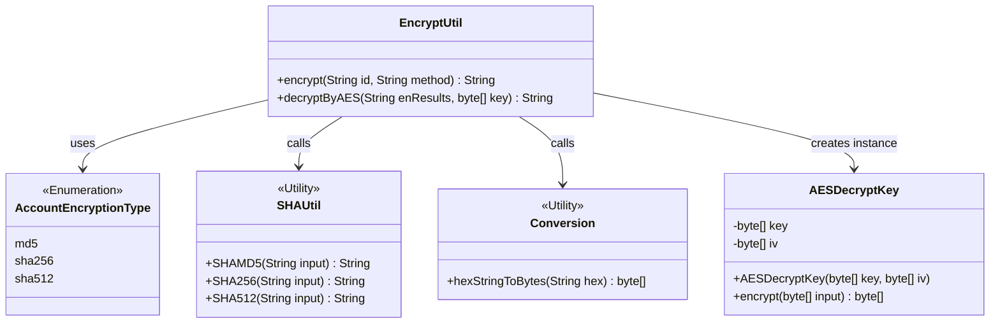
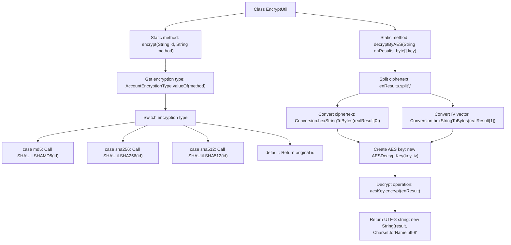

# Basic Information

|      |      |
|------|------|
| Name | EncryptUtil |
| Language | .java |
| Code Path | WeFe/mpc/mpc-common/src/main/java/com/welab/wefe/mpc/util/EncryptUtil.java |
| Package Name | com.welab.wefe.mpc.util |
| Dependencies | ['java.nio.charset.Charset', 'com.welab.wefe.mpc.commom.AccountEncryptionType', 'com.welab.wefe.mpc.commom.Conversion', 'com.welab.wefe.mpc.pir.protocol.se.SymmetricKey', 'com.welab.wefe.mpc.pir.protocol.se.aes.AESDecryptKey'] |
| Brief Description | The EncryptUtil class provides encryption and decryption functionalities, supporting MD5, SHA256, and SHA512 encryption methods, as well as AES-based decryption operations. |

# Description

The `EncryptUtil` class provides two encryption-related functionalities. The `encrypt` method performs hashing on a string based on the specified encryption type, supporting three algorithms: MD5, SHA256, and SHA512, with the original string returned by default. The `decryptByAES` method is used for AES decryption, accepting the encrypted result and a key. It first splits the encrypted data and the initialization vector, then decrypts using `AESDecryptKey`, and finally returns a UTF-8 formatted string.

# Class Summary

| Name   | Type  | Description |
|-------|------|-------------|
| EncryptUtil | class | The EncryptUtil class provides encryption and decryption functionalities, supporting MD5, SHA256, and SHA512 encryption methods, as well as AES-based decryption methods, which require passing a key and an initialization vector. |

## Class EncryptUtil

|      |      |
|------|------|
| Access Modifier | public |
| Type | class |
| Name | EncryptUtil |
| Description | The EncryptUtil class provides encryption and decryption functionalities, supporting MD5, SHA256, and SHA512 encryption methods, as well as AES-based decryption methods, which require passing a key and an initialization vector. |

### UML Class Diagram

This class diagram illustrates the core structure and relationships of the encryption utility class `EncryptUtil`. The `EncryptUtil` provides two public methods: `encrypt()` and `decryptByAES()`, which rely on the enumeration type `AccountEncryptionType` for algorithm selection, invoke static methods of `SHAUtil` for hash computation, and utilize the `Conversion` utility class for byte conversion. The decryption functionality is achieved by creating an instance of `AESDecryptKey`, which encapsulates AES keys and initialization vectors. All utility classes are marked with `<<Utility>>`, reflecting the stateless design characteristic of utility classes.

### Internal Method Call Graph

Flowchart description: This flowchart illustrates two core methods of the EncryptUtil class. The encrypt method invokes corresponding SHAUtil hash functions based on the input encryption type (md5/sha256/sha512), returning the original string by default. The decryptByAES method performs AES decryption: splitting ciphertext and IV vector, converting them to byte arrays, creating a decryption key object, and ultimately decrypting to return a UTF-8 string. The entire process clearly demonstrates the dispatch logic of encryption types and the data conversion steps in the decryption process.

### Field List

| Name  | Type  | Description |
|-------|-------|------|

### Method List

| Name  | Type  | Description |
|-------|-------|------|
| encrypt | String | The static method `encrypt` selects the encryption type (MD5, SHA256, SHA512) based on the `method` parameter to encrypt the `id`. If no match is found, it returns the original `id`. |
| decryptByAES | String | This method decrypts a string using AES, taking an encrypted string and a key as input, and outputs the decrypted UTF-8 string. The process involves splitting the input, converting byte arrays, initializing the AES key, and performing decryption. |

