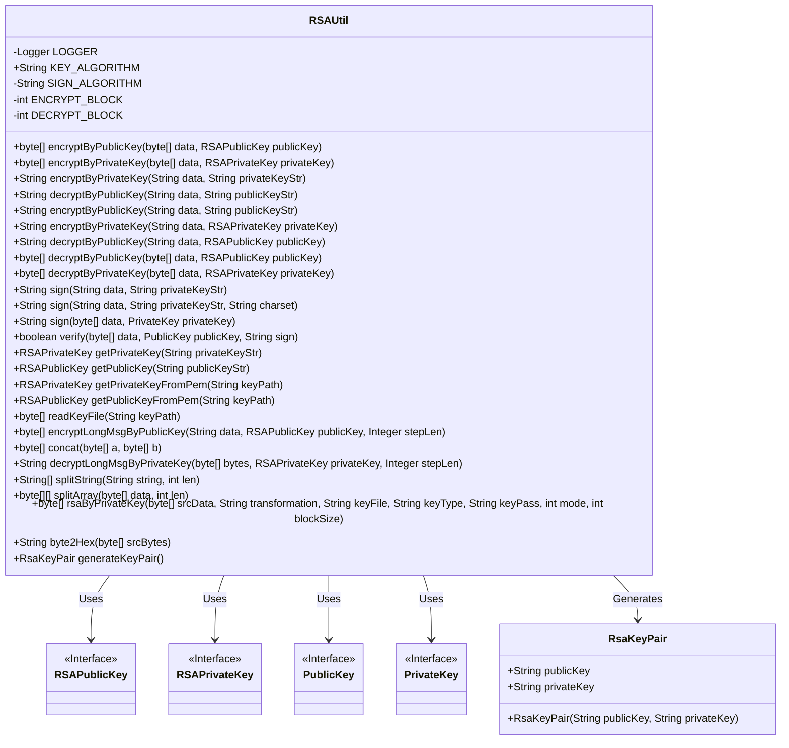
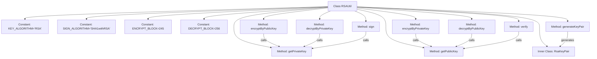

# Basic Information

|      |      |
|------|------|
| Name | RSAUtil |
| Language | .java |
| Code Path | WeFe/mpc/mpc-common/src/main/java/com/welab/wefe/mpc/util/RSAUtil.java |
| Package Name | com.welab.wefe.mpc.util |
| Dependencies | ['org.slf4j.Logger', 'org.slf4j.LoggerFactory', 'javax.crypto.Cipher', 'java.io', 'java.nio.charset.StandardCharsets', 'java.security', 'java.security.interfaces.RSAPrivateKey', 'java.security.interfaces.RSAPublicKey', 'java.security.spec.PKCS8EncodedKeySpec', 'java.security.spec.X509EncodedKeySpec', 'java.util.Base64', 'java.util.Enumeration'] |
| Brief Description | The RSAUtil class provides RSA encryption, decryption, signing, and verification functionalities, supporting public/private key conversion, segmented processing of long texts, and key pair generation. |

# Description

The RSAUtil class is a comprehensive RSA encryption utility that provides core functionalities including public key encryption, private key decryption, private key signing, and public key verification. It supports key format conversion (mutual conversion between strings and RSAPublicKey/RSAPrivateKey), segmented encryption/decryption for long texts, Base64 encoding/decoding, and includes a key pair generation method. Constants define encryption block sizes (ENCRYPT_BLOCK=245/DECRYPT_BLOCK=256) and the signature algorithm (SHA1withRSA), while also offering auxiliary features such as PEM file reading and hexadecimal conversion.

# Class Summary

| Name   | Type  | Description |
|-------|------|-------------|
| RSAUtil | class | The RSAUtil class provides RSA encryption, decryption, signing, and key generation functionalities, supporting public/private key conversion and segmented processing of large data. |

## Class RSAUtil

|      |      |
|------|------|
| Access Modifier | public |
| Type | class |
| Name | RSAUtil |
| Description | The RSAUtil class provides RSA encryption, decryption, signing, and key generation functionalities, supporting public/private key conversion and segmented processing of large data. |

### UML Class Diagram

This code represents an RSA encryption utility class that provides public/private key encryption/decryption, signature verification, and key conversion functionalities. The core class RSAUtil contains 20+ static methods supporting string/byte array encryption/decryption operations, handling long text segmentation for encryption/decryption, and reading keys from files/PEM formats. The inner class RsaKeyPair stores key pairs generated via the generateKeyPair() method. The class diagram illustrates dependencies with Java security interfaces (RSAPublicKey/RSAPrivateKey etc.), demonstrating a comprehensive asymmetric encryption solution.

### Internal Method Call Graph

This flowchart illustrates the core structure and key method invocation relationships of the RSAUtil class. The class contains encryption/decryption method groups (e.g., encryptByPublicKey, decryptByPrivateKey), signature verification methods (sign/verify), key conversion methods (getPrivateKey/getPublicKey), and key pair generation functionality. Critical workflows include: encryption methods relying on key retrieval methods, signature verification requiring prior key format conversion, and the generateKeyPair method producing an instance of the inner class RsaKeyPair containing public-private key pairs. All methods are implemented based on the RSA algorithm, with processing flows encompassing key initialization, data block processing, Base64 encoding/decoding, and other essential steps.

### Field List

| Name  | Type  | Description |
|-------|-------|------|
| ENCRYPT_BLOCK = 245 | int | The encryption block size is 245 bytes. |
| LOGGER = LoggerFactory.getLogger(RSAUtil.class) | Logger | Define a static constant LOGGER for logging in the RSAUtil class. |
| KEY_ALGORITHM = "RSA" | String | Define a constant string KEY_ALGORITHM with the value RSA, representing the key algorithm type. |
| DECRYPT_BLOCK = 256 | int | Define the constant DECRYPT_BLOCK with a value of 256, representing the decryption block size. |
| SIGN_ALGORITHM = "SHA1withRSA" | String | Define the constant SIGN_ALGORITHM with the value SHA1withRSA signature algorithm. |

### Method List

| Name  | Type  | Description |
|-------|-------|------|
| decryptByPublicKey | byte[] | Decrypting data using an RSA public key: Pass in the byte array and public key, initialize the Cipher in decryption mode, perform the decryption, and return the result. |
| sign | String | This is a Java method that signs byte array data using a private key and returns the Base64-encoded signature result. The method employs a specified algorithm and handles exceptions. |
| encryptLongMsgByPublicKey | byte[] | Using RSA public key to encrypt long text in segments, with a default step size of modulus length/8. The length of each plaintext group should not exceed the modulus length minus 11, and the encrypted results are concatenated and returned. |
| getPublicKeyFromPem | RSAPublicKey | Reading RSA public key from PEM file: Read the file content, use X509 encoding specification, and generate an RSAPublicKey object through the key factory. |
| decryptByPrivateKey | byte[] | Decrypt data using private key: Pass in the data and private key, initialize decryption mode, and return the decryption result. |
| getPrivateKeyFromPem | RSAPrivateKey | Read RSA private key from PEM file: Read the file content, use PKCS8 encoding specification, and generate an RSAPrivateKey object through KeyFactory. |
| splitArray | byte[][] | Split the byte array into a two-dimensional array by specified length, handle the remainder part, and return the split result. |
| decryptByPublicKey | String | Decrypt Base64-encoded data in segments using an RSA public key, supporting PKCS1 padding, and return a UTF-8 string. |
| readKeyFile | byte[] | Read the content of the key file, filter out lines starting with '-', then Base64 decode and return the byte array. Throw an exception if the file does not exist or an error occurs during reading. |
| getPrivateKey | RSAPrivateKey | This method converts a Base64-encoded RSA private key string into an RSAPrivateKey object by parsing it in PKCS8 format and generating a key instance. |
| verify | boolean | This method is used to verify data signatures. It takes a data byte array, a public key, and a signature string as input, initializes the verifier with the specified algorithm, updates the data, and then checks whether the signature matches. |
| encryptByPrivateKey | String | Encrypt data using an RSA private key, process it in chunks, and return the result after Base64 decoding. |
| sign | String | Use an RSA private key to sign the data and return the Base64-encoded result. The steps include decoding the private key, initializing the signer, updating the data, and generating the signature. |
| concat | byte[] | Static method `concat` merges two byte arrays `a` and `b`, returning a new array `c` containing all elements of `a` and `b`. |
| encryptByPublicKey | String | Encrypt data using RSA public key, input the data and public key string, and output the Base64-encoded encryption result. |
| decryptLongMsgByPrivateKey | String | Decrypt long messages using RSA private key in segments, supporting custom segment length. By default, it decrypts by grouping according to the modulus length, then concatenates and returns the result. |
| sign | String | Sign the data using an RSA private key and return the Base64-encoded signature result. |
| encryptByPublicKey | byte[] | Encrypt data using RSA public key, initialize the Cipher in encryption mode, perform encryption and return the result. |
| splitString | String[] | Split the string into an array of specified lengths, handling the remainder to ensure completeness. |
| encryptByPrivateKey | byte[] | Encrypt data using an RSA private key and return the encrypted byte array. |
| decryptByPublicKey | String | Decrypt data using the public key string by first converting it into an RSAPublicKey object and then calling the decryption method. |
| encryptByPrivateKey | String | Static method encrypts data using a private key, takes input data and private key string as parameters, and returns the encrypted result. |
| getPublicKey | RSAPublicKey | This method converts a Base64-encoded RSA public key string into an RSAPublicKey object, using the X509 standard for decoding and generating the key instance. |
| rsaByPrivateKey | byte[] | Using a private key for RSA encryption or decryption, supports chunk processing, requires providing the key file, type, and password, returns null on exception. |
| byte2Hex | String | Convert a byte array to a hexadecimal string, with each byte converted to a two-digit hexadecimal number, padded with zeros if necessary. |
| generateKeyPair | RsaKeyPair | Generate an RSA key pair, and return the public and private keys after Base64 encoding. |

