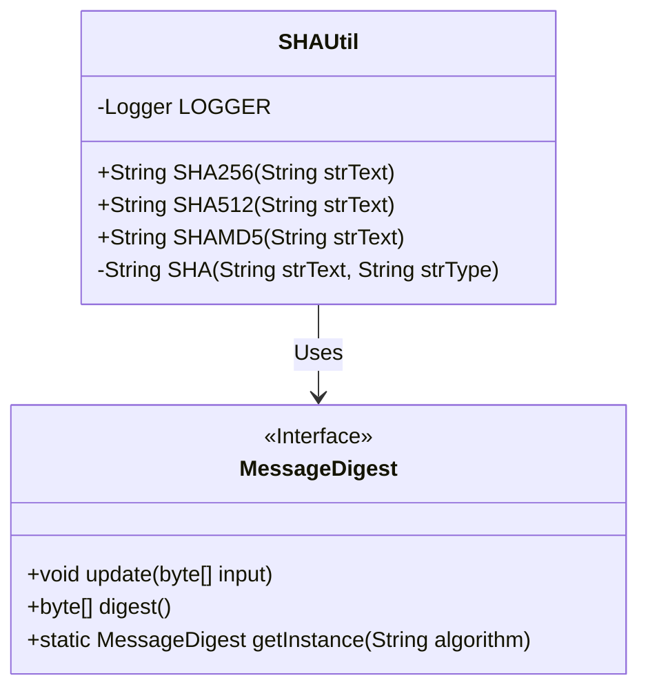
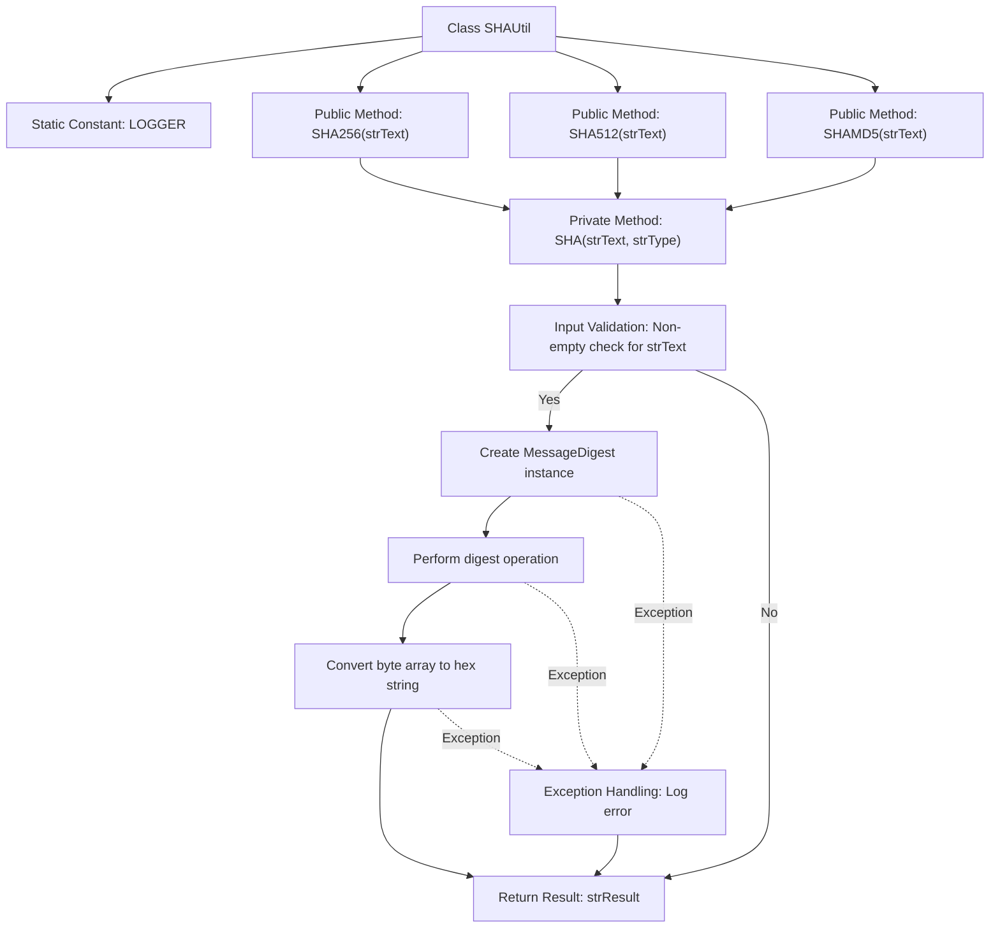

# Basic Information

|      |      |
|------|------|
| Name | SHAUtil |
| Language | .java |
| Code Path | WeFe/mpc/mpc-common/src/main/java/com/welab/wefe/mpc/util/SHAUtil.java |
| Package Name | com.welab.wefe.mpc.util |
| Dependencies | ['org.slf4j.Logger', 'org.slf4j.LoggerFactory', 'java.security.MessageDigest'] |
| Brief Description | The SHAUtil class provides SHA256, SHA512, and MD5 encryption methods, implementing string encryption through MessageDigest and returning hexadecimal results. |

# Description

The SHAUtil class provides static methods for SHA encryption of strings, supporting SHA-256, SHA-512, and MD5 algorithms. The internal private method SHA handles the actual encryption logic, including creating encryption objects, passing in strings, generating byte results, and converting them to hexadecimal strings. If the input is invalid or encryption fails, it returns null and logs an error message.

# Class Summary

| Name   | Type  | Description |
|-------|------|-------------|
| SHAUtil | class | The SHAUtil class provides SHA256, SHA512, and MD5 encryption methods, implementing string encryption through MessageDigest and returning hexadecimal results. Logs are recorded when exceptions occur. |

## Class SHAUtil

|      |      |
|------|------|
| Access Modifier | public |
| Type | class |
| Name | SHAUtil |
| Description | The SHAUtil class provides SHA256, SHA512, and MD5 encryption methods, implementing string encryption through MessageDigest and returning hexadecimal results. Logs are recorded when exceptions occur. |

### UML Class Diagram

This code demonstrates a SHAUtil utility class that provides static methods for three hash algorithms: SHA256, SHA512, and MD5. The class contains a private SHA method as the core implementation, which performs encryption operations through Java's MessageDigest interface. The class diagram clearly shows the dependency relationship between SHAUtil and the MessageDigest interface, where SHAUtil invokes the getInstance, update, and digest methods of MessageDigest to complete the encryption process. The private SHA method handles string validity checks, exception catching, and byte-to-hexadecimal conversion logic.

### Internal Method Call Graph

This code represents a SHA encryption utility class that provides encapsulated implementations for three hash algorithms: SHA-256, SHA-512, and MD5. The flowchart illustrates the calling relationships from public methods to the core private method SHA, as well as internal processing steps including input validation, encryption operations, byte conversion, and exception handling. All public methods ultimately delegate to the private SHA method for actual encryption, which implements the cryptographic functionality using Java's MessageDigest class and returns the result as a hexadecimal string.

### Field List

| Name  | Type  | Description |
|-------|-------|------|
| LOGGER = LoggerFactory.getLogger(SHAUtil.class) | Logger | The SHAUtil class defines a private static immutable logger instance named LOGGER. |

### Method List

| Name  | Type  | Description |
|-------|-------|------|
| SHA | String | This method implements SHA encryption for strings, taking plaintext and algorithm type as input, and returns the encrypted hexadecimal string. It handles exceptions and logs them. |
| SHA512 | String | This is a static method that hashes the input string using the SHA-512 algorithm. |
| SHAMD5 | String | This method defines a static function SHAMD5, which takes a string parameter strText, calls the SHA function with the encryption method specified as MD5, and returns the encrypted result. |
| SHA256 | String | This is a static method used to perform SHA-256 encryption on the input string, implemented by calling the internal SHA method. |

