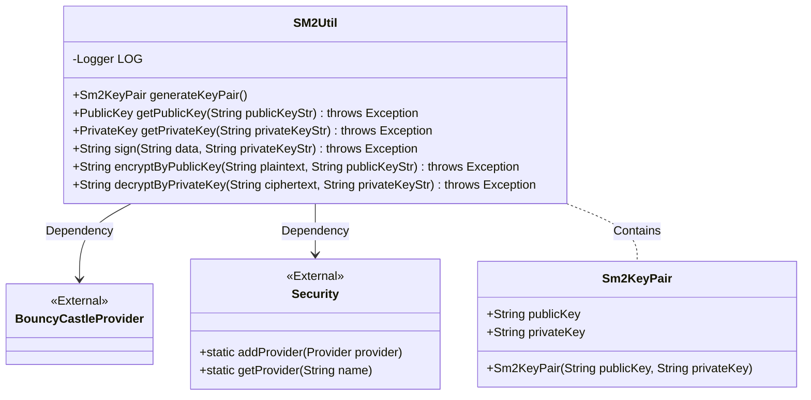

# Basic Information

|      |      |
|------|------|
| Name | SM2Util |
| Language | .java |
| Code Path | WeFe/mpc/mpc-common/src/main/java/com/welab/wefe/mpc/util/SM2Util.java |
| Package Name | com.welab.wefe.mpc.util |
| Dependencies | ['org.bouncycastle.asn1.gm.GMNamedCurves', 'org.bouncycastle.asn1.gm.GMObjectIdentifiers', 'org.bouncycastle.asn1.x9.X9ECParameters', 'org.bouncycastle.crypto.engines.SM2Engine', 'org.bouncycastle.crypto.params.ECDomainParameters', 'org.bouncycastle.crypto.params.ECPrivateKeyParameters', 'org.bouncycastle.crypto.params.ECPublicKeyParameters', 'org.bouncycastle.crypto.params.ParametersWithRandom', 'org.bouncycastle.jcajce.provider.asymmetric.ec.BCECPrivateKey', 'org.bouncycastle.jcajce.provider.asymmetric.ec.BCECPublicKey', 'org.bouncycastle.jce.provider.BouncyCastleProvider', 'org.bouncycastle.jce.spec.ECParameterSpec', 'org.bouncycastle.math.ec.ECPoint', 'org.bouncycastle.util.encoders.Hex', 'org.slf4j.Logger', 'org.slf4j.LoggerFactory', 'java.math.BigInteger', 'java.nio.charset.StandardCharsets', 'java.security', 'java.security.spec.ECGenParameterSpec', 'java.util.Base64', 'org.bouncycastle.jce.spec.ECPrivateKeySpec', 'org.bouncycastle.jce.spec.ECPublicKeySpec'] |
| Brief Description | The SM2Util class provides SM2 algorithm functionalities, including key pair generation, public/private key conversion, signature verification, encryption/decryption, and other operations, implemented using the BouncyCastle library. |

# Description

The SM2Util class is a utility class that implements the SM2 national cryptographic algorithm based on the BouncyCastle library. Its main functionalities include: a static initialization block to ensure the BouncyCastle provider is registered; the generateKeyPair method for generating SM2 key pairs, which includes public and private keys in hexadecimal format; the inner class Sm2KeyPair for encapsulating key pairs; the getPublicKey/getPrivateKey methods for converting between public/private key strings and key objects; the sign method for performing SM2 signatures on data using a private key; the encryptByPublicKey method for encrypting data with a public key; and the decryptByPrivateKey method for decrypting data with a private key. All operations use the SM2P256V1 elliptic curve parameters.

# Class Summary

| Name   | Type  | Description |
|-------|------|-------------|
| SM2Util | class | The SM2Util class provides SM2 algorithm utilities, including key pair generation, public/private key conversion, data signing, public key encryption, and private key decryption functionalities, implemented using the BouncyCastle library. |

## Class SM2Util

|      |      |
|------|------|
| Access Modifier | public |
| Type | class |
| Name | SM2Util |
| Description | The SM2Util class provides SM2 algorithm utilities, including key pair generation, public/private key conversion, data signing, public key encryption, and private key decryption functionalities, implemented using the BouncyCastle library. |

### UML Class Diagram

This code implements an SM2 encryption utility class, with main functionalities including generating SM2 key pairs, public/private key format conversion, data signing, public key encryption, and private key decryption. The class diagram illustrates the relationship between the SM2Util utility class and its inner class Sm2KeyPair, as well as its dependencies on external classes BouncyCastleProvider and Security. SM2Util provides various cryptographic operations through static methods, while Sm2KeyPair is used to encapsulate generated public and private key strings. The overall design follows the common pattern of utility classes, where all methods are static for direct invocation.

### Internal Method Call Graph

```mermaid
graph TD
    A["Class SM2Util"]
    B["Static Block: Register BouncyCastleProvider"]
    C["Method: generateKeyPair"]
    D["Inner Class: Sm2KeyPair"]
    E["Method: getPublicKey"]
    F["Method: getPrivateKey"]
    G["Method: sign"]
    H["Method: encryptByPublicKey"]
    I["Method: decryptByPrivateKey"]

    A --> B
    A --> C
    A --> D
    A --> E
    A --> F
    A --> G
    A --> H
    A --> I

    C --> C1["Create ECGenParameterSpec"]
    C --> C2["Initialize KeyPairGenerator"]
    C --> C3["Generate KeyPair"]
    C --> C4["Convert Key Format"]
    C --> C5["Return Sm2KeyPair"]

    E --> E1["Get Elliptic Curve Parameters"]
    E --> E2["Decode Public Key String"]
    E --> E3["Generate PublicKey Object"]

    F --> F1["Convert Private Key String"]
    F --> F2["Generate PrivateKey Object"]

    G --> G1["Initialize Signature Object"]
    G --> G2["Load Private Key"]
    G --> G3["Generate Signature"]

    H --> H1["Load Public Key"]
    H --> H2["Initialize SM2 Engine"]
    H --> H3["Execute Encryption"]

    I --> I1["Load Private Key"]
    I --> I2["Initialize SM2 Engine"]
    I --> I3["Execute Decryption"]
```

This flowchart illustrates the core structure and functional call chain of the SM2Util class. The static block ensures BouncyCastleProvider registration, while key methods include key pair generation (generateKeyPair), key format conversion (getPublicKey/getPrivateKey), digital signature (sign), and encryption/decryption operations (encryptByPublicKey/decryptByPrivateKey). Each method details critical steps such as parameter initialization during key generation and engine configuration for signing, fully presenting the implementation logic of the SM2 national cryptographic algorithm.

### Field List

| Name  | Type  | Description |
|-------|-------|------|
| LOG = LoggerFactory.getLogger(SM2Util.class) | Logger | The SM2Util class defines a private static immutable log object LOG, which obtains a logger using LoggerFactory. |

### Method List

| Name  | Type  | Description |
|-------|-------|------|
| sign | String | Sign the data using the SM2 algorithm and SM3 hash, input the data and private key string, and return the Base64-encoded signature result. |
| generateKeyPair | Sm2KeyPair | Generate an SM2 key pair, including hexadecimal strings of the public and private keys, implemented using the BouncyCastle library. |
| encryptByPublicKey | String | Using the SM2 algorithm and public key to encrypt the plaintext, generating a Base64-encoded ciphertext. |
| getPublicKey | PublicKey | This method generates an SM2 elliptic curve public key from a HEX string, utilizing the BouncyCastle library to parse parameters and point coordinates, ultimately returning a BCECPublicKey object. |
| getPrivateKey | PrivateKey | Java Method: Convert HEX String to SM2 Elliptic Curve Private Key, Implemented Using BouncyCastle Library. |
| decryptByPrivateKey | String | Decrypting SM2-encrypted ciphertext using a private key involves key conversion, parameter configuration, engine initialization, and data processing, ultimately returning the decrypted plaintext. |

