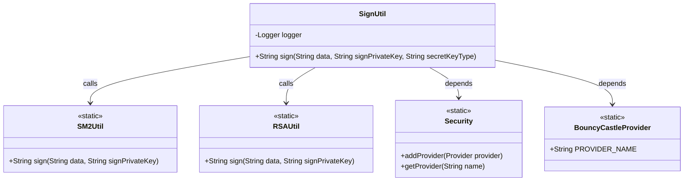
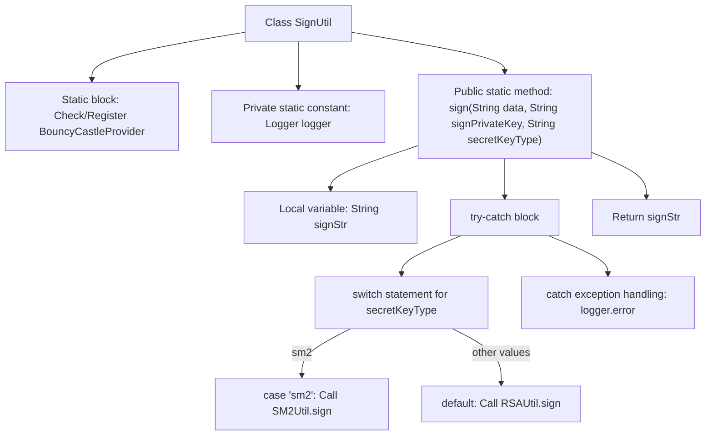

# Basic Information

|      |      |
|------|------|
| Name | SignUtil |
| Language | .java |
| Code Path | WeFe/mpc/mpc-common/src/main/java/com/welab/wefe/mpc/util/SignUtil.java |
| Package Name | com.welab.wefe.mpc.util |
| Dependencies | ['java.security.Security', 'org.bouncycastle.jce.provider.BouncyCastleProvider', 'org.slf4j.Logger', 'org.slf4j.LoggerFactory'] |
| Brief Description | The SignUtil class provides signature functionality, with a static block initializing the BouncyCastleProvider. The sign method invokes SM2 or RSA signing based on the key type and logs exceptions. |

# Description

SignUtil is a utility class that provides signature functionality. The static code block ensures the BouncyCastleProvider security provider is registered. The class includes a static logger for recording error messages. The sign method accepts data, a private signature key, and a key type parameter, invoking SM2Util or RSAUtil for signing based on the key type, with RSA as the default algorithm. In case of exceptions, it logs an error and returns null.

# Class Summary

| Name   | Type  | Description |
|-------|------|-------------|
| SignUtil | class | The SignUtil class provides signature functionality, with a static block initializing the BouncyCastleProvider. The sign method selects either SM2 or RSA signing based on the key type and logs exceptions when they occur. |

## Class SignUtil

|      |      |
|------|------|
| Access Modifier | public |
| Type | class |
| Name | SignUtil |
| Description | The SignUtil class provides signature functionality, with a static block initializing the BouncyCastleProvider. The sign method selects either SM2 or RSA signing based on the key type and logs exceptions when they occur. |

### UML Class Diagram

This code demonstrates a signature utility class SignUtil, which ensures the BouncyCastleProvider security provider is registered through a static initialization block. Its primary functionality is to select either SM2 or RSA algorithm for data signing based on the key type via the sign method, along with handling exception logging. The class diagram illustrates the calling relationships between SignUtil and SM2Util, RSAUtil, as well as its dependencies on Security and BouncyCastleProvider, reflecting the flexibility of multi-algorithm support and the mechanism for managing security providers.

### Internal Method Call Graph

This flowchart illustrates the complete signing process of the SignUtil class: first initializing the cryptographic provider in the static block, then selecting different signature algorithms (SM2 or RSA) via the sign method based on the key type, including exception handling and logging. Key paths involve the key type decision branch, invocations of the two signature algorithms, and the error handling mechanism, ultimately returning the signature result string.

### Field List

| Name  | Type  | Description |
|-------|-------|------|
| logger = LoggerFactory.getLogger(SignUtil.class) | Logger | The class SignUtil defines a static immutable logger named logger, which is obtained through LoggerFactory. |

### Method List

| Name  | Type  | Description |
|-------|-------|------|
| sign | String | This is a Java signature method that selects either the SM2 or RSA algorithm to sign data based on the key type, logs errors, and returns null upon failure. |

