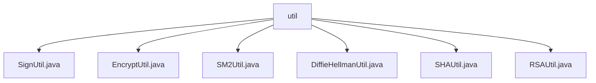

# Basic Information

|      |      |
|------|------|
| Name | util |
| Language | .java |
| Code Path | WeFe/mpc/mpc-common/src/main/java/com/welab/wefe/mpc/util |
| Package Name | docs.mpc.mpc-common.src.main.java.com.welab.wefe.mpc.util |
| Brief Description | SignUtil provides signature functionality, supporting SM2 and RSA. EncryptUtil supports MD5/SHA256/SHA512 hashing and AES decryption. SM2Util implements the SM2 national cryptographic algorithm, including key generation, encryption/decryption, and signing. DiffieHellmanUtil offers DH key exchange functionality. SHAUtil supports SHA and MD5 encryption. RSAUtil provides RSA encryption/decryption, signature verification, and key handling. |

# Description

## Overview  
This module is a cryptography toolkit, with its core responsibility being to provide implementations of various encryption algorithms and secure communication functionalities, akin to a security middleware. The interface specifications encompass operations such as signing (SM2/RSA), encryption (AES/SHA/DH), and key exchange, all uniformly invoked via static methods. Key data structures include SM2KeyPair, DiffieHellmanKey, and RSA key pairs. It relies on BouncyCastleProvider for implementing national cryptographic algorithms, such as the SM2P256V1 curve parameters. Specific implementations include SignUtil for automatic signature algorithm selection and EncryptUtil for hybrid encryption supporting MD5/SHA256/AES.  

## Primary Business Scenarios  
Typical applications include data signature verification (e.g., SignUtil invoking SM2Util for signing), secure transmission (e.g., DiffieHellmanUtil generating DH key exchange parameters), and encryption of sensitive information (e.g., RSAUtil handling long texts in segments). The typical workflow is: key generation → encryption/signing → transmission → decryption/verification, where SM2Util, for instance, provides both encryption and signing functionalities. The interaction mode is primarily API-based, such as SHAUtil directly calling static methods for hashing. Functional completeness is reflected in its coverage of mainstream algorithms, including the national cryptographic SM2, RSA, AES, and traditional hashing algorithms.

### Package Internal Structure View

This flowchart illustrates the file structure of the util utility class under the mpc-common module in the WeFe project. The root node is the util folder, which contains six utility class implementation files: SignUtil, EncryptUtil, SM2Util, DiffieHellmanUtil, SHAUtil, and RSAUtil. These files are directly subordinate to the util directory with no deeper subdirectory hierarchy.

# File List

| Name   | Type  | Description |
|-------|------|-------------|
| [SignUtil.java](SignUtil.md) | file | The SignUtil class provides signature functionality, with a static block initializing the BouncyCastleProvider. The sign method invokes SM2 or RSA signing based on the key type and logs exceptions. |
| [EncryptUtil.java](EncryptUtil.md) | file | The EncryptUtil class provides encryption and decryption functionalities, supporting MD5, SHA256, SHA512 encryption methods, as well as AES-based decryption operations. |
| [SM2Util.java](SM2Util.md) | file | The SM2Util class provides SM2 algorithm functionalities, including key pair generation, public/private key conversion, signature verification, encryption/decryption, and other operations, implemented using the BouncyCastle library. |
| [DiffieHellmanUtil.java](DiffieHellmanUtil.md) | file | The DiffieHellmanUtil class provides DH key generation, modular division operations, conversion between large integers and hexadecimal, and modular exponentiation encryption functionality, with support for MD5 hash preprocessing. |
| [SHAUtil.java](SHAUtil.md) | file | The SHAUtil class provides SHA256, SHA512, and MD5 encryption methods, implementing string encryption through MessageDigest and returning hexadecimal results. |
| [RSAUtil.java](RSAUtil.md) | file | The RSAUtil class provides RSA encryption, decryption, signing, and verification functionalities, supporting public/private key conversion, segmented processing of long texts, and key pair generation. |

