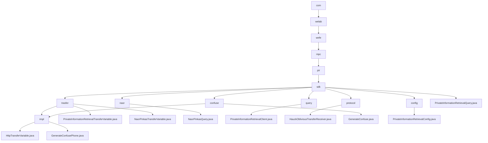

# Basic Information

|      |      |
|------|------|
| Name | com |
| Language | .java |
| Code Path | WeFe/mpc/mpc-pir/mpc-pir-sdk/src/main/java/com |
| Package Name | docs.mpc.mpc-pir.mpc-pir-sdk.src.main.java.com |
| Brief Description | This module implements secure private information retrieval based on the Naor-Pinkas protocol, including data obfuscation, OT interaction, and encrypted query functionality. The core classes handle key generation, parameter validation, and result decryption, supporting secure client-server retrieval workflows. It provides obfuscation interfaces to generate differentiated instances, with configuration classes verifying parameter legitimacy. The system ensures query privacy and process security throughout. |

# Description

## Overview  
The core responsibility of this module is to implement secure Private Information Retrieval (PIR) functionality, leveraging the Naor-Pinkas and Hauck oblivious transfer protocols to ensure query privacy through data obfuscation and encrypted transmission. The interface specifications are divided into two categories: basic PIR interfaces (e.g., `generate/query`) handle data preparation and retrieval, while protocol-specific interfaces (e.g., `queryNaorPinkasRandom`) manage cryptographic parameter exchanges. Key data structures include transmission objects such as `QueryKeysRequest` and `ObliviousTransferKey`, as well as the `PrivateInformationRetrievalConfig` containing primary key lists and obfuscation parameters. External dependencies involve the foundational communication framework and utility classes like `RandomPhoneNum`. For instance, the `NaorPinkasQuery` class implements the Diffie-Hellman encryption process with 1024-bit keys.

## Primary Business Scenarios  
A typical application involves a client-server secure retrieval workflow: first generating obfuscated datasets via `generateConfuse`, then invoking protocol interfaces in phases to complete encrypted transmission, and finally decrypting the target results. The interaction resembles a two-phase commit protocol, supporting both Naor-Pinkas and Hauck OT modes. For example, `HauckObliviousTransferReceiver` ensures transmission security through MAC verification and key derivation. The full functionality covers the entire lifecycle from data obfuscation (e.g., MD5-encrypted phone numbers) and parameter validation to secure retrieval, with exception handling integrated throughout all stages. API integration examples include anonymous querying and compliance check scenarios.

### Package Internal Structure View

This flowchart illustrates the complete Java package structure of the MPC-PIR-SDK module in the WeFe project, starting from the root directory 'com' and hierarchically expanding to the final implementation classes. The core node pir/sdk contains 7 submodules: data transfer (trasfer), Naor-Pinkas algorithm (naor), query interface (query), protocol implementation (protocol), obfuscation logic (confuse), configuration management (config), and the main query class. Each submodule is further refined into specific implementation classes, such as trasfer containing 3 transfer variable implementations and confuse including obfuscation generator implementations, fully presenting the code organization structure of the private information retrieval functionality.

# File List

| Name   | Type  | Description |
|-------|------|-------------|
| [welab](welab/_module.md) | package | This module implements secure private information retrieval based on the Naor-Pinkas protocol, including data obfuscation, OT interaction, and encrypted query functionality. The core classes handle key generation, parameter validation, and result decryption, supporting the client-server secure retrieval process. It provides obfuscation interfaces to generate differentiated instances, and configuration classes to validate parameter legality. The system ensures query privacy and process security overall. |

