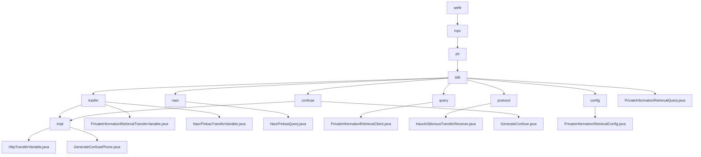

# Basic Information

|      |      |
|------|------|
| Name | welab |
| Language | .java |
| Code Path | WeFe/mpc/mpc-pir/mpc-pir-sdk/src/main/java/com/welab |
| Package Name | docs.mpc.mpc-pir.mpc-pir-sdk.src.main.java.com.welab |
| Brief Description | This module implements secure private information retrieval based on the Naor-Pinkas protocol, including data obfuscation, OT interaction, and encrypted query functionality. The core classes handle key generation, parameter validation, and result decryption, supporting the client-server secure retrieval process. It provides obfuscation interfaces to generate differentiated instances, and configuration classes to validate parameter legality. The system ensures query privacy and process security overall. |

# Description

## Overview  
The core responsibility of this module is to implement secure Private Information Retrieval (PIR) functionality, leveraging the Naor-Pinkas and Hauck oblivious transfer protocols to ensure query privacy through data obfuscation and encrypted transmission. The interface specifications are divided into two categories: basic PIR interfaces (e.g., generate/query) handle data preparation and retrieval, while protocol-specific interfaces (e.g., queryNaorPinkasRandom) manage cryptographic parameter exchanges. Key data structures include transmission objects such as QueryKeysRequest and ObliviousTransferKey, as well as PrivateInformationRetrievalConfig, which contains primary key lists and obfuscation parameters. External dependencies involve the foundational communication framework and utility classes like RandomPhoneNum. For instance, the NaorPinkasQuery class implements the Diffie-Hellman encryption process with 1024-bit keys.  

## Key Business Scenarios  
A typical application involves a client-server secure retrieval workflow: first, generateConfuse is used to create an obfuscated dataset, followed by phased calls to protocol interfaces to complete encrypted transmission, ultimately decrypting the target result. The interaction resembles a two-phase commit protocol, supporting both Naor-Pinkas and Hauck OT modes. For example, HauckObliviousTransferReceiver ensures transmission security through MAC verification and key derivation. The full functionality covers the entire lifecycle from data obfuscation (e.g., MD5-encrypted phone numbers) and parameter validation to secure retrieval, with exception handling integrated throughout. API integration examples include anonymous querying and compliance check scenarios.

### Package Internal Structure View

This flowchart illustrates the complete hierarchical structure of the MPC-PIR-SDK module in the WeFe project, starting from the root directory "wefe" and expanding level by level to the underlying implementation files and configuration files. The diagram clearly presents the dependencies of core functional modules such as "trasfer", "naor", and "query", as well as specific implementation classes under each module, such as "HttpTransferVariable.java" and "PrivateInformationRetrievalClient.java". The entire structure consists of 17 nodes, comprehensively covering all given path information and accurately reflecting the internal organization of the SDK.

# File List

| Name   | Type  | Description |
|-------|------|-------------|
| [wefe](wefe/_module.md) | package | This module implements secure private information retrieval based on the Naor-Pinkas protocol, including data obfuscation, OT interaction, and encrypted query functionality. Core classes handle key generation, parameter validation, and result decryption, supporting client-server secure retrieval processes. It provides obfuscation interfaces to generate differentiated instances, with configuration classes verifying parameter validity. The system ensures query privacy and process security throughout. |

