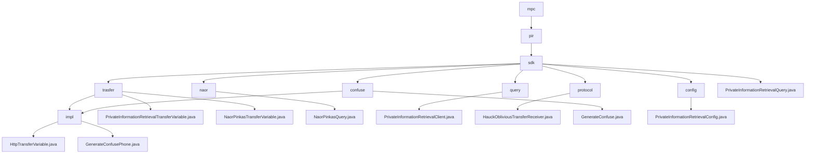

# Basic Information

|      |      |
|------|------|
| Name | mpc |
| Language | .java |
| Code Path | WeFe/mpc/mpc-pir/mpc-pir-sdk/src/main/java/com/welab/wefe/mpc |
| Package Name | docs.mpc.mpc-pir.mpc-pir-sdk.src.main.java.com.welab.wefe.mpc |
| Brief Description | This module implements secure private information retrieval based on the Naor-Pinkas protocol, including data obfuscation, OT interaction, and encrypted query functionality. Core classes handle key generation, parameter validation, and result decryption, supporting client-server secure retrieval workflows. It provides obfuscation interfaces to generate differentiated instances, with configuration classes verifying parameter validity. The system ensures query privacy and process security throughout. |

# Description

## Overview  
The core responsibility of this module is to implement secure Private Information Retrieval (PIR) functionality, leveraging the Naor-Pinkas and Hauck oblivious transfer protocols to ensure query privacy through data obfuscation and encrypted transmission. The interface specifications are divided into two categories: basic PIR interfaces (e.g., `generate/query`) handle data preparation and retrieval, while protocol-specific interfaces (e.g., `queryNaorPinkasRandom`) manage cryptographic parameter exchanges. Key data structures include transmission objects such as `QueryKeysRequest` and `ObliviousTransferKey`, as well as the `PrivateInformationRetrievalConfig` containing primary key lists and obfuscation parameters. External dependencies involve the foundational communication framework and utility classes like `RandomPhoneNum`. For instance, the `NaorPinkasQuery` class implements the Diffie-Hellman encryption process with 1024-bit keys.  

## Key Business Scenarios  
A typical application involves a client-server secure retrieval workflow: first, the `generateConfuse` method generates an obfuscated dataset, followed by phased calls to protocol interfaces to complete encrypted transmission, and finally decrypting the target result. The interaction resembles a two-phase commit protocol, supporting both Naor-Pinkas and Hauck OT modes. For example, the `HauckObliviousTransferReceiver` ensures transmission security through MAC verification and key derivation. The full functionality covers the entire lifecycle from data obfuscation (e.g., MD5-encrypted phone numbers) and parameter validation to secure retrieval, with exception handling integrated throughout all stages. API integration examples include anonymous querying and compliance check scenarios.

### Package Internal Structure View

This flowchart illustrates the hierarchical structure of the MPC-PIR-SDK module, starting from the root directory 'mpc' and expanding to subdirectories such as 'pir' and 'sdk', ultimately displaying the specific implementation files of each functional module. The diagram includes core components such as transfer protocols, query interfaces, and obfuscation algorithms, clearly presenting the dependency relationships and file distribution among the modules.

# File List

| Name   | Type  | Description |
|-------|------|-------------|
| [pir](pir/_module.md) | package | This module implements secure private information retrieval based on the Naor-Pinkas protocol, including data obfuscation, OT interaction, and encrypted query functionality. Core classes handle key generation, parameter validation, and result decryption, supporting secure client-server retrieval workflows. It provides obfuscation interfaces to generate differentiated instances, with configuration classes validating parameter legality. The system ensures query privacy and process security throughout. |

