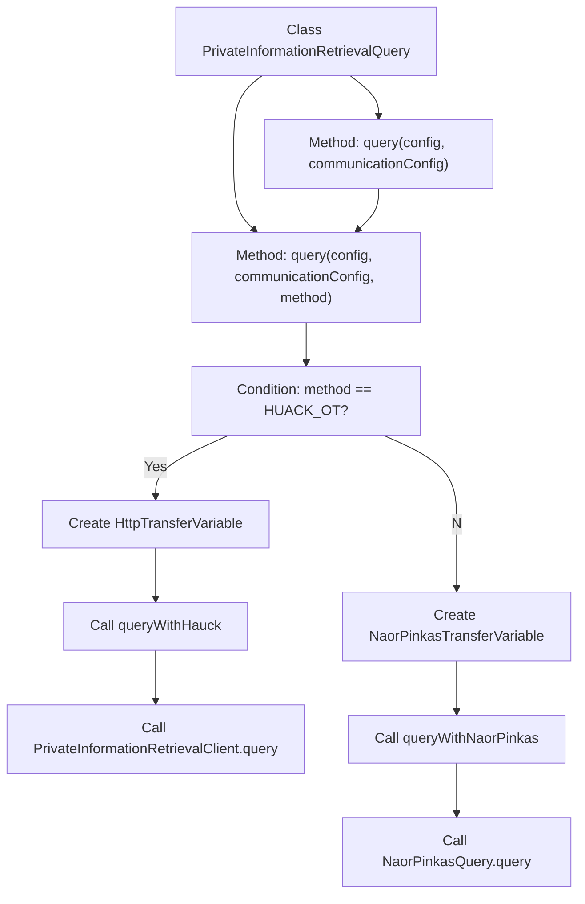

# Basic Information

|      |      |
|------|------|
| Name | PrivateInformationRetrievalQuery |
| Language | .java |
| Code Path | WeFe/mpc/mpc-pir/mpc-pir-sdk/src/main/java/com/welab/wefe/mpc/pir/sdk/PrivateInformationRetrievalQuery.java |
| Package Name | com.welab.wefe.mpc.pir.sdk |
| Dependencies | ['com.welab.wefe.mpc.commom.Constants', 'com.welab.wefe.mpc.config.CommunicationConfig', 'com.welab.wefe.mpc.pir.sdk.config.PrivateInformationRetrievalConfig', 'com.welab.wefe.mpc.pir.sdk.naor.NaorPinkasQuery', 'com.welab.wefe.mpc.pir.sdk.query.PrivateInformationRetrievalClient', 'com.welab.wefe.mpc.pir.sdk.trasfer.NaorPinkasTransferVariable', 'com.welab.wefe.mpc.pir.sdk.trasfer.PrivateInformationRetrievalTransferVariable', 'com.welab.wefe.mpc.pir.sdk.trasfer.impl.HttpTransferVariable', 'java.util.Locale'] |
| Brief Description | The class PrivateInformationRetrievalQuery implements private information retrieval functionality, supporting two oblivious transfer methods: naorpinkas_ot and huack_ot. It executes queries and returns results through configuration parameters and communication settings. |

# Description

This is a Java class that implements anonymous query functionality, containing two oblivious transfer methods: NaorPinkas and Huack. The class provides three core methods: the default query method uses NaorPinkas implementation; the overloaded query method allows specifying the transfer method; two concrete implementation methods handle different transfer protocols respectively. All methods receive configuration parameters and communication settings, interact with the server through transfer variables, and ultimately return query results. Exception handling is declared via throws Exception.

# Class Summary

| Name   | Type  | Description |
|-------|------|-------------|
| PrivateInformationRetrievalQuery | class | The stealth query class supports two oblivious transfer methods: NaorPinkas and Huack. It executes queries and returns results by configuring parameters and communication settings. |

## Class PrivateInformationRetrievalQuery

|      |      |
|------|------|
| Access Modifier | public |
| Type | class |
| Name | PrivateInformationRetrievalQuery |
| Description | The stealth query class supports two oblivious transfer methods: NaorPinkas and Huack. It executes queries and returns results by configuring parameters and communication settings. |

### UML Class Diagram

```mermaid
classDiagram
    class PrivateInformationRetrievalQuery {
        +query(PrivateInformationRetrievalConfig config, CommunicationConfig communicationConfig) String
        +query(PrivateInformationRetrievalConfig config, CommunicationConfig communicationConfig, String method) String
        +queryWithHauck(PrivateInformationRetrievalConfig config, PrivateInformationRetrievalTransferVariable transferVariable) String
        +queryWithNaorPinkas(PrivateInformationRetrievalConfig config, NaorPinkasTransferVariable transferVariable) String
    }

    class PrivateInformationRetrievalConfig
    class CommunicationConfig
    class Constants.PIR {
        <<Interface>>
        +NAORPINKAS_OT
        +HUACK_OT
    }
    class PrivateInformationRetrievalTransferVariable {
        <<Interface>>
    }
    class HttpTransferVariable {
        +HttpTransferVariable(CommunicationConfig communicationConfig)
    }
    class NaorPinkasTransferVariable {
        <<Interface>>
    }
    class PrivateInformationRetrievalClient {
        +PrivateInformationRetrievalClient(PrivateInformationRetrievalTransferVariable transferVariable, PrivateInformationRetrievalConfig config)
        +query() String
    }
    class NaorPinkasQuery {
        +query(PrivateInformationRetrievalConfig config, NaorPinkasTransferVariable transferVariable) String
    }

    PrivateInformationRetrievalQuery --> PrivateInformationRetrievalConfig : depends
    PrivateInformationRetrievalQuery --> CommunicationConfig : depends
    PrivateInformationRetrievalQuery --> Constants.PIR : depends
    PrivateInformationRetrievalQuery --> PrivateInformationRetrievalTransferVariable : depends
    PrivateInformationRetrievalQuery --> NaorPinkasTransferVariable : depends
    HttpTransferVariable ..|> PrivateInformationRetrievalTransferVariable : implements
    HttpTransferVariable ..|> NaorPinkasTransferVariable : implements
    PrivateInformationRetrievalQuery --> PrivateInformationRetrievalClient : creates
    PrivateInformationRetrievalQuery --> NaorPinkasQuery : creates
```

This code implements a Private Information Retrieval (PIR) system that protects query privacy through two distinct Oblivious Transfer (OT) methods (Hauck and Naor-Pinkas). The core class PrivateInformationRetrievalQuery provides the query entry point, selecting different OT implementations based on configuration. It handles network communication via HttpTransferVariable, with the actual query logic ultimately executed by either PrivateInformationRetrievalClient or NaorPinkasQuery. The system design adheres to the Open-Closed Principle, facilitating the extension of new OT methods.

### Internal Method Call Graph

This code implements a Private Information Retrieval (PIR) functionality, executing queries through two distinct Oblivious Transfer (OT) methods (Huack and Naor-Pinkas). The main entry method query() invokes the overloaded method and defaults to using the Naor-Pinkas OT method. Based on the provided method parameter, the system creates different transfer variable objects (HttpTransferVariable) and calls the corresponding query methods (queryWithHauck or queryWithNaorPinkas), ultimately completing the PIR through different client implementations. The entire process includes conditional branching and two distinct execution paths, both ultimately returning query results.

### Field List

| Name  | Type  | Description |
|-------|-------|------|

### Method List

| Name  | Type  | Description |
|-------|-------|------|
| query | String | The method selects different private information retrieval algorithms based on the input method: HUACK_OT invokes queryWithHauck, otherwise queryWithNaorPinkas is called, with both transmitting variables via HTTP. |
| queryWithHauck | String | Java Method: Perform Private Information Retrieval using the Hauck protocol, receiving configuration and transmission variable parameters, and returning the query result. |
| queryWithNaorPinkas | String | This method employs the NaorPinkas protocol to perform private information retrieval queries, receiving configuration and transmission variable parameters, and returns the query results. |
| query | String | This is a Java method designed for private information retrieval queries, which accepts configuration parameters and invokes an internal query method, defaulting to the Naor-Pinkas OT protocol. |

