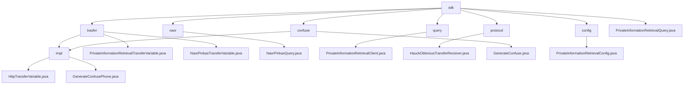

# Basic Information

|      |      |
|------|------|
| Name | sdk |
| Language | .java |
| Code Path | WeFe/mpc/mpc-pir/mpc-pir-sdk/src/main/java/com/welab/wefe/mpc/pir/sdk |
| Package Name | docs.mpc.mpc-pir.mpc-pir-sdk.src.main.java.com.welab.wefe.mpc.pir.sdk |
| Brief Description | This module implements secure private information retrieval based on the Naor-Pinkas protocol, including data obfuscation, OT interaction, and encrypted query functionality. Core classes handle key generation, parameter validation, and result decryption, supporting secure client-server retrieval workflows. It provides obfuscation interfaces to generate differentiated instances, with configuration classes validating parameter legality. The system ensures query privacy and process security overall. |

# Description

## Overview  
The core responsibility of this module is to implement secure Private Information Retrieval (PIR) functionality, leveraging the Naor-Pinkas and Hauck oblivious transfer protocols to ensure query privacy through data obfuscation and encrypted transmission. The interface specifications are divided into two categories: basic PIR interfaces (e.g., `generate`/`query`) handle data preparation and retrieval, while protocol-specific interfaces (e.g., `queryNaorPinkasRandom`) manage cryptographic parameter exchanges. Key data structures include transmission objects such as `QueryKeysRequest` and `ObliviousTransferKey`, as well as `PrivateInformationRetrievalConfig` containing primary key lists and obfuscation parameters. External dependencies involve foundational communication frameworks and utility classes like `RandomPhoneNum`. For instance, the `NaorPinkasQuery` class implements a 1024-bit Diffie-Hellman encryption flow.

## Key Business Scenarios  
A typical application involves a client-server secure retrieval process: first generating obfuscated datasets via `generateConfuse`, then invoking protocol interfaces in phases to complete encrypted transmission, and finally decrypting the target results. The interaction resembles a two-phase commit protocol, supporting both Naor-Pinkas and Hauck OT modes. For example, `HauckObliviousTransferReceiver` ensures transmission security through MAC verification and key derivation. The full functionality covers the entire lifecycle from data obfuscation (e.g., MD5-encrypted phone numbers) and parameter validation to secure retrieval, with exception handling integrated throughout. API integration cases include scenarios like anonymous queries and compliance checks.

### Package Internal Structure View

This flowchart illustrates the code structure of the MPC-PIR-SDK module, with `sdk` as the root node encompassing 7 submodules including `transfer`, `naor`, and `query`. The `transfer` module branches into an `impl` implementation layer and two core transfer variable classes, while the `confuse` module contains a confusion generator and its implementation. Other modules directly link to core functional classes. The overall structure clearly reflects the layered design of the privacy information retrieval SDK.

# File List

| Name   | Type  | Description |
|-------|------|-------------|
| [PrivateInformationRetrievalQuery.java](PrivateInformationRetrievalQuery.md) | file | The class PrivateInformationRetrievalQuery implements the private information retrieval functionality, supporting both naorpinkas_ot and huack_ot oblivious transfer methods. It executes queries and returns results by configuring parameters and communication settings. |
| [config](config/_module.md) | package | The `PrivateInformationRetrievalConfig` class is used for private information retrieval configuration, including the target index, primary key list, and query obfuscation functionality. When the primary key list size is 1, it generates an obfuscated query set and randomly sets the target index. It provides constructor methods and validation logic to ensure parameter legality. |
| [trasfer](trasfer/_module.md) | package | The HttpTransferVariable class inherits from AbstractHttpTransferVariable and implements two interfaces, providing various query methods that all internally invoke the query method to handle requests and responses. The interfaces define private information retrieval and Naor-Pinkas protocol-related methods. |
| [confuse](confuse/_module.md) | package | The `GenerateConfusePhone` class implements the `GenerateConfuse` interface. Its `generate` method generates a specified number of random phone number lists via `RandomPhoneNum.getKeys` and processes the target object string using MD5 encryption. |
| [protocol](protocol/_module.md) | package | The `HauckObliviousTransferReceiver` class implements the `ObliviousTransfer` interface and is responsible for key derivation. By generating a random number `x` and verifying the validity of `s`, it calculates `r` and `xs` to ultimately generate the target key. It includes asynchronous operations and error handling. |
| [query](query/_module.md) | package | The `PrivateInformationRetrievalClient` class inherits from `BasePrivateInformationRetrieval`, initializes with transmission variables and configurations, and implements private information retrieval functionality based on `HauckObliviousTransfer`, including key generation, query requests, and result decryption. |
| [naor](naor/_module.md) | package | The NaorPinkasQuery class implements private information retrieval, securely retrieving target index data through Diffie-Hellman key exchange and AES encryption. |

