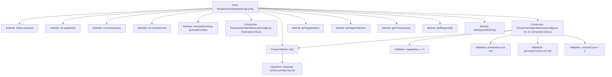

# Basic Information

|      |      |
|------|------|
| Name | PrivateInformationRetrievalConfig |
| Language | .java |
| Code Path | WeFe/mpc/mpc-pir/mpc-pir-sdk/src/main/java/com/welab/wefe/mpc/pir/sdk/config/PrivateInformationRetrievalConfig.java |
| Package Name | com.welab.wefe.mpc.pir.sdk.config |
| Dependencies | ['com.welab.wefe.mpc.pir.sdk.confuse.GenerateConfuse', 'java.util.List', 'java.util.Random'] |
| Brief Description | The `PrivateInformationRetrievalConfig` class is used for private information retrieval configuration, containing the target index, primary key list, and query obfuscation functionality. When the primary key list size is 1, it generates an obfuscated query set and randomly sets the target index. It provides constructor methods and validation logic to ensure parameter legality. |

# Description

The `PrivateInformationRetrievalConfig` class is used to configure private information retrieval parameters, including request ID, target index, primary key list, and confusion parameters. The target index must be greater than 0, and the primary key list cannot be empty. When the number of primary keys is 1, the confusion query set must be generated via the `generateConfuse` interface, and the number of confusions must be greater than 1. The constructor validates parameter legality and randomly generates the target index and confusion primary key list when the number of primary keys is 1. Getter and setter methods are provided to access and modify configuration parameters.

# Class Summary

| Name   | Type  | Description |
|-------|------|-------------|
| PrivateInformationRetrievalConfig | class | The `PrivateInformationRetrievalConfig` class is used for private information retrieval configuration, containing the request ID, target index, primary key list, and query obfuscation functionality. When the number of primary keys is 1, the `generateConfuse` method generates an obfuscated query set to ensure the target index is random yet valid. The constructor validates parameter legality and initializes the configuration. |


## Class PrivateInformationRetrievalConfig

|      |      |
|------|------|
| Access Modifier | public |
| Type | class |
| Name | PrivateInformationRetrievalConfig |
| Description | The `PrivateInformationRetrievalConfig` class is used for private information retrieval configuration, containing the request ID, target index, primary key list, and query obfuscation functionality. When the number of primary keys is 1, the `generateConfuse` method generates an obfuscated query set to ensure the target index is random yet valid. The constructor validates parameter legality and initializes the configuration. |


### UML Class Diagram

```mermaid
classDiagram
    class PrivateInformationRetrievalConfig {
        -String requestId
        -int targetIndex
        -List~Object~ primaryKeys
        -int confuseCount
        -GenerateConfuse generateConfuse
        +PrivateInformationRetrievalConfig(List~Object~ primaryKeys, GenerateConfuse generateConfuse)
        +PrivateInformationRetrievalConfig(List~Object~ primaryKeys, int targetIndex, int confuseCount, GenerateConfuse generateConfuse)
        -void init()
        +Integer getTargetIndex()
        +void setTargetIndex(int targetIndex)
        +List~Object~ getPrimaryKeys()
        +String getRequestId()
        +void setRequestId(String requestId)
    }

    <<Interface>> GenerateConfuse {
        +List~Object~ generate(int count, Object key)
    }

    PrivateInformationRetrievalConfig --> GenerateConfuse : depends on
```

Class diagram description:
The PrivateInformationRetrievalConfig class is used to configure private information retrieval parameters, containing private fields such as target index, primary key list, confusion count, and request ID. Parameter validation and initialization are performed through constructors. When the primary key list size is 1, the GenerateConfuse interface is used to generate confusion data. This class provides methods to get and set the target index, primary key list, and request ID, and implements the confusion processing logic for the primary key list through the init method.


### Internal Method Call Graph



This flowchart illustrates the complete structure of the private information retrieval configuration class. The core lies in the parameter validation logic and initialization process, where a primaryKeys size of 1 triggers the confuse primary key generation mechanism. The constructor includes four layers of parameter validation, after which the init() method is called to generate a random target index and expand the primary key list, ensuring query privacy. Attributes include key fields such as request ID and target index, with standard getter/setter methods provided.

### Field List

| Name  | Type  | Description |
|-------|-------|------|
| primaryKeys | List<Object> | List of objects storing primary keys. |
| targetIndex = -1 | int | Declare a private integer variable targetIndex with an initial value of -1. |
| requestId | String | The private string variable requestId is used to uniquely identify a request. |
| generateConfuse | GenerateConfuse | Private generation of obfuscated objects. |
| confuseCount = 100 | int | The private integer variable confuseCount has an initial value of 100. |

### Method List

| Name  | Type  | Description |
|-------|-------|------|
| setTargetIndex | void | Methods for setting the target index, assigning the parameter value to the class member variable `targetIndex`. |
| init | void | Initialization method: When the number of primary keys is 1, randomly generate obfuscation values and insert the primary key at a random position, then update the primary key list. |
| getPrimaryKeys | List<Object> | Methods for obtaining a list of primary keys, returning a collection object that stores the primary keys. |
| getTargetIndex | Integer | Methods to obtain the target index value, returns an integer type. |
| getRequestId | String | Methods to obtain the request ID, returns a string-type requestId. |
| setRequestId | void | The method to set the request ID assigns the passed `requestId` to the `requestId` property of the current object. |


