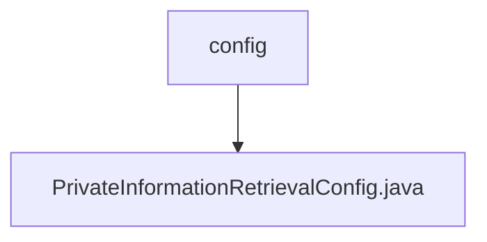

# Basic Information

|      |      |
|------|------|
| Name | config |
| Language | .java |
| Code Path | WeFe/mpc/mpc-pir/mpc-pir-sdk/src/main/java/com/welab/wefe/mpc/pir/sdk/config |
| Package Name | docs.mpc.mpc-pir.mpc-pir-sdk.src.main.java.com.welab.wefe.mpc.pir.sdk.config |
| Brief Description | The `PrivateInformationRetrievalConfig` class is used for private information retrieval configuration, including the target index, primary key list, and query obfuscation functionality. When the primary key list size is 1, it generates an obfuscated query set and randomly sets the target index. It provides constructor methods and validation logic to ensure parameter legality. |

# Description

The `PrivateInformationRetrievalConfig` class is used to configure private information retrieval parameters, including request ID, target index, primary key list, and confusion parameters. The target index must be greater than 0, and the primary key list cannot be empty. When the number of primary keys is 1, the confusion query set must be generated via the `generateConfuse` interface, and the number of confusion items must be greater than 1. The constructor validates parameter legality and randomly generates the target index and confusion primary key list when the number of primary keys is 1. Getter and setter methods are provided to access and modify configuration parameters.

### Package Internal Structure View

This flowchart illustrates the configuration directory structure of the MPC-PIR-SDK module in the WeFe project. The top-level node is the config folder, which contains a configuration file named PrivateInformationRetrievalConfig.java. This structure reflects a typical Java project configuration layer design, where configuration classes are centrally stored in a dedicated directory for unified management and maintenance.

# File List

| Name   | Type  | Description |
|-------|------|-------------|
| [PrivateInformationRetrievalConfig.java](PrivateInformationRetrievalConfig.md) | file | The `PrivateInformationRetrievalConfig` class is used for private information retrieval configuration, containing the target index, primary key list, and query obfuscation functionality. When the primary key list size is 1, it generates an obfuscated query set and randomly sets the target index. It provides constructor methods and validation logic to ensure parameter legality. |

