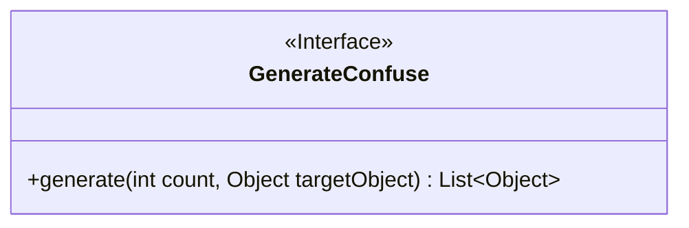
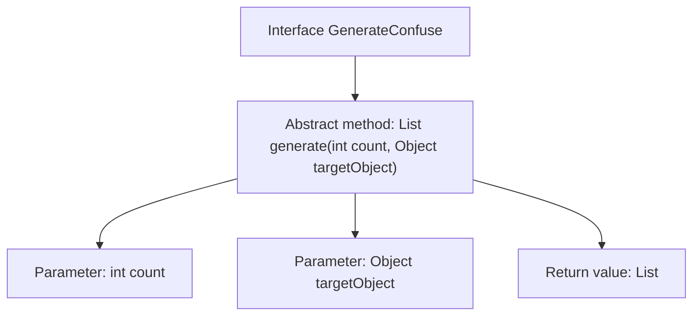

# Basic Information

|      |      |
|------|------|
| Name | GenerateConfuse |
| Language | .java |
| Code Path | WeFe/mpc/mpc-pir/mpc-pir-sdk/src/main/java/com/welab/wefe/mpc/pir/sdk/confuse/GenerateConfuse.java |
| Package Name | com.welab.wefe.mpc.pir.sdk.confuse |
| Dependencies | ['java.util.List'] |
| Brief Description | The interface `GenerateConfuse` defines the method `generate`, which produces a list of specified quantity of objects differing from the target object. |

# Description

GenerateConfuse is an interface that defines a method called `generate`, which is used to produce a list of objects differing from the target object in a specified quantity. The method accepts two parameters: `count` indicating the number of objects to generate, and `targetObject` representing the target object. The return value is a list containing the generated objects. This method is designed to create multiple object instances that exhibit differences from the target object.

# Class Summary

| Name   | Type  | Description |
|-------|------|-------------|
| GenerateConfuse | interface | ```textThe interface GenerateConfuse defines a method for generating multiple objects that differ from the target object, with parameters being the quantity and the target object, and returns a list of objects.``` |


## Class GenerateConfuse

|      |      |
|------|------|
| Access Modifier | public |
| Type | interface |
| Name | GenerateConfuse |
| Description | ```textThe interface GenerateConfuse defines a method for generating multiple objects that differ from the target object, with parameters being the quantity and the target object, and returns a list of objects.``` |


### UML Class Diagram



This code defines an interface named GenerateConfuse, which declares a method for generating confused objects. The core functionality of the interface is to produce a list of objects differing from the target object via the `generate` method. The method takes two parameters: `count` specifies the quantity to generate, and `targetObject` serves as the reference object; the return value is a List collection of Object type. This design is suitable for scenarios requiring dynamic generation of differentiated objects, such as test data generation or obfuscation algorithm implementation. The interface ensures type safety of the returned collection through the generic `List~Object~`, reflecting sound abstraction design principles.


### Internal Method Call Graph



This flowchart illustrates the structure of the `GenerateConfuse` interface, with its core being the abstract method `generate`. It accepts two parameters (`count` for generation quantity and `targetObject` as the target object) and returns a list containing distinct objects. The interface defines a contract for generating instances that differ from the target object, requiring implementations to fulfill logic such as parameter validation, object differentiation, and collection return. The arrows clearly depict the hierarchical relationship between the method signature and its parameters.

### Field List

| Name  | Type  | Description |
|-------|-------|------|

### Method List

| Name  | Type  | Description |
|-------|-------|------|
| generate | List<Object> | Generate a list of target objects with the specified quantity. |


