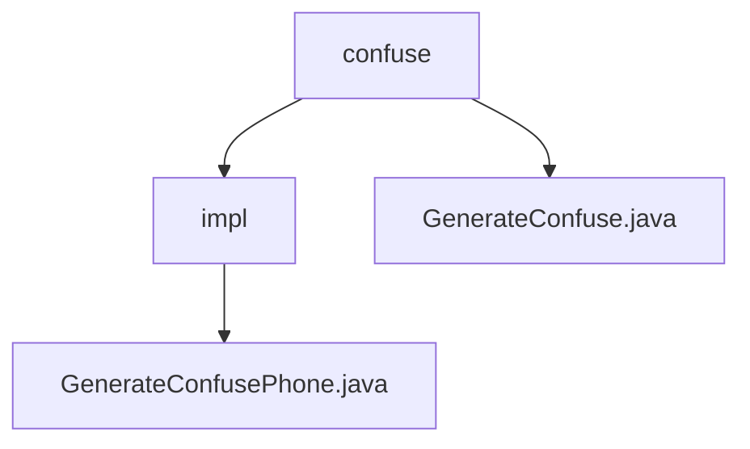

# Basic Information

|      |      |
|------|------|
| Name | confuse |
| Language | .java |
| Code Path | WeFe/mpc/mpc-pir/mpc-pir-sdk/src/main/java/com/welab/wefe/mpc/pir/sdk/confuse |
| Package Name | docs.mpc.mpc-pir.mpc-pir-sdk.src.main.java.com.welab.wefe.mpc.pir.sdk.confuse |
| Brief Description | The `GenerateConfusePhone` class implements the `GenerateConfuse` interface. Its `generate` method generates a specified number of random phone number lists via `RandomPhoneNum.getKeys` and processes the target object string using MD5 encryption. |

# Description

## Overview  
The core responsibility of this module is to implement data obfuscation functionality, generating a list of instances differentiated from the target object through the `GenerateConfuse` interface. The interface specification requires implementing classes to include a `generate` method, which accepts a count parameter `count` and a target object `targetObject`, and returns a list of obfuscated objects.  

Key data structures include the target object string and an MD5 encryption type identifier. External dependencies are limited to the `RandomPhoneNum` utility class. For example, the `GenerateConfusePhone` class invokes `RandomPhoneNum.getKeys` and combines it with MD5 encryption to generate a list of random phone numbers.  

## Primary Business Scenarios  
A typical application pattern is to provide data obfuscation services for Private Information Retrieval (PIR), similar to data desensitization workflows. The business process includes: receiving the target object → generating differentiated instances → returning the obfuscation result. For instance, when a phone number and count parameter are input, the output is a list of random numbers encrypted with MD5.  

The interaction model adheres to standard interface contracts and supports obfuscation for multiple object types. Functional completeness is demonstrated by meeting both quantity control and encryption processing requirements. The API type is a generative interface, with integration examples including specific implementations such as phone number obfuscation.

### Package Internal Structure View

This flowchart illustrates the hierarchical structure of the confuse package in the mpc-pir-sdk project. The root node is the confuse directory, which contains the GenerateConfuse.java file and the impl subdirectory. The impl subdirectory further includes the GenerateConfusePhone.java implementation file, clearly presenting the file organization relationships of the obfuscation functionality module.

# File List

| Name   | Type  | Description |
|-------|------|-------------|
| [GenerateConfuse.java](GenerateConfuse.md) | file | The interface `GenerateConfuse` defines the method `generate`, which produces a list of objects differing from the target object by a specified quantity. |
| [impl](impl/_module.md) | package | Generate a class for obfuscating phone numbers, implementing the `GenerateConfuse` interface, which randomly generates a specified number of MD5-encrypted phone number lists. |

