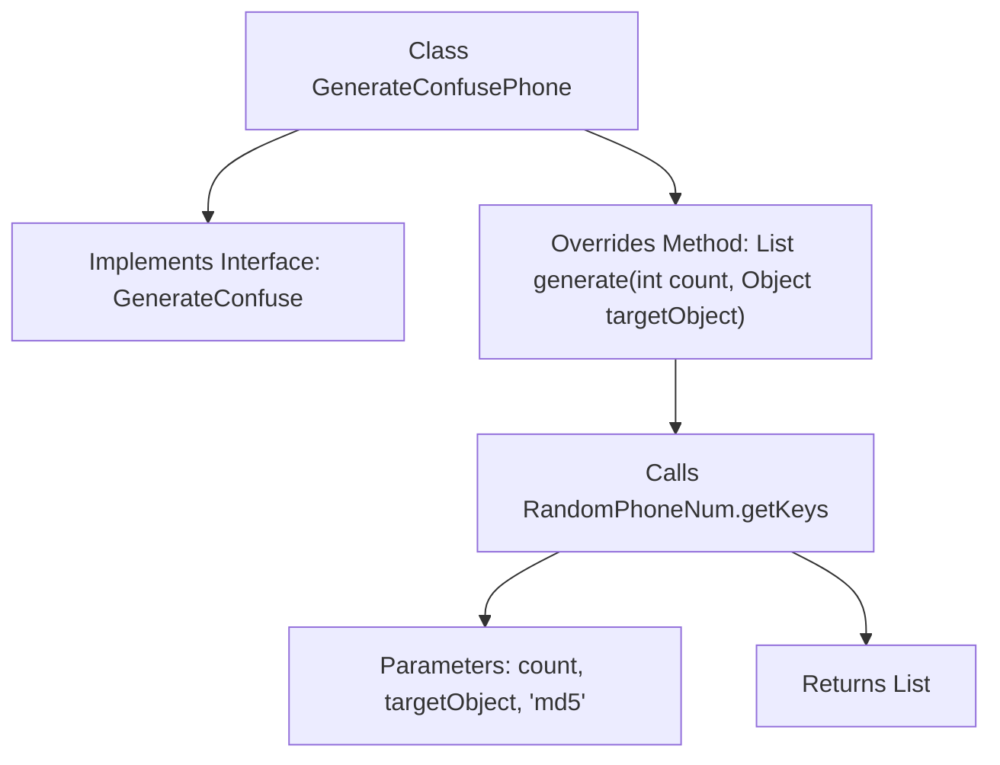

# Basic Information

|      |      |
|------|------|
| Name | GenerateConfusePhone |
| Language | .java |
| Code Path | WeFe/mpc/mpc-pir/mpc-pir-sdk/src/main/java/com/welab/wefe/mpc/pir/sdk/confuse/impl/GenerateConfusePhone.java |
| Package Name | com.welab.wefe.mpc.pir.sdk.confuse.impl |
| Dependencies | ['com.welab.wefe.mpc.commom.AccountEncryptionType', 'com.welab.wefe.mpc.commom.RandomPhoneNum', 'com.welab.wefe.mpc.pir.sdk.confuse.GenerateConfuse', 'java.util.List'] |
| Brief Description | Generate a class for obfuscating phone numbers, implementing the GenerateConfuse interface, by randomly generating a specified number of MD5-encrypted phone number lists. |

# Description

The content describes a class named GenerateConfusePhone, which implements the GenerateConfuse interface. This class includes a generate method that takes an integer count and a target object targetObject as parameters. Internally, the method calls the RandomPhoneNum.getKeys function, passing in count, the targetObject string, and the encryption type md5 to generate and return a specified number of random phone number lists. The entire process involves data obfuscation and MD5 encryption handling.

# Class Summary

| Name   | Type  | Description |
|-------|------|-------------|
| GenerateConfusePhone | class | Generate a class for obfuscating phone numbers, implementing the `GenerateConfuse` interface, to produce a list of randomly generated MD5-encrypted phone numbers in a specified quantity. |


## Class GenerateConfusePhone

|      |      |
|------|------|
| Access Modifier | public |
| Type | class |
| Name | GenerateConfusePhone |
| Description | Generate a class for obfuscating phone numbers, implementing the `GenerateConfuse` interface, to produce a list of randomly generated MD5-encrypted phone numbers in a specified quantity. |


### UML Class Diagram

```mermaid
classDiagram
    class GenerateConfusePhone {
        +generate(int count, Object targetObject) List~Object~
    }
    <<Interface>> GenerateConfuse {
        +generate(int count, Object targetObject) List~Object~
    }
    GenerateConfusePhone ..|> GenerateConfuse : Implements
    GenerateConfusePhone --> RandomPhoneNum : Invokes
    GenerateConfusePhone --> AccountEncryptionType : References

    class RandomPhoneNum {
        +getKeys(int count, String targetObject, String encryptionType) List~Object~
    }
    class AccountEncryptionType {
        <<enumeration>>
        md5
        // Other enum values...
    }
```

This code demonstrates the `GenerateConfusePhone` class implementing the `GenerateConfuse` interface, which generates a list of obfuscated phone numbers by invoking the `RandomPhoneNum.getKeys()` method. The class diagram clearly illustrates the implementation relationship, method invocation, and enumeration reference, with `GenerateConfusePhone` as the core class relying on utility methods from `RandomPhoneNum` and encryption type enums from `AccountEncryptionType`. The design adheres to the Interface Segregation Principle, ensuring flexibility in the returned list through generics.


### Internal Method Call Graph



This flowchart illustrates the structure and method invocation relationships of the GenerateConfusePhone class. The class implements the GenerateConfuse interface and overrides the generate method, which generates a list of random phone numbers by calling RandomPhoneNum.getKeys. Key steps include passing the count parameter, target object, and encryption type 'md5', ultimately returning the processed List<Object> result. The flow clearly demonstrates the complete call chain from method entry to result return.

### Field List

| Name  | Type  | Description |
|-------|-------|------|

### Method List

| Name  | Type  | Description |
|-------|-------|------|
| generate | List<Object> | Method override, generate a specified number of random phone number lists, and use MD5 to encrypt the target object string. |


