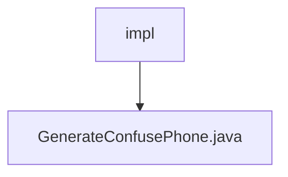

# Basic Information

|      |      |
|------|------|
| Name | impl |
| Language | .java |
| Code Path | WeFe/mpc/mpc-pir/mpc-pir-sdk/src/main/java/com/welab/wefe/mpc/pir/sdk/confuse/impl |
| Package Name | docs.mpc.mpc-pir.mpc-pir-sdk.src.main.java.com.welab.wefe.mpc.pir.sdk.confuse.impl |
| Brief Description | Generate a class for obfuscating phone numbers, implementing the `GenerateConfuse` interface, which randomly generates a specified number of MD5-encrypted phone number lists. |

# Description

The content describes a class named GenerateConfusePhone, which implements the GenerateConfuse interface. This class includes a generate method that takes an integer count and a target object targetObject as parameters. Inside the method, it calls the RandomPhoneNum.getKeys function, passing in count, the targetObject string, and the encryption type md5 to generate and return a specified number of random phone number lists. The entire process involves data obfuscation and MD5 encryption processing.

### Package Internal Structure View

This flowchart illustrates a simple hierarchical relationship where the "impl" folder contains the "GenerateConfusePhone.java" file. It represents a typical Java project structure, indicating the implementation class file for generating obfuscated phone numbers under the functional implementation directory for obfuscation. The entire structure clearly reflects the organization of the source code.

# File List

| Name   | Type  | Description |
|-------|------|-------------|
| [GenerateConfusePhone.java](GenerateConfusePhone.md) | file | Generate a class for obfuscating phone numbers, implementing the `GenerateConfuse` interface, which randomly generates a specified number of MD5-encrypted phone number lists. |

