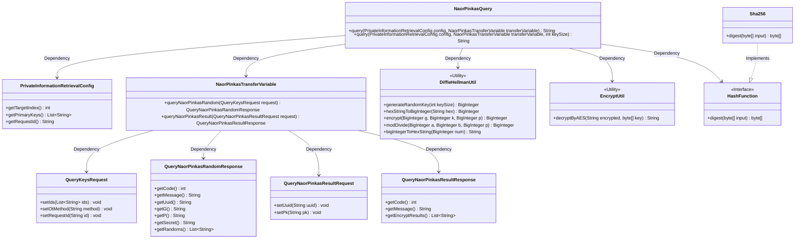
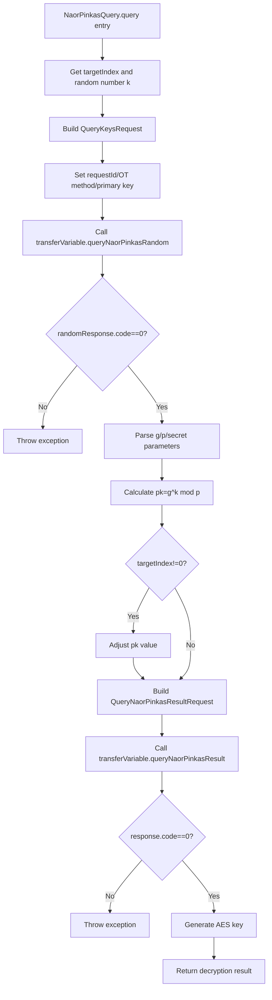

# Basic Information

|      |      |
|------|------|
| Name | NaorPinkasQuery |
| Language | .java |
| Code Path | WeFe/mpc/mpc-pir/mpc-pir-sdk/src/main/java/com/welab/wefe/mpc/pir/sdk/naor/NaorPinkasQuery.java |
| Package Name | com.welab.wefe.mpc.pir.sdk.naor |
| Dependencies | ['java.math.BigInteger', 'java.util.UUID', 'org.apache.commons.lang3.StringUtils', 'com.welab.wefe.mpc.commom.Constants', 'com.welab.wefe.mpc.pir.protocol.ro.hf.HashFunction', 'com.welab.wefe.mpc.pir.protocol.ro.hf.Sha256', 'com.welab.wefe.mpc.pir.request.QueryKeysRequest', 'com.welab.wefe.mpc.pir.request.naor.QueryNaorPinkasRandomResponse', 'com.welab.wefe.mpc.pir.request.naor.QueryNaorPinkasResultRequest', 'com.welab.wefe.mpc.pir.request.naor.QueryNaorPinkasResultResponse', 'com.welab.wefe.mpc.pir.sdk.config.PrivateInformationRetrievalConfig', 'com.welab.wefe.mpc.pir.sdk.trasfer.NaorPinkasTransferVariable', 'com.welab.wefe.mpc.util.DiffieHellmanUtil', 'com.welab.wefe.mpc.util.EncryptUtil'] |
| Brief Description | The NaorPinkasQuery class implements private information retrieval, securely obtaining target index data through Diffie-Hellman key exchange and AES encryption. |

# Description

The `NaorPinkasQuery` class implements private information retrieval query functionality based on the Naor-Pinkas oblivious transfer protocol. This class contains two overloaded methods, with the core method accepting configuration parameters, transmission variables, and a key size, which defaults to 1024 bits. The method first generates a random key `k`, constructs a random query request, and obtains a response. After validating the response, it extracts the parameters. A public key `pk` is generated via Diffie-Hellman encryption, and the target index offset is processed before sending the result request. Finally, the encrypted result of the target index is returned using SHA-256 hashing and AES decryption. The entire process ensures secure information retrieval while maintaining query privacy.

# Class Summary

| Name   | Type  | Description |
|-------|------|-------------|
| NaorPinkasQuery | class | The NaorPinkasQuery class implements private information retrieval functionality, ensuring data security through Diffie-Hellman key exchange and AES encryption, while supporting custom key sizes and exception handling. |

## Class NaorPinkasQuery

|      |      |
|------|------|
| Access Modifier | public |
| Type | class |
| Name | NaorPinkasQuery |
| Description | The NaorPinkasQuery class implements private information retrieval functionality, ensuring data security through Diffie-Hellman key exchange and AES encryption, while supporting custom key sizes and exception handling. |

### UML Class Diagram

Class Diagram Description: This diagram illustrates the relationship between the NaorPinkasQuery class and multiple auxiliary classes, including the configuration class PrivateInformationRetrievalConfig, transfer variable class NaorPinkasTransferVariable, request/response classes (QueryKeysRequest, etc.), encryption utility classes DiffieHellmanUtil and EncryptUtil, as well as the hash interface HashFunction and its implementation Sha256. NaorPinkasQuery achieves privacy-preserving information retrieval functionality based on the Naor-Pinkas oblivious transfer protocol by composing these classes.

### Internal Method Call Graph

This flowchart illustrates the complete query process of the Naor-Pinkas Private Information Retrieval protocol. Starting from parameter initialization, it involves two rounds of OT protocol interaction (random number acquisition and result query), including critical steps such as exception handling, Diffie-Hellman key calculation, and AES decryption, ultimately returning the decrypted result of the target index. The entire process strictly adheres to the Naor-Pinkas protocol specifications, ensuring secure data retrieval without exposing the query target.

### Field List

| Name  | Type  | Description |
|-------|-------|------|

### Method List

| Name  | Type  | Description |
|-------|-------|------|
| query | String | The method performs Naor-Pinkas oblivious transfer, generates random keys, processes requests and responses, conducts Diffie-Hellman encryption calculations, and ultimately decrypts and returns the target index result. |
| query | String | Java Method: Queries information based on configuration and transfer variables, with a default buffer size of 1024, may throw exceptions. |

