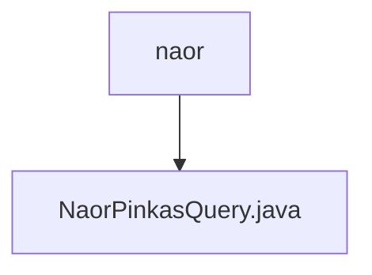

# Basic Information

|      |      |
|------|------|
| Name | naor |
| Language | .java |
| Code Path | WeFe/mpc/mpc-pir/mpc-pir-sdk/src/main/java/com/welab/wefe/mpc/pir/sdk/naor |
| Package Name | docs.mpc.mpc-pir.mpc-pir-sdk.src.main.java.com.welab.wefe.mpc.pir.sdk.naor |
| Brief Description | The NaorPinkasQuery class implements private information retrieval, securely retrieving target index data through Diffie-Hellman key exchange and AES encryption. |

# Description

The `NaorPinkasQuery` class implements private information retrieval query functionality based on the Naor-Pinkas oblivious transfer protocol. This class contains two overloaded methods, with the core method accepting configuration parameters, transmission variables, and a key size (defaulting to 1024 bits). The method first generates a random key `k`, constructs a random query request and obtains the response, then verifies the response validity before extracting parameters. It generates a public key `pk` via Diffie-Hellman encryption, processes the target index offset, and sends the result request. Finally, it uses SHA-256 hashing and AES decryption to return the encrypted result of the target index. The entire process achieves secure information retrieval while ensuring query privacy.

### Package Internal Structure View

This flowchart illustrates the package structure of the `naor` directory within the `mpc-pir-sdk` module of the WeFe project, where the `naor` directory contains a Java file named `NaorPinkasQuery.java`. It indicates that in the Private Information Retrieval SDK, the query functionality related to the Naor-Pinkas protocol is implemented and encapsulated within this standalone file.

# File List

| Name   | Type  | Description |
|-------|------|-------------|
| [NaorPinkasQuery.java](NaorPinkasQuery.md) | file | The NaorPinkasQuery class implements private information retrieval, securely retrieving target index data through Diffie-Hellman key exchange and AES encryption. |

