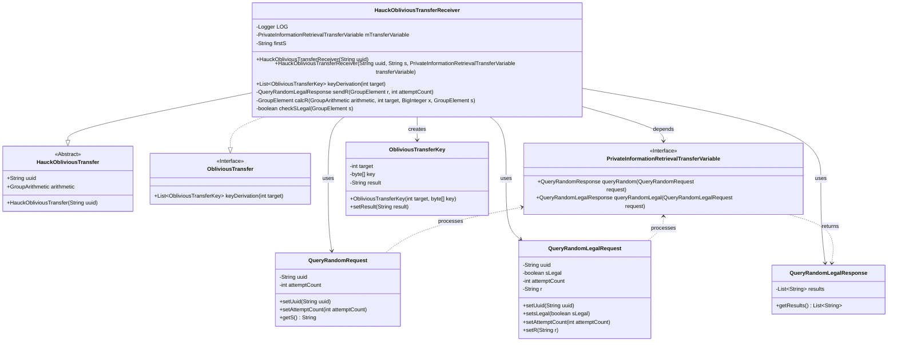
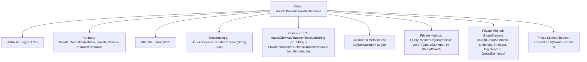
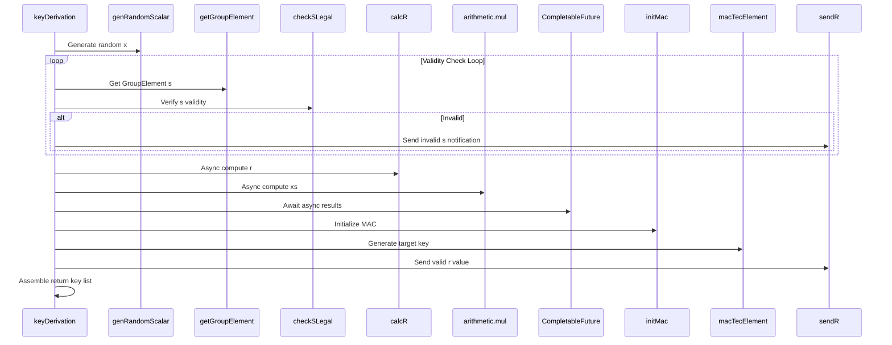

# Basic Information

|      |      |
|------|------|
| Name | HauckObliviousTransferReceiver |
| Language | .java |
| Code Path | WeFe/mpc/mpc-pir/mpc-pir-sdk/src/main/java/com/welab/wefe/mpc/pir/sdk/protocol/HauckObliviousTransferReceiver.java |
| Package Name | com.welab.wefe.mpc.pir.sdk.protocol |
| Dependencies | ['java.math.BigInteger', 'java.util.ArrayList', 'java.util.List', 'java.util.concurrent.CompletableFuture', 'java.util.concurrent.ExecutionException', 'org.slf4j.Logger', 'org.slf4j.LoggerFactory', 'com.welab.wefe.mpc.commom.Conversion', 'com.welab.wefe.mpc.pir.protocol.nt.group.GroupArithmetic', 'com.welab.wefe.mpc.pir.protocol.nt.group.GroupElement', 'com.welab.wefe.mpc.pir.protocol.ot.ObliviousTransfer', 'com.welab.wefe.mpc.pir.protocol.ot.ObliviousTransferKey', 'com.welab.wefe.mpc.pir.protocol.ot.hauck.HauckObliviousTransfer', 'com.welab.wefe.mpc.pir.request.QueryRandomLegalRequest', 'com.welab.wefe.mpc.pir.request.QueryRandomLegalResponse', 'com.welab.wefe.mpc.pir.request.QueryRandomRequest', 'com.welab.wefe.mpc.pir.sdk.trasfer.PrivateInformationRetrievalTransferVariable', 'com.welab.wefe.mpc.util.EncryptUtil', 'cn.hutool.core.util.StrUtil'] |
| Brief Description | The `HauckObliviousTransferReceiver` class implements the `ObliviousTransfer` interface and is responsible for key derivation. By generating a random number `x` and verifying the validity of `s`, it calculates `r` and `xs`, ultimately generating the target key. It includes asynchronous operations and error handling. |

# Description

The `HauckObliviousTransferReceiver` class implements the `ObliviousTransfer` interface and is responsible for executing the receiver logic of the oblivious transfer protocol. This class includes attributes such as a UUID identifier, transfer variables, and an initial value `S`. The core method `keyDerivation` completes key derivation through steps such as generating a random number `x`, validating the legality of `S`, computing the values of `R` and `XS`, initializing the MAC, and generating the target key. The process employs asynchronous computation and legality verification mechanisms, ultimately returning an `ObliviousTransferKey` list containing the target key and results. Auxiliary methods include operations such as sending the `R` value, computing the `R` value, and checking the legality of `S`.

# Class Summary

| Name   | Type  | Description |
|-------|------|-------------|
| HauckObliviousTransferReceiver | class | The `HauckObliviousTransferReceiver` class implements the `ObliviousTransfer` interface and is responsible for key derivation. By generating a random number `x` and verifying the validity of `s`, it calculates `r` and `xs` to ultimately generate the target key. It includes asynchronous computation and error handling logic. |

## Class HauckObliviousTransferReceiver

|      |      |
|------|------|
| Access Modifier | public |
| Type | class |
| Name | HauckObliviousTransferReceiver |
| Description | The `HauckObliviousTransferReceiver` class implements the `ObliviousTransfer` interface and is responsible for key derivation. By generating a random number `x` and verifying the validity of `s`, it calculates `r` and `xs` to ultimately generate the target key. It includes asynchronous computation and error handling logic. |

### UML Class Diagram

This code describes an implementation of a receiver for oblivious transfer based on the Hauck protocol, which inherits from the abstract class HauckObliviousTransfer and implements the ObliviousTransfer interface. The core functionality involves generating target keys through the keyDerivation method, encompassing operations such as random number generation, group arithmetic, legality checks, and asynchronous communication. The class diagram illustrates the interaction between the receiver and the transfer variable interface, request-response objects, as well as the data flow during the key generation process.

### Internal Method Call Graph

This flowchart illustrates the core structure and interaction process of the HauckObliviousTransferReceiver class. Inheriting from HauckObliviousTransfer and implementing the ObliviousTransfer interface, the class contains attributes like logger and transfer variables, along with the key derivation method. The sequence diagram details the execution flow of the keyDerivation method: starting from random number generation, verifying parameter validity through loops, leveraging asynchronous computation for performance, and ultimately completing key derivation and result return. The entire process involves multiple cryptographic operations and thread coordination, reflecting the core processing logic of secure transfer protocols.

### Field List

| Name  | Type  | Description |
|-------|-------|------|
| mTransferVariable | PrivateInformationRetrievalTransferVariable | Private Information Retrieval Transfer Variable mTransferVariable. |
| firstS | String | Declare a string variable firstS. |
| LOG = LoggerFactory.getLogger(HauckObliviousTransferReceiver.class) | Logger | The `HauckObliviousTransferReceiver` class defines a private static logger instance named `LOG`. |

### Method List

| Name  | Type  | Description |
|-------|-------|------|
| sendR | QueryRandomLegalResponse | The method sendR sends a random legitimate request, sets the UUID, legitimate flag, attempt count, and R value, returns the query result, and logs the record. |
| keyDerivation | List<ObliviousTransferKey> | Method to Generate ObliviousTransferKey: Generate a random number x, iteratively obtain a valid s, asynchronously compute r and xs, initialize the mac, and generate the key, finally returning a key list containing the results. |
| calcR | GroupElement | The method calcR computes the group element r. The process involves: generating t via hashing, computing ct=c*t and xg=x*generator, and finally r=ct+xg. Logging marks the start and end. |
| checkSLegal | boolean | Check whether the GroupElement object s is within the arithmetic group, returning a boolean value. |

