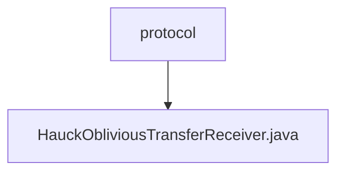

# Basic Information

|      |      |
|------|------|
| Name | protocol |
| Language | .java |
| Code Path | WeFe/mpc/mpc-pir/mpc-pir-sdk/src/main/java/com/welab/wefe/mpc/pir/sdk/protocol |
| Package Name | docs.mpc.mpc-pir.mpc-pir-sdk.src.main.java.com.welab.wefe.mpc.pir.sdk.protocol |
| Brief Description | The `HauckObliviousTransferReceiver` class implements the `ObliviousTransfer` interface and is responsible for key derivation. By generating a random number `x` and verifying the validity of `s`, it calculates `r` and `xs` to ultimately generate the target key. It includes asynchronous operations and error handling. |

# Description

The `HauckObliviousTransferReceiver` class implements the `ObliviousTransfer` interface and is responsible for executing the receiver logic of the oblivious transfer protocol. This class includes attributes such as a UUID identifier, transfer variables, and an initial value `S`. The core method, `keyDerivation`, completes key derivation through steps such as generating a random number `x`, validating the legality of `S`, computing the values of `R` and `XS`, initializing the MAC, and generating the target key. The process employs asynchronous computation and legality-checking mechanisms, ultimately returning an `ObliviousTransferKey` list containing the target key and results. Auxiliary methods include operations such as sending the value of `R`, computing the value of `R`, and checking the legality of `S`.

### Package Internal Structure View

This flowchart illustrates the structural relationships within the protocol layer of the MPC-PIR-SDK project. The `protocol` directory contains the implementation file `HauckObliviousTransferReceiver.java`, which represents the core code file implementing the receiver logic of the Hauck oblivious transfer protocol. It belongs to the protocol implementation layer of the Privacy Information Retrieval SDK.

# File List

| Name   | Type  | Description |
|-------|------|-------------|
| [HauckObliviousTransferReceiver.java](HauckObliviousTransferReceiver.md) | file | The HauckObliviousTransferReceiver class implements the ObliviousTransfer interface and is responsible for key derivation. By generating a random number x and verifying the validity of s, it calculates r and xs to ultimately produce the target key. It includes asynchronous operations and error handling. |

