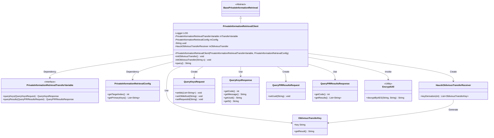
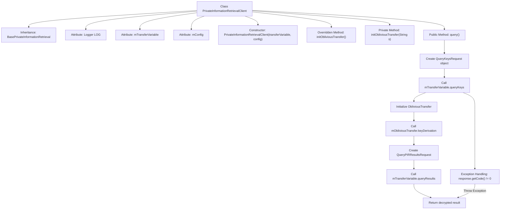

# Basic Information

|      |      |
|------|------|
| Name | PrivateInformationRetrievalClient |
| Language | .java |
| Code Path | WeFe/mpc/mpc-pir/mpc-pir-sdk/src/main/java/com/welab/wefe/mpc/pir/sdk/query/PrivateInformationRetrievalClient.java |
| Package Name | com.welab.wefe.mpc.pir.sdk.query |
| Dependencies | ['org.slf4j.Logger', 'org.slf4j.LoggerFactory', 'com.welab.wefe.mpc.commom.Constants', 'com.welab.wefe.mpc.pir.flow.BasePrivateInformationRetrieval', 'com.welab.wefe.mpc.pir.protocol.ot.ObliviousTransferKey', 'com.welab.wefe.mpc.pir.request.QueryKeysRequest', 'com.welab.wefe.mpc.pir.request.QueryKeysResponse', 'com.welab.wefe.mpc.pir.request.QueryPIRResultsRequest', 'com.welab.wefe.mpc.pir.request.QueryPIRResultsResponse', 'com.welab.wefe.mpc.pir.sdk.config.PrivateInformationRetrievalConfig', 'com.welab.wefe.mpc.pir.sdk.protocol.HauckObliviousTransferReceiver', 'com.welab.wefe.mpc.pir.sdk.trasfer.PrivateInformationRetrievalTransferVariable', 'com.welab.wefe.mpc.util.EncryptUtil', 'cn.hutool.core.lang.UUID'] |
| Brief Description | The `PrivateInformationRetrievalClient` class inherits from `BasePrivateInformationRetrieval`, initializes with transmission variables and configurations, and implements private information retrieval functionality based on `HauckObliviousTransfer`, including key generation, query requests, and result decryption. |

# Description

The `PrivateInformationRetrievalClient` class inherits from `BasePrivateInformationRetrieval` and implements private information retrieval client functionality. This class contains the transfer variable `mTransferVariable` and configuration `mConfig`, which are initialized via the constructor. It provides the `initObliviousTransfer` method to initialize oblivious transfer and the `query` method to execute the query process: generating requests, obtaining responses, initializing transfers, deriving keys, and ultimately decrypting and returning the target index result. During the process, UUIDs are used to identify requests, key steps are logged, and error messages are thrown when exceptions occur.

# Class Summary

| Name   | Type  | Description |
|-------|------|-------------|
| PrivateInformationRetrievalClient | class | Private Information Retrieval Client Class, inherits from the base class, includes transmission variables and configurations, provides initialization for OT and query methods, handles key requests and result decryption. |

## Class PrivateInformationRetrievalClient

|      |      |
|------|------|
| Access Modifier | public |
| Type | class |
| Name | PrivateInformationRetrievalClient |
| Description | Private Information Retrieval Client Class, inherits from the base class, includes transmission variables and configurations, provides initialization for OT and query methods, handles key requests and result decryption. |

### UML Class Diagram

This code demonstrates a private information retrieval client implementation that inherits from a base abstract class, achieving secure query functionality through transfer variables and configuration objects. The core class PrivateInformationRetrievalClient contains query flow control, OT protocol initialization, and key derivation capabilities. It depends on multiple request/response DTO classes and encryption utility classes, interacting with the server via transfer variable interfaces to implement a secure query mechanism based on the Hauck OT protocol.

### Internal Method Call Graph

This code demonstrates the implementation flow of a private information retrieval client. Inheriting from a base class, the client is initialized via transfer variables and configurations, primarily providing query functionality. The query process involves request construction, key exchange, result decryption, and other steps, encompassing multiple network requests and exception handling. The flowchart clearly presents the complete call chain from initialization to result return, particularly highlighting error handling branches and critical data processing nodes (such as key derivation and result decryption), reflecting the core logic of secure communication and data processing.

### Field List

| Name  | Type  | Description |
|-------|-------|------|
| LOG = LoggerFactory.getLogger(PrivateInformationRetrievalClient.class) | Logger | Private static constant LOG, used for logging in the PrivateInformationRetrievalClient class. |
| mTransferVariable | PrivateInformationRetrievalTransferVariable | Private Information Retrieval Transfer Variable mTransferVariable. |
| mConfig | PrivateInformationRetrievalConfig | Private Information Retrieval configuration object mConfig. |

### Method List

| Name  | Type  | Description |
|-------|-------|------|
| initObliviousTransfer | void | Initialize ObliviousTransfer by creating an instance of HauckObliviousTransferReceiver using uuid, string s, and mTransferVariable. |
| initObliviousTransfer | void | The method `initObliviousTransfer` is an empty implementation used to initialize the oblivious transfer protocol. |
| query | String | The method `query` executes the query process: initializes the request, obtains the key response, handles exceptions; if the result is empty, initiates a secondary query, and returns the target index result after decryption. |

