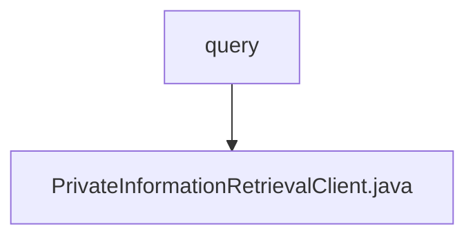

# Basic Information

|      |      |
|------|------|
| Name | query |
| Language | .java |
| Code Path | WeFe/mpc/mpc-pir/mpc-pir-sdk/src/main/java/com/welab/wefe/mpc/pir/sdk/query |
| Package Name | docs.mpc.mpc-pir.mpc-pir-sdk.src.main.java.com.welab.wefe.mpc.pir.sdk.query |
| Brief Description | The `PrivateInformationRetrievalClient` class inherits from `BasePrivateInformationRetrieval`, initializes with transmission variables and configurations, and implements private information retrieval functionality based on `HauckObliviousTransfer`, including key generation, query requests, and result decryption. |

# Description

The `PrivateInformationRetrievalClient` class inherits from `BasePrivateInformationRetrieval` and is used to implement private information retrieval client functionality. This class contains the transfer variable `mTransferVariable` and the configuration `mConfig`, which are initialized via the constructor. It provides the `initObliviousTransfer` method to initialize oblivious transfer and the `query` method to execute the query process: generating requests, obtaining responses, initializing transfers, deriving keys, and ultimately decrypting and returning the target index result. During the process, a UUID is used to identify requests, key steps are logged, and error messages are thrown in case of exceptions.

### Package Internal Structure View

This flowchart illustrates the query package structure of the MPC-PIR-SDK module in the WeFe project. The query directory contains a core client class, PrivateInformationRetrievalClient.java, which implements private information retrieval functionality. This concise hierarchical relationship reflects the single responsibility design principle of the SDK module, with query serving as the entry point to centrally manage all retrieval-related implementations.

# File List

| Name   | Type  | Description |
|-------|------|-------------|
| [PrivateInformationRetrievalClient.java](PrivateInformationRetrievalClient.md) | file | The `PrivateInformationRetrievalClient` class inherits from `BasePrivateInformationRetrieval`, initializes through the transfer of variables and configurations, and implements private information retrieval functionality based on Hauck Oblivious Transfer, including key generation, query requests, and result decryption. |

