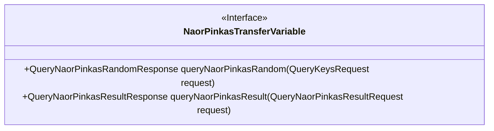
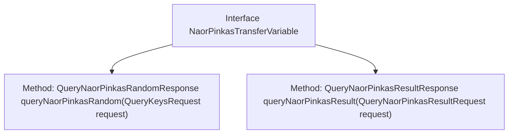

# Basic Information

|      |      |
|------|------|
| Name | NaorPinkasTransferVariable |
| Language | .java |
| Code Path | WeFe/mpc/mpc-pir/mpc-pir-sdk/src/main/java/com/welab/wefe/mpc/pir/sdk/trasfer/NaorPinkasTransferVariable.java |
| Package Name | com.welab.wefe.mpc.pir.sdk.trasfer |
| Dependencies | ['com.welab.wefe.mpc.pir.request.QueryKeysRequest', 'com.welab.wefe.mpc.pir.request.naor.QueryNaorPinkasRandomResponse', 'com.welab.wefe.mpc.pir.request.naor.QueryNaorPinkasResultRequest', 'com.welab.wefe.mpc.pir.request.naor.QueryNaorPinkasResultResponse'] |
| Brief Description | The NaorPinkasTransferVariable interface defines two methods: queryNaorPinkasRandom for querying random numbers and queryNaorPinkasResult for querying results. |

# Description

The content defines a Java interface named NaorPinkasTransferVariable, which contains two methods. The first method, queryNaorPinkasRandom, accepts a parameter of type QueryKeysRequest and returns a result of type QueryNaorPinkasRandomResponse. The second method, queryNaorPinkasResult, accepts a parameter of type QueryNaorPinkasResultRequest and returns a result of type QueryNaorPinkasResultResponse. Both methods are used for query operations, but their specific functionalities are not detailed. The interface name and parameter types suggest that it may involve handling transmission variables related to the Naor-Pinkas protocol.

# Class Summary

| Name   | Type  | Description |
|-------|------|-------------|
| NaorPinkasTransferVariable | interface | The NaorPinkasTransferVariable interface defines two methods: querying the NaorPinkas random number and querying the NaorPinkas result. |

## Class NaorPinkasTransferVariable

|      |      |
|------|------|
| Access Modifier | public |
| Type | interface |
| Name | NaorPinkasTransferVariable |
| Description | The NaorPinkasTransferVariable interface defines two methods: querying the NaorPinkas random number and querying the NaorPinkas result. |

### UML Class Diagram

This class diagram illustrates an interface named NaorPinkasTransferVariable, which defines two public methods: queryNaorPinkasRandom and queryNaorPinkasResult. The former accepts a parameter of type QueryKeysRequest and returns QueryNaorPinkasRandomResponse, while the latter takes QueryNaorPinkasResultRequest as input and returns QueryNaorPinkasResultResponse. This interface is likely used to implement random number query and result query functionalities in a secure transmission protocol, reflecting a modular design philosophy.

### Internal Method Call Graph

This flowchart illustrates the structure of the NaorPinkasTransferVariable interface, which contains two core methods: queryNaorPinkasRandom and queryNaorPinkasResult. The former processes random number query requests and returns responses, while the latter handles result query requests and provides responses. As an abstract contract, the interface defines standardized method signatures for data transfer, applicable to classes requiring implementation of Naor-Pinkas protocol-related functionalities. Arrows indicate the hierarchical relationship between the interface and its methods, presenting a concise and clear overall structure.

### Field List

| Name  | Type  | Description |
|-------|-------|------|

### Method List

| Name  | Type  | Description |
|-------|-------|------|
| queryNaorPinkasResult | QueryNaorPinkasResultResponse | QueryNaorPinkasResultResponse is the returned result of invoking the queryNaorPinkasResult method, which accepts QueryNaorPinkasResultRequest as its request parameter. |
| queryNaorPinkasRandom | QueryNaorPinkasRandomResponse | The QueryNaorPinkasRandomResponse method accepts a QueryKeysRequest parameter and returns a random response. |

