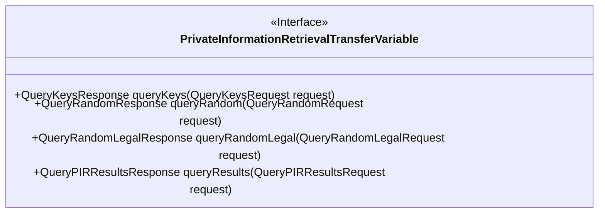
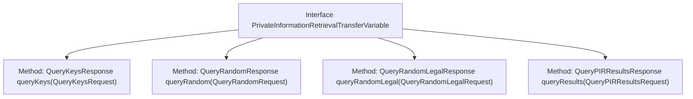

# Basic Information

|      |      |
|------|------|
| Name | PrivateInformationRetrievalTransferVariable |
| Language | .java |
| Code Path | WeFe/mpc/mpc-pir/mpc-pir-sdk/src/main/java/com/welab/wefe/mpc/pir/sdk/trasfer/PrivateInformationRetrievalTransferVariable.java |
| Package Name | com.welab.wefe.mpc.pir.sdk.trasfer |
| Dependencies | ['com.welab.wefe.mpc.pir.request'] |
| Brief Description | The interface defines private information retrieval transmission methods, including sending obfuscated users, obtaining OT random numbers, verifying the legality of random numbers, and retrieving encrypted results. |

# Description

The interface defines four key methods for private information retrieval transmission: queryKeys is used to send obfuscated user data to the server, queryRandom retrieves OT random numbers from the server, queryRandomLegal notifies the server whether the OT random numbers are compliant, and queryResults obtains the encrypted results of all obfuscated users. Each method has corresponding request and response types to implement a secure data retrieval process.

# Class Summary

| Name   | Type  | Description |
|-------|------|-------------|
| PrivateInformationRetrievalTransferVariable | interface | Private Information Retrieval Transmission Interface, which includes four methods: sending obfuscated users, obtaining OT random numbers, verifying the legality of random numbers, and retrieving encrypted results. |

## Class PrivateInformationRetrievalTransferVariable

|      |      |
|------|------|
| Access Modifier | public |
| Type | interface |
| Name | PrivateInformationRetrievalTransferVariable |
| Description | Private Information Retrieval Transmission Interface, which includes four methods: sending obfuscated users, obtaining OT random numbers, verifying the legality of random numbers, and retrieving encrypted results. |

### UML Class Diagram

This interface defines the key communication methods in a Private Information Retrieval (PIR) protocol, encompassing four core operations: querying keys, obtaining OT random numbers, validating random number legality, and retrieving encrypted results for obfuscated users. Each method adopts a request-response pattern, ensuring type safety through specific parameter types, which reflects the complete client-server interaction flow within the PIR protocol.

### Internal Method Call Graph

This flowchart illustrates the structure of the Private Information Retrieval Transfer Variable interface, which comprises four core methods: sending an obfuscated user key request, obtaining OT random numbers, validating random number legality, and retrieving obfuscated user encryption results. Each method follows a request-response pattern, returning corresponding response objects through specific request parameter types, forming a complete privacy information retrieval workflow. The interface design reflects a step-by-step interaction process, ensuring data transmission security and verifiability.

### Field List

| Name  | Type  | Description |
|-------|-------|------|

### Method List

| Name  | Type  | Description |
|-------|-------|------|
| queryKeys | QueryKeysResponse | Query key response method, which receives query key request parameters and returns key information. |
| queryRandom | QueryRandomResponse | Query the random number interface, input request parameters, and return random results. |
| queryRandomLegal | QueryRandomLegalResponse | Randomly query the response interface for legitimate requests, input request parameters, and return random valid results. |
| queryResults | QueryPIRResultsResponse | Query the PIR result response method, receive the query request parameters, and return the query results. |

