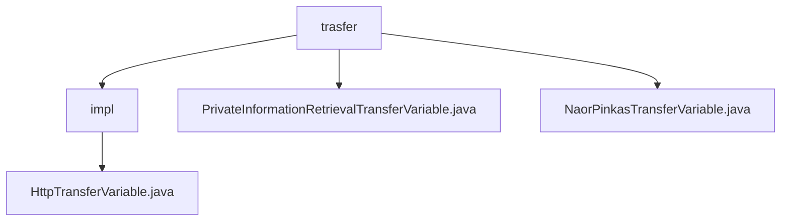

# Basic Information

|      |      |
|------|------|
| Name | trasfer |
| Language | .java |
| Code Path | WeFe/mpc/mpc-pir/mpc-pir-sdk/src/main/java/com/welab/wefe/mpc/pir/sdk/trasfer |
| Package Name | docs.mpc.mpc-pir.mpc-pir-sdk.src.main.java.com.welab.wefe.mpc.pir.sdk.trasfer |
| Brief Description | The HttpTransferVariable class inherits from AbstractHttpTransferVariable and implements two interfaces, providing various query methods that all internally invoke the query method to handle requests and responses. The interfaces define private information retrieval and Naor-Pinkas protocol-related methods. |

# Description

## Overview  
The core responsibility of this module is to implement secure Private Information Retrieval (PIR) functionality based on the Naor-Pinkas protocol, encapsulating the multi-party secure computation process through an abstract transfer variable mechanism. The interface specifications are unified into two categories: PrivateInformationRetrievalTransferVariable provides basic methods such as data obfuscation and OT random number exchange, while NaorPinkasTransferVariable focuses on protocol-specific random numbers and result queries. Key data structures include request/response objects such as QueryKeysRequest and QueryNaorPinkasRandomResponse, with communication parameters configured via CommunicationConfig. External dependencies are limited to the basic communication framework. For example, the queryRandomLegal method is used to verify the compliance of the server's OT random numbers.  

## Primary Business Scenarios  
The typical application pattern follows a client-server secure retrieval process: first sending obfuscated data via queryKeys, then invoking queryNaorPinkasRandom in phases to obtain protocol parameters, and finally using queryResults to retrieve the encrypted results. The interaction resembles a two-phase commit protocol, with all APIs based on a request-response model. For instance, queryNaorPinkasResult implements the final result transmission of the protocol, while queryRandomLegal serves as a compliance checkpoint to ensure process security. The complete functionality covers the entire lifecycle from data preparation to secure retrieval.

### Package Internal Structure View

This flowchart illustrates the hierarchical structure of the trasfer directory in the MPC-PIR-SDK project. The top level is the trasfer folder, which contains an impl subdirectory and two standalone files. The impl subdirectory houses the HttpTransferVariable.java implementation file, while the top-level trasfer directory directly stores two distinct transfer variable class files, designed for private information retrieval and Naor-Pinkas protocol transmission scenarios respectively.

# File List

| Name   | Type  | Description |
|-------|------|-------------|
| [PrivateInformationRetrievalTransferVariable.java](PrivateInformationRetrievalTransferVariable.md) | file | The interface defines private information retrieval transmission methods, including sending obfuscated users, obtaining OT random numbers, verifying the validity of random numbers, and retrieving encrypted results. |
| [NaorPinkasTransferVariable.java](NaorPinkasTransferVariable.md) | file | The NaorPinkasTransferVariable interface defines two methods: queryNaorPinkasRandom for querying random numbers and queryNaorPinkasResult for querying results. |
| [impl](impl/_module.md) | package | The HttpTransferVariable class inherits from AbstractHttpTransferVariable and implements the private information retrieval and NaorPinkas transfer interfaces. It provides various query methods, including random queries, legal queries, key queries, and result queries. |

