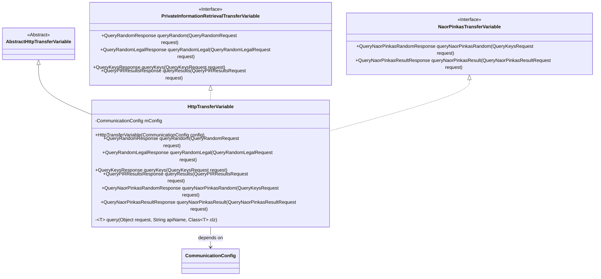

# Basic Information

|      |      |
|------|------|
| Name | HttpTransferVariable |
| Language | .java |
| Code Path | WeFe/mpc/mpc-pir/mpc-pir-sdk/src/main/java/com/welab/wefe/mpc/pir/sdk/trasfer/impl/HttpTransferVariable.java |
| Package Name | com.welab.wefe.mpc.pir.sdk.trasfer.impl |
| Dependencies | ['com.welab.wefe.mpc.config.CommunicationConfig', 'com.welab.wefe.mpc.pir.PrivateInformationRetrievalApiName', 'com.welab.wefe.mpc.pir.request', 'com.welab.wefe.mpc.pir.request.naor.QueryNaorPinkasRandomResponse', 'com.welab.wefe.mpc.pir.request.naor.QueryNaorPinkasResultRequest', 'com.welab.wefe.mpc.pir.request.naor.QueryNaorPinkasResultResponse', 'com.welab.wefe.mpc.pir.sdk.trasfer.NaorPinkasTransferVariable', 'com.welab.wefe.mpc.pir.sdk.trasfer.PrivateInformationRetrievalTransferVariable', 'com.welab.wefe.mpc.trasfer.AbstractHttpTransferVariable'] |
| Brief Description | The HttpTransferVariable class inherits from AbstractHttpTransferVariable and implements the private information retrieval and NaorPinkas transfer interfaces, providing various query methods including random queries, legal queries, key queries, and result queries. |

# Description

The `HttpTransferVariable` class inherits from `AbstractHttpTransferVariable` and implements the `PrivateInformationRetrievalTransferVariable` and `NaorPinkasTransferVariable` interfaces. This class is initialized via `CommunicationConfig` configuration and provides multiple query methods: `queryRandom`, `queryRandomLegal`, `queryKeys`, `queryResults`, `queryNaorPinkasRandom`, and `queryNaorPinkasResult`. All these methods internally invoke the private `query` method, passing in the request object, API name, and response class type, ultimately returning the corresponding response result.

# Class Summary

| Name   | Type  | Description |
|-------|------|-------------|
| HttpTransferVariable | class | The HttpTransferVariable class inherits from AbstractHttpTransferVariable, implements private information retrieval and NaorPinkas transfer interfaces, provides multiple query methods, and processes requests through configuration objects. |

## Class HttpTransferVariable

|      |      |
|------|------|
| Access Modifier | public |
| Type | class |
| Name | HttpTransferVariable |
| Description | The HttpTransferVariable class inherits from AbstractHttpTransferVariable, implements private information retrieval and NaorPinkas transfer interfaces, provides multiple query methods, and processes requests through configuration objects. |

### UML Class Diagram

This class diagram illustrates the inheritance and implementation relationships of the HttpTransferVariable class, which extends the AbstractHttpTransferVariable abstract class and implements both the PrivateInformationRetrievalTransferVariable and NaorPinkasTransferVariable interfaces. The class encapsulates HTTP-related functionalities, including various operations such as random queries, legal queries, key queries, and result queries, with API behaviors controlled through the CommunicationConfig configuration object. The private generic method query() provides a unified implementation foundation for all public query methods.

### Internal Method Call Graph

```mermaid
graph TD
    A["Class HttpTransferVariable"]
    B["Inherits: AbstractHttpTransferVariable"]
    C["Implements: PrivateInformationRetrievalTransferVariable"]
    D["Implements: NaorPinkasTransferVariable"]
    E["Property: CommunicationConfig mConfig"]
    F["Constructor: HttpTransferVariable(CommunicationConfig config)"]
    G["Method: QueryRandomResponse queryRandom(QueryRandomRequest request)"]
    H["Method: QueryRandomLegalResponse queryRandomLegal(QueryRandomLegalRequest request)"]
    I["Method: QueryKeysResponse queryKeys(QueryKeysRequest request)"]
    J["Method: QueryPIRResultsResponse queryResults(QueryPIRResultsRequest request)"]
    K["Method: QueryNaorPinkasRandomResponse queryNaorPinkasRandom(QueryKeysRequest request)"]
    L["Method: QueryNaorPinkasResultResponse queryNaorPinkasResult(QueryNaorPinkasResultRequest request)"]
    M["Private Method: <T> T query(Object request, String apiName, Class<T> clz)"]

    A --> B
    A --> C
    A --> D
    A --> E
    A --> F
    A --> G
    A --> H
    A --> I
    A --> J
    A --> K
    A --> L
    A --> M
    G --> M
    H --> M
    I --> M
    J --> M
    K --> M
    L --> M
```

This flowchart illustrates the structure of the HttpTransferVariable class, which inherits from AbstractHttpTransferVariable and implements two interfaces. Its core functionality involves processing different types of requests through the query method, including random queries, legal random queries, key queries, PIR result queries, as well as random and result queries for the Naor-Pinkas protocol. All public query methods ultimately invoke the private generic query method to handle actual request processing, reflecting the design philosophy of code reuse and unified interfaces.

### Field List

| Name  | Type  | Description |
|-------|-------|------|
| mConfig | CommunicationConfig | Private communication configuration object mConfig. |

### Method List

| Name  | Type  | Description |
|-------|-------|------|
| queryRandom | QueryRandomResponse | This method processes random query requests, invokes internal query methods, and returns responses. |
| queryRandomLegal | QueryRandomLegalResponse | The method receives a query request, calls a private information retrieval interface to obtain random valid data, and returns the query result. |
| queryResults | QueryPIRResultsResponse | The method `queryResults` processes the query request, invokes the `query` method, and returns the `QueryPIRResultsResponse` result. |
| queryKeys | QueryKeysResponse | This method overrides the parent class method, receives query request parameters, calls an internal query interface, and returns the query results. |
| queryNaorPinkasRandom | QueryNaorPinkasRandomResponse | The method `queryNaorPinkasRandom` processes the `QueryKeysRequest` request, invokes the `query` method, and returns the `QueryNaorPinkasRandomResponse` result. |
| queryNaorPinkasResult | QueryNaorPinkasResultResponse | Rewrite the query method to invoke the private information retrieval API for retrieving NaorPinkas results and return the response object. |
| query | T | Private generic method that invokes queries via request objects, API names, and target class types, returning results of the specified type. |

