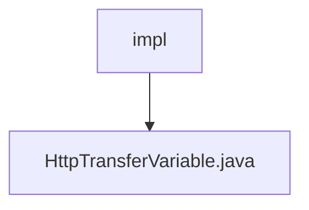

# Basic Information

|      |      |
|------|------|
| Name | impl |
| Language | .java |
| Code Path | WeFe/mpc/mpc-pir/mpc-pir-sdk/src/main/java/com/welab/wefe/mpc/pir/sdk/trasfer/impl |
| Package Name | docs.mpc.mpc-pir.mpc-pir-sdk.src.main.java.com.welab.wefe.mpc.pir.sdk.trasfer.impl |
| Brief Description | The HttpTransferVariable class inherits from AbstractHttpTransferVariable and implements the private information retrieval and NaorPinkas transfer interfaces. It provides various query methods, including random queries, legal queries, key queries, and result queries. |

# Description

The HttpTransferVariable class extends AbstractHttpTransferVariable and implements the PrivateInformationRetrievalTransferVariable and NaorPinkasTransferVariable interfaces. Initialized via CommunicationConfig configuration, this class provides multiple query methods: queryRandom, queryRandomLegal, queryKeys, queryResults, queryNaorPinkasRandom, and queryNaorPinkasResult. All these methods internally invoke the private query method by passing the request object, API name, and response class type, ultimately returning the corresponding response result.

### Package Internal Structure View

This flowchart illustrates the directory structure under the transfer module in the mpc-pir-sdk project, specifically showing the impl folder containing a concrete implementation file, HttpTransferVariable.java. With impl as the parent node and HttpTransferVariable.java as its child node, it clearly presents a single-level file containment relationship. Such a structure is commonly found in Java projects for organizing interface implementation classes, isolating concrete logic for different transfer protocols.

# File List

| Name   | Type  | Description |
|-------|------|-------------|
| [HttpTransferVariable.java](HttpTransferVariable.md) | file | The HttpTransferVariable class inherits from AbstractHttpTransferVariable and implements interfaces for private information retrieval and NaorPinkas transfer. It provides various query methods, including random queries, legal queries, key queries, and result queries. |

