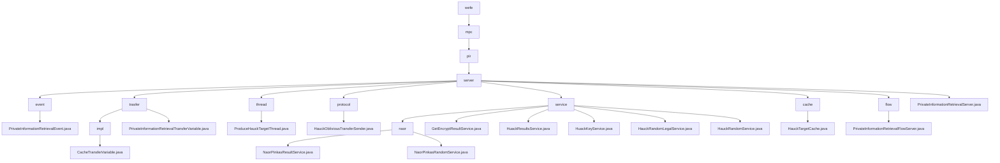

# Basic Information

|      |      |
|------|------|
| Name | welab |
| Language | .java |
| Code Path | WeFe/mpc/mpc-pir/mpc-pir-server/src/main/java/com/welab |
| Package Name | docs.mpc.mpc-pir.mpc-pir-server.src.main.java.com.welab |
| Brief Description | The PrivateInformationRetrievalEvent class handles private information retrieval events, containing uuid and keys attributes. The module implements PIR protocol data transmission and verification, managing random numbers and encrypted data. The ProduceHauckTargetThread thread generates and caches HauckTarget objects. The HauckObliviousTransferSender class implements the key generation process. The module provides secure query services based on the Naor-Pinkas protocol. The HauckTargetCache singleton class manages thread-safe caching. The PrivateInformationRetrievalFlowServer class handles the retrieval process. The PrivateInformationRetrievalServer class provides server initialization and cache management functionality. |

# Description

## Overview  
This module implements the Private Information Retrieval (PIR) protocol in secure multi-party computation, with core responsibilities including key generation, random number validation, and encrypted data transmission, resembling a secure middleware pattern. The integrated interface specification comprises six types of operations: random number processing (e.g., `processHauckRandomLegal`), key derivation (e.g., `keyDerivation`), cache management (e.g., `HauckTargetCache`), and others. Key data structures are aggregated into four categories: request tracking (UUID/ID), cryptographic parameters (Diffie-Hellman key pairs/AES keys), cache objects (`HauckTarget`), and transmission carriers (JSON/hexadecimal strings). External dependencies, after deduplication, include the JCE encryption library, thread pools, and singleton cache instances, such as `ArrayBlockingQueue` for thread-safe caching.

## Primary Business Scenarios  
A typical application is hierarchical privacy queries: during the preprocessing phase, random number pools are pre-generated via `ProduceHauckTargetThread`, akin to a key distribution center; during the query phase, the Naor-Pinkas protocol is combined with AES encryption (e.g., `NaorPinkasResultService`), resembling a hybrid encryption gateway. The complete business workflow encompasses three dimensions: 1) cache control (e.g., 500-capacity threshold + 2-second sleep detection), 2) security validation (e.g., 120-second timeout + MAC verification), and 3) asynchronous transmission (e.g., JSON result encapsulation by `PrivateInformationRetrievalFlowServer`). The API integration model adopts a dual-track approach: synchronous interfaces handle immediate requests (e.g., `getHauckTarget`), while asynchronous services manage background tasks (e.g., `HuackKeyService` thread pool).

### Package Internal Structure View

This flowchart illustrates the complete directory structure of the MPC-PIR server in the WeFe project, starting from the root directory 'wefe' and hierarchically expanding to specific implementation classes and interfaces. It highlights the 8 submodules under the 'server' directory and their interrelationships, including core components such as event handling, transfer protocols, thread management, and service implementations, ultimately forming a comprehensive private information retrieval server architecture.

# File List

| Name   | Type  | Description |
|-------|------|-------------|
| [wefe](wefe/_module.md) | package | The `PrivateInformationRetrievalEvent` class handles private information retrieval events, containing `uuid` and `keys` attributes. The module implements PIR protocol data transmission and verification, managing random numbers and encrypted data. The `ProduceHauckTargetThread` thread generates and caches `HauckTarget` objects. The `HauckObliviousTransferSender` class implements the key generation process. The module provides secure query services based on the Naor-Pinkas protocol. The `HauckTargetCache` singleton class manages thread-safe caching. The `PrivateInformationRetrievalFlowServer` class handles the retrieval process. The `PrivateInformationRetrievalServer` class provides server initialization and cache management functionality. |

