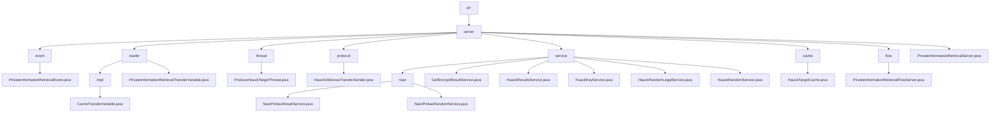

# Basic Information

|      |      |
|------|------|
| Name | pir |
| Language | .java |
| Code Path | WeFe/mpc/mpc-pir/mpc-pir-server/src/main/java/com/welab/wefe/mpc/pir |
| Package Name | docs.mpc.mpc-pir.mpc-pir-server.src.main.java.com.welab.wefe.mpc.pir |
| Brief Description | The `PrivateInformationRetrievalEvent` class handles private information retrieval events, containing `uuid` and `keys` attributes. The module implements PIR protocol data transmission and verification, managing random numbers and encrypted data. The `ProduceHauckTargetThread` thread generates and caches `HauckTarget` objects. The `HauckObliviousTransferSender` class implements the key generation process. The module provides secure query services based on the Naor-Pinkas protocol. The `HauckTargetCache` singleton class manages thread-safe caching. The `PrivateInformationRetrievalFlowServer` class handles the retrieval process. The `PrivateInformationRetrievalServer` class provides server initialization and cache management functionality. |

# Description

## Overview  
This module implements the Private Information Retrieval (PIR) protocol in secure multi-party computation, with core responsibilities including key generation, random number verification, and encrypted data transmission, akin to a secure middleware pattern. The integrated interface specification encompasses six types of operations: random number processing (e.g., `processHauckRandomLegal`), key derivation (e.g., `keyDerivation`), cache management (e.g., `HauckTargetCache`), and others. Key data structures are aggregated into four categories: request tracking (UUID/ID), encryption parameters (Diffie-Hellman key pairs/AES keys), cache objects (`HauckTarget`), and transmission carriers (JSON/hexadecimal strings). External dependencies, after deduplication, include the JCE encryption library, thread pools, and singleton cache instances, such as `ArrayBlockingQueue` for thread-safe caching.

## Primary Business Scenarios  
A typical application is hierarchical privacy queries: during the preprocessing phase, a random number pool is pre-generated via `ProduceHauckTargetThread`, resembling a key distribution center; during the query phase, the Naor-Pinkas protocol is combined with AES encryption (e.g., `NaorPinkasResultService`), functioning like a hybrid encryption gateway. The complete business process spans three dimensions: 1) cache control (e.g., 500-capacity threshold + 2-second sleep detection), 2) security verification (e.g., 120-second timeout + MAC validation), and 3) asynchronous transmission (e.g., JSON result encapsulation by `PrivateInformationRetrievalFlowServer`). The API integration model follows a dual-track approach: synchronous interfaces handle immediate requests (e.g., `getHauckTarget`), while asynchronous services manage background tasks (e.g., `HuackKeyService` thread pool).

### Package Internal Structure View

This flowchart illustrates the core structure of the MPC-PIR server project, with pir as the root node encompassing the main server module and its 8 submodules. The server module includes components such as event handling, data transfer, thread management, protocol implementation, service layer, cache management, and flow control. Each submodule further contains specific implementation class files, forming a complete server architecture system.

# File List

| Name   | Type  | Description |
|-------|------|-------------|
| [server](server/_module.md) | package | The `PrivateInformationRetrievalEvent` class handles private information retrieval events, containing `uuid` and `keys` attributes. The module implements PIR protocol data transmission and verification, managing random numbers and encrypted data. The `ProduceHauckTargetThread` thread generates and caches `HauckTarget` objects. The `HauckObliviousTransferSender` class implements the key generation process. The module provides secure query services based on the Naor-Pinkas protocol. The `HauckTargetCache` singleton class manages thread-safe caching. The `PrivateInformationRetrievalFlowServer` class handles the retrieval process. The `PrivateInformationRetrievalServer` class provides server initialization and cache management functionalities. |

