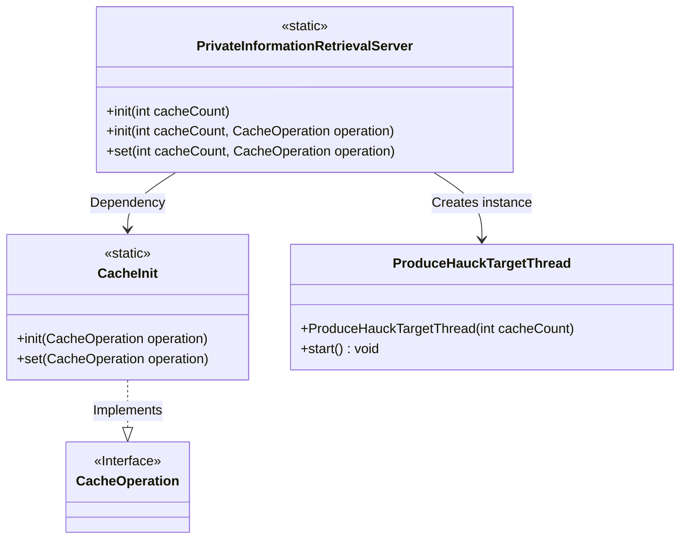
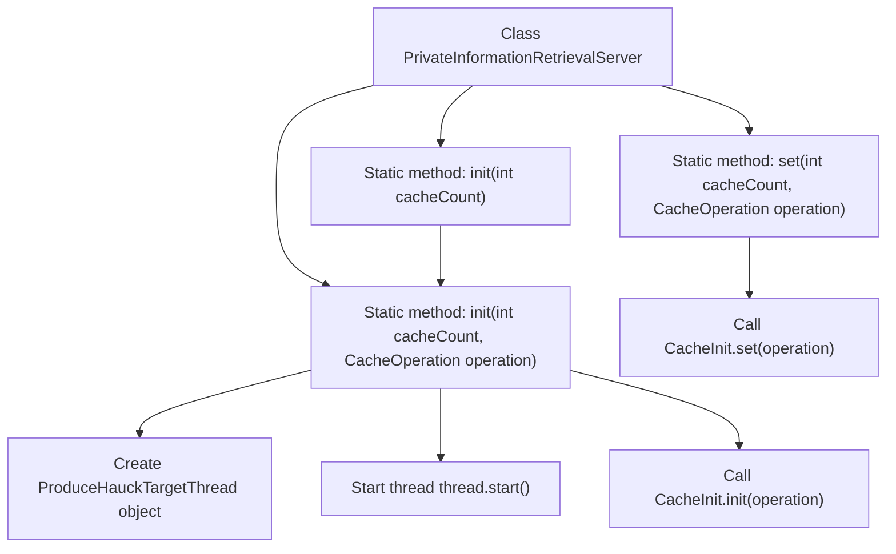

# Basic Information

|      |      |
|------|------|
| Name | PrivateInformationRetrievalServer |
| Language | .java |
| Code Path | WeFe/mpc/mpc-pir/mpc-pir-server/src/main/java/com/welab/wefe/mpc/pir/server/PrivateInformationRetrievalServer.java |
| Package Name | com.welab.wefe.mpc.pir.server |
| Dependencies | ['com.welab.wefe.mpc.cache.CacheInit', 'com.welab.wefe.mpc.cache.intermediate.CacheOperation', 'com.welab.wefe.mpc.pir.server.thread.ProduceHauckTargetThread'] |
| Brief Description | Private information retrieval server class, providing initialization methods, supporting pre-generation of Huack objects and cache operations, with configurable cache quantity and operations. |

# Description

This is a Java class named PrivateInformationRetrievalServer, which provides initialization and setup functionalities for a private information retrieval server. The class contains three static methods: The first init method accepts a cache count parameter and calls the second overloaded method; The second init method takes cache count and cache operation parameters, starts a thread that generates Hauck target objects, and initializes the cache; The set method is used to update cache operation configurations. All methods involve cache management and background thread operations.

# Class Summary

| Name   | Type  | Description |
|-------|------|-------------|
| PrivateInformationRetrievalServer | class | Private Information Retrieval Server Class, providing initialization methods, supporting pre-generation of Huack objects and cache operations, with configurable cache quantity and operations. |

## Class PrivateInformationRetrievalServer

|      |      |
|------|------|
| Access Modifier | public |
| Type | class |
| Name | PrivateInformationRetrievalServer |
| Description | Private Information Retrieval Server Class, providing initialization methods, supporting pre-generation of Huack objects and cache operations, with configurable cache quantity and operations. |

### UML Class Diagram

This class diagram illustrates the core structure of a private information retrieval server. The PrivateInformationRetrievalServer provides initialization functionality through static methods, relies on CacheInit for cache operations, and creates ProduceHauckTargetThread instances for preprocessing. CacheOperation serves as an interface defining cache operation specifications, which are implemented by CacheInit. The entire design adopts a static method pattern, emphasizing thread safety and high-concurrency processing capabilities, making it suitable for retrieval scenarios requiring efficient cache management.

### Internal Method Call Graph

This code demonstrates the static method invocation flow of the PrivateInformationRetrievalServer class. The class contains three core methods: two overloaded init() methods and one set() method. The main init() method creates and starts a ProduceHauckTargetThread while initializing the cache; the set() method is used to update cache operations. The flowchart clearly illustrates the calling relationships and execution order between methods, particularly showcasing jumps between overloaded methods and the thread creation process.

### Field List

| Name  | Type  | Description |
|-------|-------|------|

### Method List

| Name  | Type  | Description |
|-------|-------|------|
| init | void | The static method `init` takes an `int` parameter `cacheCount` and calls the overloaded method `init` with `cacheCount` and `null` as arguments. |
| set | void | Setting cache operation: Call the CacheInit.set method and pass in the operation type parameter. |
| init | void | Static method `init` initializes the cache: starts a thread to pre-generate Huack objects and invokes `CacheInit.init` to perform caching operations. Parameters include cache count `cacheCount` and operation type `operation`. |

