# Basic Information

|      |      |
|------|------|
| Name | server |
| Language | .java |
| Code Path | WeFe/mpc/mpc-pir/mpc-pir-server/src/main/java/com/welab/wefe/mpc/pir/server |
| Package Name | docs.mpc.mpc-pir.mpc-pir-server.src.main.java.com.welab.wefe.mpc.pir.server |
| Brief Description | The `PrivateInformationRetrievalEvent` class handles private information retrieval events, containing `uuid` and `keys` attributes. The module implements PIR protocol data transmission and verification, managing random numbers and encrypted data. The `ProduceHauckTargetThread` thread generates and caches `HauckTarget` objects. The `HauckObliviousTransferSender` class implements the key generation process. The module provides secure query services based on the Naor-Pinkas protocol. The `HauckTargetCache` singleton class manages thread-safe caching. The `PrivateInformationRetrievalFlowServer` class handles the retrieval process. The `PrivateInformationRetrievalServer` class provides server initialization and cache management functionalities. |

# Description

## Overview  
This module implements the Private Information Retrieval (PIR) protocol in secure multi-party computation, with core responsibilities including key generation, random number verification, and encrypted data transmission, akin to a secure middleware pattern. The integrated interface specification encompasses six types of operations: random number processing (e.g., `processHauckRandomLegal`), key derivation (e.g., `keyDerivation`), cache management (e.g., `HauckTargetCache`), and others. Key data structures are aggregated into four categories: request tracking (UUID/ID), encryption parameters (Diffie-Hellman key pairs/AES keys), cache objects (`HauckTarget`), and transmission carriers (JSON/hexadecimal strings). External dependencies, after deduplication, include the JCE encryption library, thread pools, and singleton cache instances, such as `ArrayBlockingQueue` for thread-safe caching.

## Key Business Scenarios  
A typical application is hierarchical privacy queries: during the preprocessing phase, a random number pool is pre-generated via `ProduceHauckTargetThread`, resembling a key distribution center; during the query phase, the Naor-Pinkas protocol is combined with AES encryption (e.g., `NaorPinkasResultService`), functioning like a hybrid encryption gateway. The complete business process spans three dimensions: 1) cache control (e.g., 500-capacity threshold + 2-second sleep detection), 2) security verification (e.g., 120-second timeout + MAC validation), and 3) asynchronous transmission (e.g., JSON result encapsulation by `PrivateInformationRetrievalFlowServer`). The API integration model follows a dual-track approach: synchronous interfaces handle immediate requests (e.g., `getHauckTarget`), while asynchronous services manage background tasks (e.g., the `HuackKeyService` thread pool).

### Package Internal Structure View

```mermaid
graph TD
    server --> event
    server --> trasfer
    server --> thread
    server --> protocol
    server --> service
    server --> cache
    server --> flow
    server --> PrivateInformationRetrievalServer.java
    event --> PrivateInformationRetrievalEvent.java
    trasfer --> impl
    trasfer --> PrivateInformationRetrievalTransferVariable.java
    impl --> CacheTransferVariable.java
    thread --> ProduceHauckTargetThread.java
    protocol --> HauckObliviousTransferSender.java
    service --> naor
    service --> GetEncryptResultService.java
    service --> HuackResultsService.java
    service --> HuackKeyService.java
    service --> HauckRandomLegalService.java
    service --> HauckRandomService.java
    naor --> NaorPinkasResultService.java
    naor --> NaorPinkasRandomService.java
    cache --> HauckTargetCache.java
    flow --> PrivateInformationRetrievalFlowServer.java
```

This flowchart illustrates the complete directory structure of the mpc-pir-server module, with 'server' as the root node encompassing 8 main subdirectories: event, trasfer, thread, protocol, service, cache, flow, and the main file. The 'service' directory is further subdivided into the 'naor' subdirectory and 5 service class files, while the 'trasfer' directory contains the 'impl' implementation subdirectory. The entire structure clearly presents the component distribution of the Private Information Retrieval server, including core functional modules such as event handling, transfer protocols, thread management, and service implementations.

# File List

| Name   | Type  | Description |
|-------|------|-------------|
| [PrivateInformationRetrievalServer.java](PrivateInformationRetrievalServer.md) | file | Private Information Retrieval Server Class, providing initialization methods, supports pre-generating Huack objects and cache operations, with configurable cache size and operations. |
| [flow](flow/_module.md) | package | The `PrivateInformationRetrievalFlowServer` class inherits from `BasePrivateInformationRetrieval` and implements the private information retrieval flow. It processes data through asynchronous queries and key derivation, encrypts results using AES, and transmits them. |
| [cache](cache/_module.md) | package | HauckTargetCache is a singleton class that uses a blocking queue to store up to 500 HauckTarget objects, providing put, get, and size methods to operate the queue. |
| [service](service/_module.md) | package | This module implements secure multi-party computation queries based on the Naor-Pinkas protocol, incorporating random number generation and result encryption services. It employs asynchronous processing and UUID tracking, relies on the JCE encryption library and thread pools, and supports key generation, multi-layer AES encryption, and cache operations. |
| [protocol](protocol/_module.md) | package | The HauckObliviousTransferSender class implements the ObliviousTransfer interface and is responsible for key derivation. It computes the key list through HauckTarget, supports parallel computation for multiple targets, and includes cache handling and asynchronous operations. |
| [thread](thread/_module.md) | package | The `ProduceHauckTargetThread` thread class is used to generate `HauckTarget` objects and cache them. It continuously generates objects when the cache quantity is insufficient; otherwise, it sleeps for 2 seconds. Logs are recorded in case of exceptions. |
| [trasfer](trasfer/_module.md) | package | The CacheTransferVariable class implements the PIR data transfer interface, containing four methods to handle random numbers, encryption results, and validity checks, with cache operations featuring a 120-second timeout. |
| [event](event/_module.md) | package | The `PrivateInformationRetrievalEvent` class contains the attributes `uuid`, `keys`, and `PrivateInformationRetrievalFlowServer`, providing a constructor method and getter methods. |

