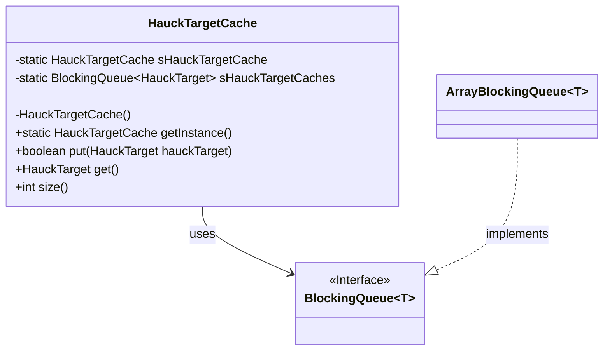
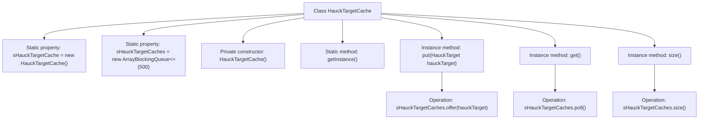

# Basic Information

|      |      |
|------|------|
| Name | HauckTargetCache |
| Language | .java |
| Code Path | WeFe/mpc/mpc-pir/mpc-pir-server/src/main/java/com/welab/wefe/mpc/pir/server/cache/HauckTargetCache.java |
| Package Name | com.welab.wefe.mpc.pir.server.cache |
| Dependencies | ['com.welab.wefe.mpc.pir.protocol.ot.hauck.HauckTarget', 'java.util.concurrent.ArrayBlockingQueue', 'java.util.concurrent.BlockingQueue'] |
| Brief Description | HauckTargetCache is a singleton class that uses a blocking queue to store up to 500 HauckTarget objects, providing put, get, and size methods to operate on the queue. |

# Description

HauckTargetCache is a singleton class designed to manage the caching of HauckTarget objects. It ensures global uniqueness through a private static instance, sHauckTargetCache, and prevents external instantiation via a private constructor. The cache employs an ArrayBlockingQueue with a capacity of 500 to achieve thread-safe operations. Three public methods are provided: `put` for adding elements (non-blocking), `get` for retrieving elements (non-blocking), and `size` to return the current cache size.

# Class Summary

| Name   | Type  | Description |
|-------|------|-------------|
| HauckTargetCache | class | HauckTargetCache is a singleton class that uses a blocking queue to store HauckTarget objects, providing put, get, and size methods, with a queue capacity of 500. |

## Class HauckTargetCache

|      |      |
|------|------|
| Access Modifier | public |
| Type | class |
| Name | HauckTargetCache |
| Description | HauckTargetCache is a singleton class that uses a blocking queue to store HauckTarget objects, providing put, get, and size methods, with a queue capacity of 500. |

### UML Class Diagram

This code demonstrates a singleton-pattern HauckTargetCache class that utilizes BlockingQueue as the underlying storage structure to cache HauckTarget objects. The class ensures singleton through a private constructor, provides put/get methods to manipulate the queue, and supports querying the current cache size. The class diagram clearly illustrates the relationship between HauckTargetCache, the BlockingQueue interface, and its implementation class ArrayBlockingQueue, reflecting design patterns of composition and interface implementation.

### Internal Method Call Graph

This code implements a singleton target cache class HauckTargetCache based on a blocking queue. The singleton pattern is achieved through the static property sHauckTargetCache, using an ArrayBlockingQueue with a capacity of 500 to store HauckTarget objects. It provides a non-blocking put() method to add elements, a non-blocking get() method to retrieve elements, and a size() method to obtain the current queue size. The flowchart clearly illustrates the class structure, singleton initialization process, and the calling relationships between the three core methods and their underlying queue operations.

### Field List

| Name  | Type  | Description |
|-------|-------|------|
| sHauckTargetCache = new HauckTargetCache() | HauckTargetCache | The static variable sHauckTargetCache is initialized as an instance of HauckTargetCache. |
| sHauckTargetCaches = new ArrayBlockingQueue<>(500) | BlockingQueue<HauckTarget> | Defined a blocking queue with a capacity of 500 for storing HauckTarget objects. |

### Method List

| Name  | Type  | Description |
|-------|-------|------|
| get | HauckTarget | The method get() retrieves and returns a HauckTarget object from the cache queue sHauckTargetCaches. |
| getInstance | HauckTargetCache | The static method getInstance returns the singleton object sHauckTargetCache. |
| put | boolean | The Java method `put` stores the `HauckTarget` object into the cache queue `sHauckTargetCaches`, returning `true` on success and `false` on failure. |
| size | int | This method returns the size of sHauckTargetCaches, which is the number of elements. |

