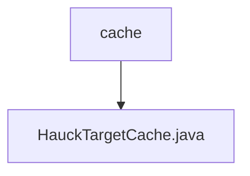

# Basic Information

|      |      |
|------|------|
| Name | cache |
| Language | .java |
| Code Path | WeFe/mpc/mpc-pir/mpc-pir-server/src/main/java/com/welab/wefe/mpc/pir/server/cache |
| Package Name | docs.mpc.mpc-pir.mpc-pir-server.src.main.java.com.welab.wefe.mpc.pir.server.cache |
| Brief Description | HauckTargetCache is a singleton class that uses a blocking queue to store up to 500 HauckTarget objects, providing put, get, and size methods to operate the queue. |

# Description

HauckTargetCache is a singleton class designed to manage the caching of HauckTarget objects. It ensures global uniqueness through a private static instance, sHauckTargetCache, and prevents external instantiation via a private constructor. The cache employs an ArrayBlockingQueue with a capacity of 500 to achieve thread-safe operations. It provides three public methods: put for adding elements (non-blocking), get for retrieving elements (non-blocking), and size to return the current cache size.

### Package Internal Structure View

This flowchart illustrates the hierarchical relationship between the `cache` directory and the `HauckTargetCache.java` file in the `mpc-pir-server` project. The `cache` directory, as the parent, contains a specific Java implementation file `HauckTargetCache.java`, reflecting the concrete location of the server-side caching functionality implementation. The entire structure is concise and clear, aligning with the given two path pieces of information.

# File List

| Name   | Type  | Description |
|-------|------|-------------|
| [HauckTargetCache.java](HauckTargetCache.md) | file | HauckTargetCache is a singleton class that uses a blocking queue to store up to 500 HauckTarget objects, providing put, get, and size methods to operate on the queue. |

