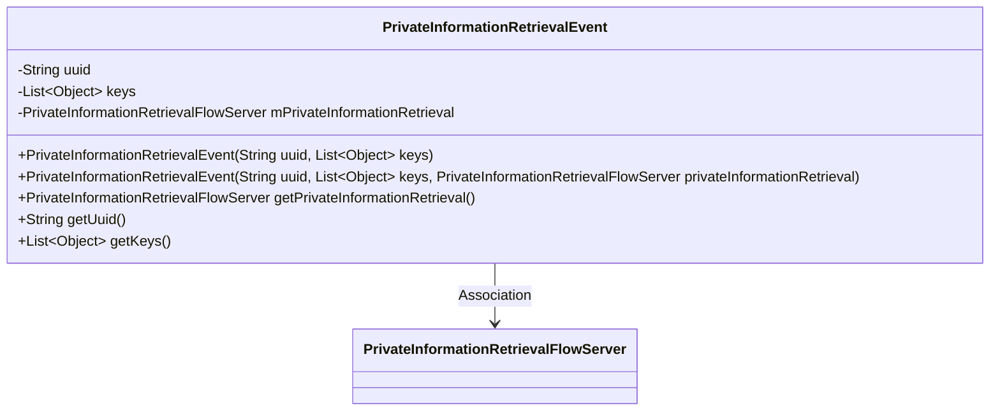
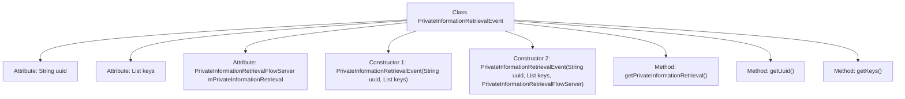

# Basic Information

|      |      |
|------|------|
| Name | PrivateInformationRetrievalEvent |
| Language | .java |
| Code Path | WeFe/mpc/mpc-pir/mpc-pir-server/src/main/java/com/welab/wefe/mpc/pir/server/event/PrivateInformationRetrievalEvent.java |
| Package Name | com.welab.wefe.mpc.pir.server.event |
| Dependencies | ['com.welab.wefe.mpc.pir.server.flow.PrivateInformationRetrievalFlowServer', 'java.util.List'] |
| Brief Description | The `PrivateInformationRetrievalEvent` class contains `uuid`, `keys`, and `PrivateInformationRetrievalFlowServer` attributes, providing constructor and getter methods. |

# Description

The `PrivateInformationRetrievalEvent` class is designed to handle private information retrieval events, containing two core attributes: a UUID string and a list of keys objects. This class provides two constructors—one initializing only the UUID and keys, while the other additionally initializes a `PrivateInformationRetrievalFlowServer` object. It offers three getter methods to retrieve the UUID, keys, and `PrivateInformationRetrievalFlowServer` instance respectively.

# Class Summary

| Name   | Type  | Description |
|-------|------|-------------|
| PrivateInformationRetrievalEvent | class | The `PrivateInformationRetrievalEvent` class contains `uuid`, `keys`, and `PrivateInformationRetrievalFlowServer` attributes, providing constructor and getter methods. |

## Class PrivateInformationRetrievalEvent

|      |      |
|------|------|
| Access Modifier | public |
| Type | class |
| Name | PrivateInformationRetrievalEvent |
| Description | The `PrivateInformationRetrievalEvent` class contains `uuid`, `keys`, and `PrivateInformationRetrievalFlowServer` attributes, providing constructor and getter methods. |

### UML Class Diagram

This code defines a `PrivateInformationRetrievalEvent` class for managing private information retrieval events. The class contains three main attributes: a unique identifier uuid, a list of keys, and a server instance mPrivateInformationRetrieval. It provides two constructor methods and three getter methods. The class diagram clearly illustrates its association with `PrivateInformationRetrievalFlowServer`, reflecting the interactive dependency between the event object and the server.

### Internal Method Call Graph

This code defines a class named PrivateInformationRetrievalEvent for handling private information retrieval events. The class contains three attributes: uuid for uniquely identifying events, keys for storing associated key lists, and mPrivateInformationRetrieval referencing a flow server instance. Two constructors are provided to initialize basic attributes and complete attributes respectively, along with three getter methods to retrieve these attribute values. This class is primarily used to encapsulate and transmit event data related to private information retrieval.

### Field List

| Name  | Type  | Description |
|-------|-------|------|
| uuid | String | Declare a string variable uuid. |
| mPrivateInformationRetrieval | PrivateInformationRetrievalFlowServer | Private Information Retrieval Flow Server Instance mPrivateInformationRetrieval. |
| keys | List<Object> | Declare a list named keys with elements of type Object. |

### Method List

| Name  | Type  | Description |
|-------|-------|------|
| getKeys | List<Object> | Methods to retrieve key-value lists, returning the stored collection of key-value pairs. |
| getPrivateInformationRetrieval | PrivateInformationRetrievalFlowServer | Method to retrieve the private information retrieval flow server instance, returns the member variable mPrivateInformationRetrieval. |
| getUuid | String | The method getUuid returns a uuid value of string type. |

