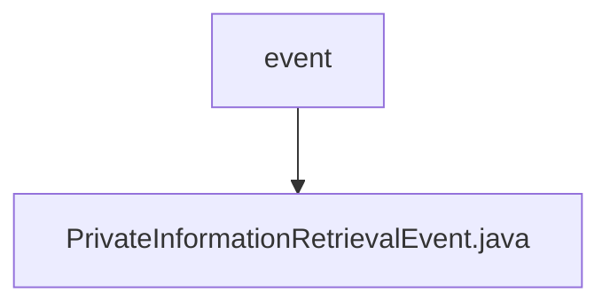

# Basic Information

|      |      |
|------|------|
| Name | event |
| Language | .java |
| Code Path | WeFe/mpc/mpc-pir/mpc-pir-server/src/main/java/com/welab/wefe/mpc/pir/server/event |
| Package Name | docs.mpc.mpc-pir.mpc-pir-server.src.main.java.com.welab.wefe.mpc.pir.server.event |
| Brief Description | The `PrivateInformationRetrievalEvent` class contains the attributes `uuid`, `keys`, and `PrivateInformationRetrievalFlowServer`, providing a constructor method and getter methods. |

# Description

The `PrivateInformationRetrievalEvent` class is designed to handle private information retrieval events, containing two core attributes: a UUID string and a list of keys objects. This class provides two constructors—one initializing only the UUID and keys, while the other additionally initializes a `PrivateInformationRetrievalFlowServer` object. It offers three getter methods to retrieve the UUID, keys, and the `PrivateInformationRetrievalFlowServer` instance respectively.

### Package Internal Structure View

This flowchart illustrates the hierarchical structure of the event module in the mpc-pir-server project. The root node "event" represents the event handling directory, which contains a concrete event implementation class "PrivateInformationRetrievalEvent.java". This structure adheres to the typical event-driven architecture design, where the event handler serves as the parent node and specific event classes act as child nodes, embodying the single responsibility principle. The entire structure is concise and clear, facilitating easy maintenance and extension of event handling logic.

# File List

| Name   | Type  | Description |
|-------|------|-------------|
| [PrivateInformationRetrievalEvent.java](PrivateInformationRetrievalEvent.md) | file | The `PrivateInformationRetrievalEvent` class contains `uuid`, `keys`, and `PrivateInformationRetrievalFlowServer` attributes, providing constructor and getter methods. |

