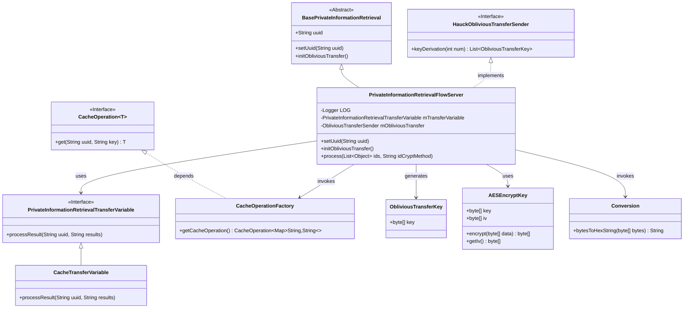

# Basic Information

|      |      |
|------|------|
| Name | PrivateInformationRetrievalFlowServer |
| Language | .java |
| Code Path | WeFe/mpc/mpc-pir/mpc-pir-server/src/main/java/com/welab/wefe/mpc/pir/server/flow/PrivateInformationRetrievalFlowServer.java |
| Package Name | com.welab.wefe.mpc.pir.server.flow |
| Dependencies | ['cn.hutool.core.util.ObjectUtil', 'com.alibaba.fastjson.JSON', 'com.welab.wefe.mpc.cache.intermediate.CacheOperation', 'com.welab.wefe.mpc.cache.intermediate.CacheOperationFactory', 'com.welab.wefe.mpc.commom.Constants', 'com.welab.wefe.mpc.commom.Conversion', 'com.welab.wefe.mpc.pir.flow.BasePrivateInformationRetrieval', 'com.welab.wefe.mpc.pir.protocol.ot.ObliviousTransferKey', 'com.welab.wefe.mpc.pir.protocol.se.SymmetricKey', 'com.welab.wefe.mpc.pir.protocol.se.aes.AESEncryptKey', 'com.welab.wefe.mpc.pir.server.protocol.HauckObliviousTransferSender', 'com.welab.wefe.mpc.pir.server.trasfer.PrivateInformationRetrievalTransferVariable', 'com.welab.wefe.mpc.pir.server.trasfer.impl.CacheTransferVariable', 'org.slf4j.Logger', 'org.slf4j.LoggerFactory', 'java.util.ArrayList', 'java.util.List', 'java.util.Map', 'java.util.concurrent.CompletableFuture', 'java.util.concurrent.TimeUnit'] |
| Brief Description | The `PrivateInformationRetrievalFlowServer` class inherits from `BasePrivateInformationRetrieval` and implements the private information retrieval flow. It processes data through asynchronous queries and key derivation, encrypts results using AES, and transmits them. |

# Description

The `PrivateInformationRetrievalFlowServer` class inherits from `BasePrivateInformationRetrieval` and implements the private information retrieval flow. Its core functionalities include initializing the oblivious transfer protocol `HauckObliviousTransferSender`, processing ID lists, and handling encryption methods. It asynchronously queries cached data, generates keys, encrypts results using AES, and converts them into hexadecimal strings. The final encrypted results in JSON format are transmitted via transport variables. The entire process incorporates logging, error handling, and concurrency control.

# Class Summary

| Name   | Type  | Description |
|-------|------|-------------|
| PrivateInformationRetrievalFlowServer | class | The `PrivateInformationRetrievalFlowServer` class inherits from `BasePrivateInformationRetrieval` and implements the private information retrieval flow. It processes data through asynchronous queries and key derivation, encrypts results using AES, and transmits them. It includes functionalities such as UUID setting, initialization, data processing, and encrypted result transmission. |


## Class PrivateInformationRetrievalFlowServer

|      |      |
|------|------|
| Access Modifier | public |
| Type | class |
| Name | PrivateInformationRetrievalFlowServer |
| Description | The `PrivateInformationRetrievalFlowServer` class inherits from `BasePrivateInformationRetrieval` and implements the private information retrieval flow. It processes data through asynchronous queries and key derivation, encrypts results using AES, and transmits them. It includes functionalities such as UUID setting, initialization, data processing, and encrypted result transmission. |


### UML Class Diagram



This class diagram illustrates the core structure of a private information retrieval flow server, which inherits from a base abstract class and implements the oblivious transfer interface. Key functionalities include: asynchronously parallelizing cache data retrieval and encryption key generation, encrypting query results using AES before returning them via transfer variables. The system comprises components like cache operation factory, key derivation, and data encryption, implementing a high-concurrency secure data processing flow through composition pattern. Each module has clearly defined responsibilities and achieves decoupling through interfaces.


### Internal Method Call Graph

```mermaid
graph TD
    A["Class PrivateInformationRetrievalFlowServer"]
    B["Inheritance: BasePrivateInformationRetrieval"]
    C["Attribute: Logger LOG"]
    D["Attribute: PrivateInformationRetrievalTransferVariable mTransferVariable"]
    E["Overridden Method: setUuid(String uuid)"]
    F["Overridden Method: initObliviousTransfer()"]
    G["Method: process(List<Object> ids, String idCryptMethod)"]
    H["Step: Log data volume"]
    I["Step: Create CacheOperation async task"]
    J["Step: Create ObliviousTransferKey async task"]
    K["Step: Wait for both async tasks to complete"]
    L["Step: Retrieve results and handle exceptions"]
    M["Step: Encrypt result data"]
    N["Step: Send processed results"]
    O["Step: Log completion status"]

    A --> B
    A --> C
    A --> D
    A --> E
    A --> F
    A --> G
    G --> H
    G --> I
    G --> J
    G --> K
    G --> L
    G --> M
    G --> N
    G --> O
    E -->|Calls| F
    I -->|Includes| 'Loop to fetch results'
    M -->|Uses| 'AESEncryptKey encryption'
    N -->|Calls| 'mTransferVariable.processResult'
```

Flowchart Description:
This flowchart illustrates the complete processing flow of the PrivateInformationRetrievalFlowServer class, starting from its inheritance relationship and detailing the execution steps of the process method. Key phases include initial logging, creating two parallel async tasks (data query and key derivation), waiting for task completion, exception handling, data encryption, and result transmission. It highlights core functionalities such as coordinated async task processing and AES encryption, culminating in sending processed results via transfer variables and logging completion status.

### Field List

| Name  | Type  | Description |
|-------|-------|------|
| LOG = LoggerFactory.getLogger(PrivateInformationRetrievalFlowServer.class) | Logger | Private logger for the PrivateInformationRetrievalFlowServer class. |
| mTransferVariable = new CacheTransferVariable() | PrivateInformationRetrievalTransferVariable | Create a private information retrieval transfer variable mTransferVariable and initialize it as a CacheTransferVariable instance. |

### Method List

| Name  | Type  | Description |
|-------|-------|------|
| process | void | The method asynchronously processes a list of IDs, retrieves data in parallel through cached queries and key derivation, encrypts the results using AES, and then sends them. It includes exception handling and logging. |
| setUuid | void | Rewrite the setUuid method, initialize the OT protocol after calling the parent class method. |
| initObliviousTransfer | void | Initialize the HauckObliviousTransferSender instance using uuid as a parameter. |


