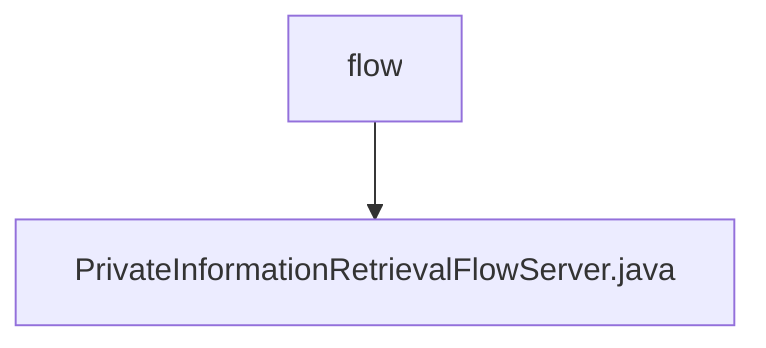

# Basic Information

|      |      |
|------|------|
| Name | flow |
| Language | .java |
| Code Path | WeFe/mpc/mpc-pir/mpc-pir-server/src/main/java/com/welab/wefe/mpc/pir/server/flow |
| Package Name | docs.mpc.mpc-pir.mpc-pir-server.src.main.java.com.welab.wefe.mpc.pir.server.flow |
| Brief Description | The `PrivateInformationRetrievalFlowServer` class inherits from `BasePrivateInformationRetrieval` and implements the private information retrieval flow. It processes data through asynchronous queries and key derivation, encrypts results using AES, and transmits them. |

# Description

The `PrivateInformationRetrievalFlowServer` class inherits from `BasePrivateInformationRetrieval` and implements the private information retrieval flow. Its core functionalities include initializing the oblivious transfer protocol `HauckObliviousTransferSender`, processing ID lists, and handling encryption methods. It asynchronously queries cached data, generates keys, encrypts results using AES, and converts them into hexadecimal strings. The encrypted results are then transmitted as JSON-formatted data via transport variables. The entire process incorporates logging, error handling, and concurrency control.

### Package Internal Structure View

This flowchart illustrates the file structure relationship within the server/flow directory of the mpc-pir-server project. The root node "flow" contains a Java implementation file "PrivateInformationRetrievalFlowServer.java", indicating this is the main implementation class of the flow server. Such a concise structure suggests the module is functionally focused, with core business logic centralized in a single file.

# File List

| Name   | Type  | Description |
|-------|------|-------------|
| [PrivateInformationRetrievalFlowServer.java](PrivateInformationRetrievalFlowServer.md) | file | The `PrivateInformationRetrievalFlowServer` class inherits from `BasePrivateInformationRetrieval` and implements the private information retrieval flow. It processes data through asynchronous queries and key derivation, encrypts results using AES, and transmits them. |

