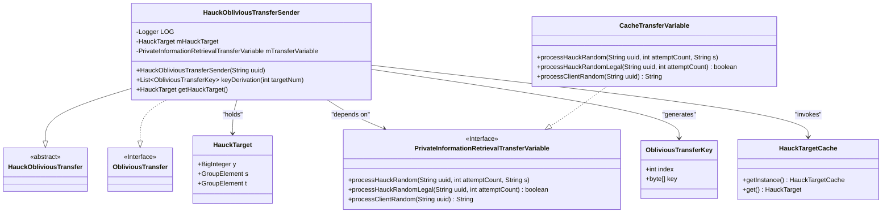
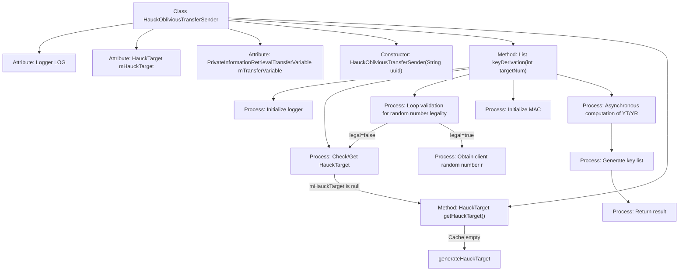
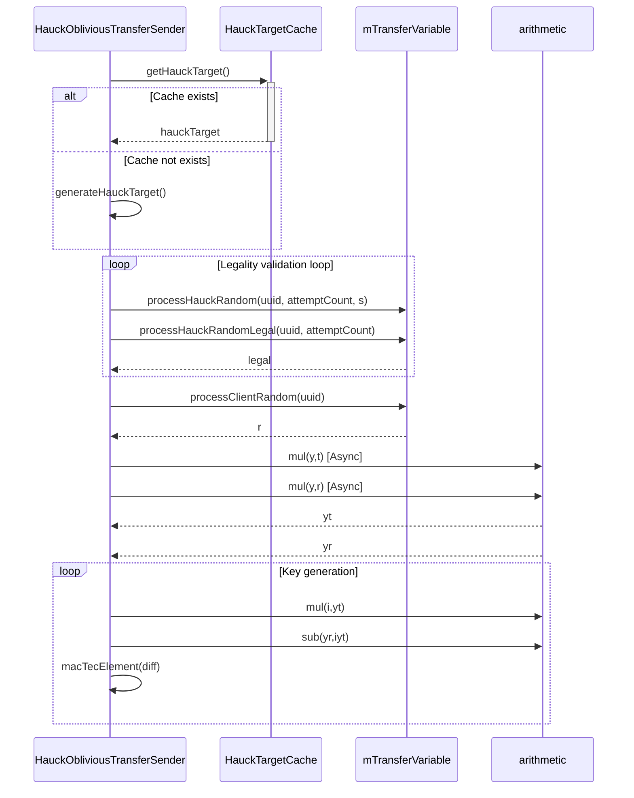

# Basic Information

|      |      |
|------|------|
| Name | HauckObliviousTransferSender |
| Language | .java |
| Code Path | WeFe/mpc/mpc-pir/mpc-pir-server/src/main/java/com/welab/wefe/mpc/pir/server/protocol/HauckObliviousTransferSender.java |
| Package Name | com.welab.wefe.mpc.pir.server.protocol |
| Dependencies | ['com.welab.wefe.mpc.commom.Conversion', 'com.welab.wefe.mpc.pir.protocol.nt.group.GroupElement', 'com.welab.wefe.mpc.pir.protocol.ot.ObliviousTransfer', 'com.welab.wefe.mpc.pir.protocol.ot.ObliviousTransferKey', 'com.welab.wefe.mpc.pir.protocol.ot.hauck.HauckObliviousTransfer', 'com.welab.wefe.mpc.pir.protocol.ot.hauck.HauckTarget', 'com.welab.wefe.mpc.pir.server.cache.HauckTargetCache', 'com.welab.wefe.mpc.pir.server.trasfer.PrivateInformationRetrievalTransferVariable', 'com.welab.wefe.mpc.pir.server.trasfer.impl.CacheTransferVariable', 'org.slf4j.Logger', 'org.slf4j.LoggerFactory', 'java.math.BigInteger', 'java.util.ArrayList', 'java.util.List', 'java.util.concurrent.CompletableFuture'] |
| Brief Description | The HauckObliviousTransferSender class implements the ObliviousTransfer interface and is responsible for key derivation. It computes the key list through HauckTarget, supports parallel computation for multiple targets, and includes cache handling and asynchronous operations. |

# Description

The `HauckObliviousTransferSender` class implements the `ObliviousTransfer` interface and inherits from the `HauckObliviousTransfer` base class. This class contains a `HauckTarget` object and a `PrivateInformationRetrievalTransferVariable` variable. The core method `keyDerivation` is responsible for generating a list of keys, with the process including: checking and retrieving the `HauckTarget` object, validating the legitimacy of random numbers, initializing the MAC, computing `yt` and `yr`, and ultimately generating a specified number of `ObliviousTransferKey` objects. The `getHauckTarget` method prioritizes retrieving the target object from the cache, generating a new object if it does not exist. The entire process logs the status of key steps.

# Class Summary

| Name   | Type  | Description |
|-------|------|-------------|
| HauckObliviousTransferSender | class | The `HauckObliviousTransferSender` class implements the `ObliviousTransfer` interface and is responsible for key derivation. It generates a key list through `HauckTarget` and asynchronous computation, supporting caching and validity verification. |

## Class HauckObliviousTransferSender

|      |      |
|------|------|
| Access Modifier | public |
| Type | class |
| Name | HauckObliviousTransferSender |
| Description | The `HauckObliviousTransferSender` class implements the `ObliviousTransfer` interface and is responsible for key derivation. It generates a key list through `HauckTarget` and asynchronous computation, supporting caching and validity verification. |

### UML Class Diagram

This code describes a HauckObliviousTransferSender class that inherits from the abstract HauckObliviousTransfer class and implements the ObliviousTransfer interface. Its primary function is to generate a set of ObliviousTransferKey objects through a key derivation algorithm, involving interactions with HauckTarget, a caching system, and transfer variables. The class diagram illustrates its inheritance relationships, dependencies, and key data structures, including HauckTarget for storing intermediate computation results, the CacheTransferVariable implementation class for handling transfer variables, and the final generated key object ObliviousTransferKey. The overall design employs asynchronous computation and caching mechanisms to enhance performance.

### Internal Method Call Graph

This flowchart describes the key derivation process of the HauckObliviousTransferSender class, comprising 6 stages: initialization check, target object acquisition, random number legality validation, asynchronous mathematical operations, key list generation, and result return. The sequence diagram details the interaction between objects, particularly the asynchronous calls with cache system and arithmetic components. The entire process employs a loop validation mechanism to ensure random number legality and utilizes CompletableFuture for parallel computation to optimize performance.

### Field List

| Name  | Type  | Description |
|-------|-------|------|
| LOG = LoggerFactory.getLogger(HauckObliviousTransferSender.class) | Logger | Define a private static log object LOG for the HauckObliviousTransferSender class. |
| mHauckTarget = null | HauckTarget | Declared a variable named mHauckTarget of type HauckTarget with an initial value of null. |
| mTransferVariable = new CacheTransferVariable() | PrivateInformationRetrievalTransferVariable | Create a private information retrieval transfer variable mTransferVariable and initialize it as a CacheTransferVariable instance. |

### Method List

| Name  | Type  | Description |
|-------|-------|------|
| getHauckTarget | HauckTarget | The method `getHauckTarget` retrieves a `HauckTarget` from the cache. If it is empty, a new instance is generated, cached, and then returned. |
| keyDerivation | List<ObliviousTransferKey> | The method generates a list of ObliviousTransferKeys by iteratively validating the legitimacy of HauckTarget, computing YT and YR, and ultimately generating the key list based on the target count. |

