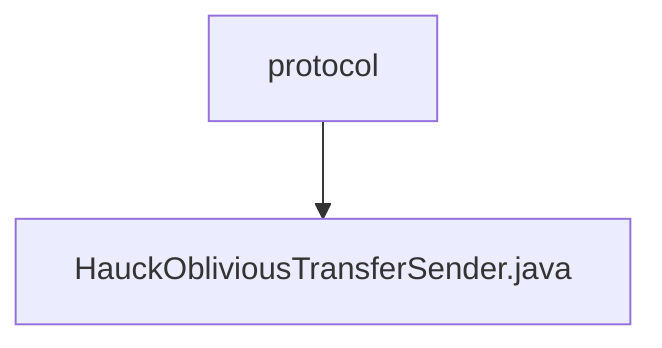

# Basic Information

|      |      |
|------|------|
| Name | protocol |
| Language | .java |
| Code Path | WeFe/mpc/mpc-pir/mpc-pir-server/src/main/java/com/welab/wefe/mpc/pir/server/protocol |
| Package Name | docs.mpc.mpc-pir.mpc-pir-server.src.main.java.com.welab.wefe.mpc.pir.server.protocol |
| Brief Description | The HauckObliviousTransferSender class implements the ObliviousTransfer interface and is responsible for key derivation. It computes the key list through HauckTarget, supports parallel computation for multiple targets, and includes cache handling and asynchronous operations. |

# Description

The `HauckObliviousTransferSender` class implements the `ObliviousTransfer` interface and inherits from the `HauckObliviousTransfer` base class. This class contains a `HauckTarget` object and a `PrivateInformationRetrievalTransferVariable` variable. The core method `keyDerivation` is responsible for generating a list of keys, with the process including: checking and retrieving the `HauckTarget` object, validating the legitimacy of random numbers, initializing the MAC, computing `yt` and `yr`, and ultimately generating a specified number of `ObliviousTransferKey` objects. The `getHauckTarget` method prioritizes retrieving the target object from the cache, generating a new object if it does not exist. The entire process logs the status of key steps.

### Package Internal Structure View

This flowchart illustrates the hierarchical structure of the MPC-PIR server protocol module in the WeFe project. The protocol folder contains the implementation file HauckObliviousTransferSender.java, reflecting the containment relationship between the protocol layer and the specific OT sender implementation.

# File List

| Name   | Type  | Description |
|-------|------|-------------|
| [HauckObliviousTransferSender.java](HauckObliviousTransferSender.md) | file | The HauckObliviousTransferSender class implements the ObliviousTransfer interface and is responsible for key derivation. It computes key lists via HauckTarget, supports multi-target parallel computation, and includes cache handling and asynchronous operations. |

