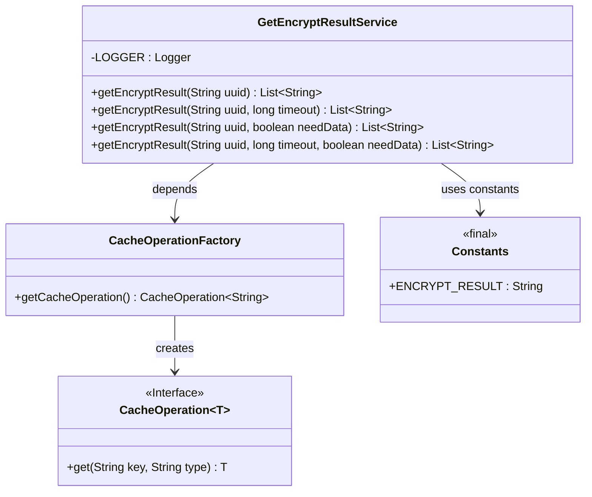
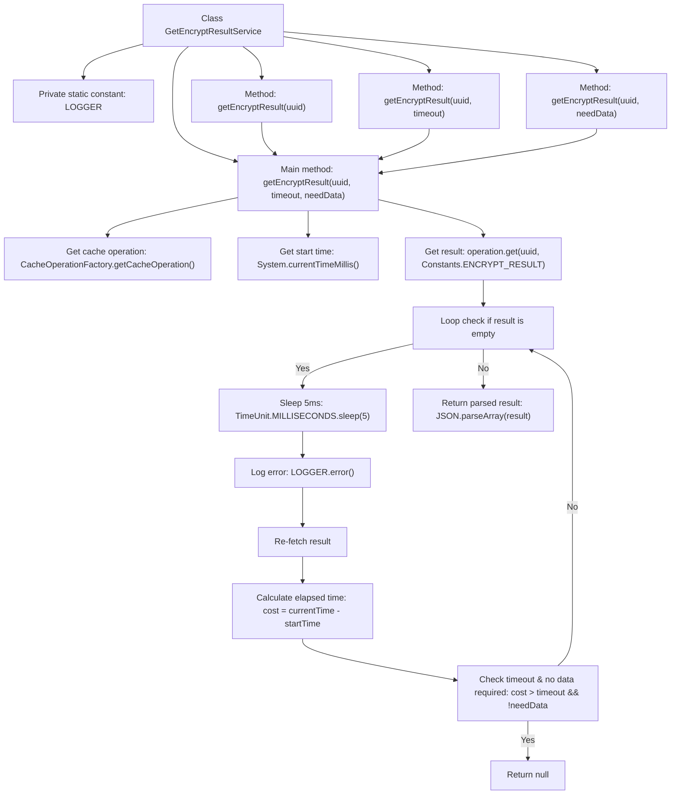

# Basic Information

|      |      |
|------|------|
| Name | GetEncryptResultService |
| Language | .java |
| Code Path | WeFe/mpc/mpc-pir/mpc-pir-server/src/main/java/com/welab/wefe/mpc/pir/server/service/GetEncryptResultService.java |
| Package Name | com.welab.wefe.mpc.pir.server.service |
| Dependencies | ['com.alibaba.fastjson.JSON', 'com.welab.wefe.mpc.cache.intermediate.CacheOperation', 'com.welab.wefe.mpc.cache.intermediate.CacheOperationFactory', 'com.welab.wefe.mpc.commom.Constants', 'org.slf4j.Logger', 'org.slf4j.LoggerFactory', 'java.util.List', 'java.util.concurrent.TimeUnit'] |
| Brief Description | Static method to obtain encrypted results, supporting timeout and mandatory return data parameters, with cached operations to query results. |

# Description

The GetEncryptResultService is a utility class that provides encrypted result query functionality, containing four overloaded methods. The core method retrieves encrypted result data from cache using a UUID, supporting timeout settings and control parameters for mandatory data return. Internally, it employs cyclic cache checks with brief sleep intervals between retries when data isn't immediately available. The loop terminates when timeout occurs without mandatory return requirements. The obtained JSON-formatted results are parsed into string lists for return, or null if no data exists. A logger captures exception information.

# Class Summary

| Name   | Type  | Description |
|-------|------|-------------|
| GetEncryptResultService | class | The GetEncryptResultService class provides static methods to retrieve encryption results via uuid, supporting timeout configuration and mandatory data return requirements, with internal implementation utilizing cache operations and polling mechanisms. |

## Class GetEncryptResultService

|      |      |
|------|------|
| Access Modifier | public |
| Type | class |
| Name | GetEncryptResultService |
| Description | The GetEncryptResultService class provides static methods to retrieve encryption results via uuid, supporting timeout configuration and mandatory data return requirements, with internal implementation utilizing cache operations and polling mechanisms. |

### UML Class Diagram

This code demonstrates an encrypted result query service that provides flexible query methods through parameter-overloaded functions. The core method utilizes a cache operation interface to poll for data, supporting timeout control and mandatory data checks. The class diagram includes service class, cache operation interface, factory class, and constants class, illustrating design patterns of interface decoupling and constant reuse.

### Internal Method Call Graph

This flowchart illustrates the core logic of the GetEncryptResultService class, featuring four overloaded methods that ultimately invoke the main processing method. The main method retrieves encrypted results through cache operations using a polling mechanism, with timeout control and data requirement evaluation. When results are empty, it enters a waiting loop with timeout checks, ultimately returning either parsed results or null. The entire process demonstrates asynchronous cache data retrieval and timeout handling mechanisms, suitable for scenarios requiring waiting for backend processing results.

### Field List

| Name  | Type  | Description |
|-------|-------|------|
| LOGGER = LoggerFactory.getLogger(GetEncryptResultService.class) | Logger | Define a static logger instance for the GetEncryptResultService class, created using LoggerFactory. |

### Method List

| Name  | Type  | Description |
|-------|-------|------|
| getEncryptResult | List<String> | The static method `getEncryptResult` receives `uuid` and `timeout` parameters, calls the method of the same name with a default `false` parameter passed in, and returns a string list. |
| getEncryptResult | List<String> | This is a Java static method that takes a UUID string parameter, calls an overloaded method, and by default does not encrypt, returning a list of strings. |
| getEncryptResult | List<String> | Method to obtain encrypted results: Query the results corresponding to a UUID through cache operations, supporting timeout and empty data checks, and return the parsed string list. |
| getEncryptResult | List<String> | The static method `getEncryptResult` accepts `uuid` and `needData` parameters, with a default timeout of 60 seconds, and returns a list of encrypted results. |

