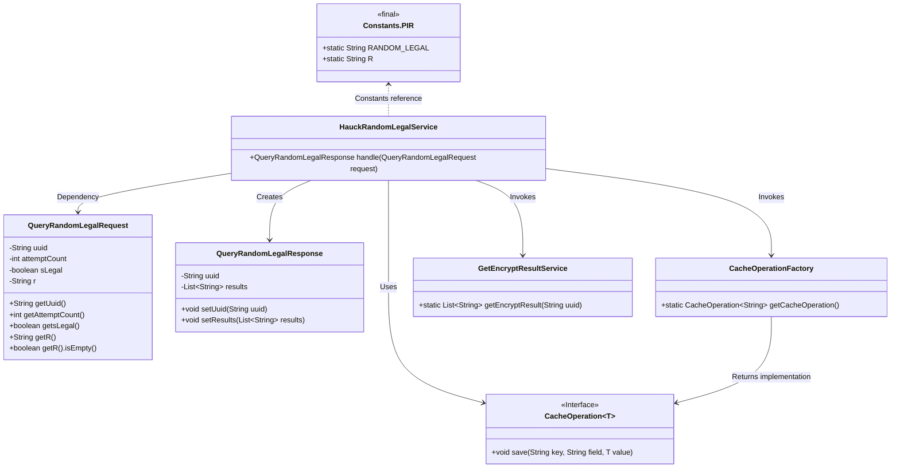
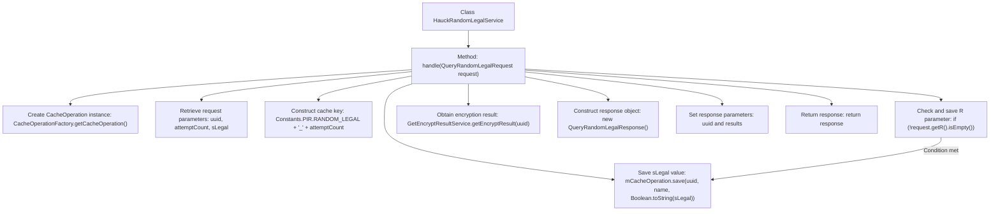

# Basic Information

|      |      |
|------|------|
| Name | HauckRandomLegalService |
| Language | .java |
| Code Path | WeFe/mpc/mpc-pir/mpc-pir-server/src/main/java/com/welab/wefe/mpc/pir/server/service/HauckRandomLegalService.java |
| Package Name | com.welab.wefe.mpc.pir.server.service |
| Dependencies | ['com.welab.wefe.mpc.cache.intermediate.CacheOperation', 'com.welab.wefe.mpc.cache.intermediate.CacheOperationFactory', 'com.welab.wefe.mpc.commom.Constants', 'com.welab.wefe.mpc.pir.request.QueryRandomLegalRequest', 'com.welab.wefe.mpc.pir.request.QueryRandomLegalResponse', 'java.util.List'] |
| Brief Description | HauckRandomLegalService handles random legal requests, saves UUID and attempt counts to cache, retrieves encrypted results, and returns the response. |

# Description

The HauckRandomLegalService class processes the QueryRandomLegalRequest request by saving the uuid, attemptCount, and sLegal parameters from the request into the cache via CacheOperation. If the request includes the R parameter, it is also saved. Subsequently, it invokes the GetEncryptResultService to obtain the encrypted result and constructs the QueryRandomLegalResponse response object, setting the uuid and the result list (if present). The entire process involves cache operations and encrypted result handling.

# Class Summary

| Name   | Type  | Description |
|-------|------|-------------|
| HauckRandomLegalService | class | HauckRandomLegalService processes random legal query requests, saves UUID, attempt count, and legality to the cache, stores the R value if present, and finally returns an encrypted response containing the result and UUID. |

## Class HauckRandomLegalService

|      |      |
|------|------|
| Access Modifier | public |
| Type | class |
| Name | HauckRandomLegalService |
| Description | HauckRandomLegalService processes random legal query requests, saves UUID, attempt count, and legality to the cache, stores the R value if present, and finally returns an encrypted response containing the result and UUID. |

### UML Class Diagram

This code describes a service class HauckRandomLegalService that handles random legal queries. It receives QueryRandomLegalRequest requests, processes data through cache operations and encryption result services, and ultimately returns QueryRandomLegalResponse responses. The core workflow includes: 1) Extracting parameters from the request; 2) Using CacheOperation to save data to cache; 3) Invoking GetEncryptResultService to obtain encrypted results; 4) Constructing and returning the response object. Key components involved are the cache operation factory, encryption result service, and constants class, demonstrating a typical layered service processing pattern.

### Internal Method Call Graph

This code flowchart illustrates the complete process of HauckRandomLegalService handling random legal query requests. The service first obtains a cache operation instance via the factory pattern, then extracts request parameters and constructs a cache key, converting the boolean sLegal value to a string before storing it in cache. If the request contains an R parameter, it additionally caches this parameter. Subsequently, it invokes GetEncryptResultService to obtain the encryption result, and finally constructs and returns a response object. The entire process reflects three key phases: parameter validation, data caching, and result encapsulation, with clear arrow connections demonstrating the logical execution sequence between steps.

### Field List

| Name  | Type  | Description |
|-------|-------|------|

### Method List

| Name  | Type  | Description |
|-------|-------|------|
| handle | QueryRandomLegalResponse | The method processes random legitimate query requests, saves the request parameters to the cache, retrieves the encrypted results, and returns the response. Key operations include cache saving and encrypted result querying. |

