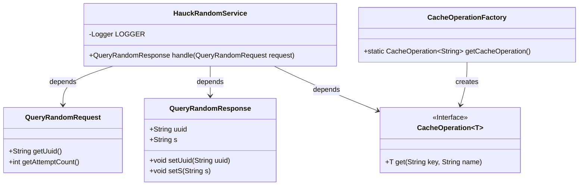
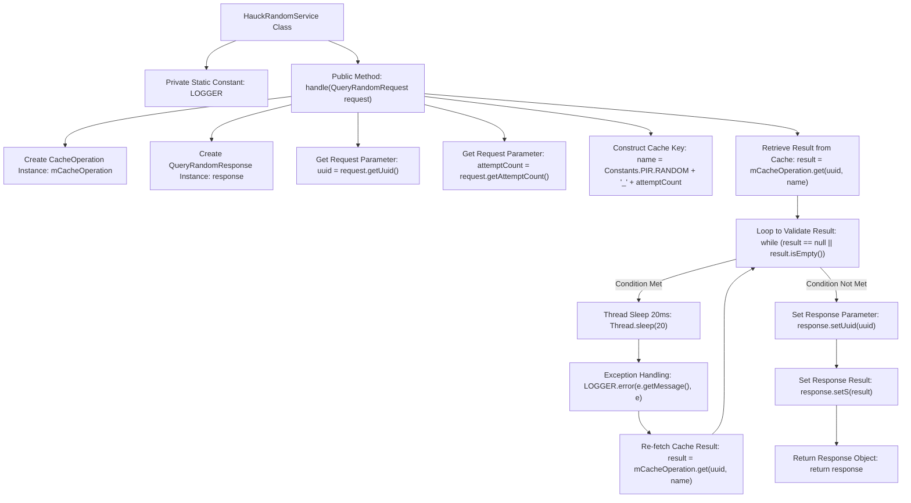

# Basic Information

|      |      |
|------|------|
| Name | HauckRandomService |
| Language | .java |
| Code Path | WeFe/mpc/mpc-pir/mpc-pir-server/src/main/java/com/welab/wefe/mpc/pir/server/service/HauckRandomService.java |
| Package Name | com.welab.wefe.mpc.pir.server.service |
| Dependencies | ['com.welab.wefe.mpc.cache.intermediate.CacheOperation', 'com.welab.wefe.mpc.cache.intermediate.CacheOperationFactory', 'com.welab.wefe.mpc.commom.Constants', 'com.welab.wefe.mpc.pir.request.QueryRandomRequest', 'com.welab.wefe.mpc.pir.request.QueryRandomResponse', 'org.slf4j.Logger', 'org.slf4j.LoggerFactory'] |
| Brief Description | The HauckRandomService class handles random query requests, retrieves results through cache operations, and enters a loop waiting if the result is empty, ultimately returning a response containing UUID and the result. |

# Description

The HauckRandomService class handles random query requests by retrieving results through cache operations. The service accepts a QueryRandomRequest, extracts the uuid and attemptCount parameters from it, and constructs a cache key. It uses CacheOperation to fetch the result from the cache. If the result is null, it waits for 20 milliseconds in a loop before retrying until a valid result is obtained. Finally, it encapsulates the uuid and the result into a QueryRandomResponse object for return. During the process, any interrupted exceptions are caught and logged.

# Class Summary

| Name   | Type  | Description |
|-------|------|-------------|
| HauckRandomService | class | HauckRandomService processes random query requests, retrieves results through cache operations, and enters a loop to wait if the result is empty, ultimately returning a response containing a UUID and the result. |

## Class HauckRandomService

|      |      |
|------|------|
| Access Modifier | public |
| Type | class |
| Name | HauckRandomService |
| Description | HauckRandomService processes random query requests, retrieves results through cache operations, and enters a loop to wait if the result is empty, ultimately returning a response containing a UUID and the result. |

### UML Class Diagram

This code demonstrates a random service handler class HauckRandomService, which obtains a cache operation instance through CacheOperationFactory, processes QueryRandomRequest requests, and returns QueryRandomResponse. The main workflow includes: retrieving UUID and attempt count from the request, constructing cache key names, querying the cache in a loop until valid results are obtained, and finally setting response data. The code utilizes the generic interface CacheOperation<T> for cache operations and creates instances via the factory pattern, reflecting a well-decoupled design.

### Internal Method Call Graph

This flowchart illustrates the complete process of HauckRandomService handling random query requests. The service first initializes a cache operation instance and response object, then extracts key parameters from the request and constructs a cache key. The core logic involves continuously attempting to retrieve results from the cache in a loop. If the result is invalid, it sleeps for 20 milliseconds before retrying until a valid result is obtained. Finally, the retrieved result is encapsulated into the response object for return. The entire process includes exception handling and logging mechanisms to ensure service robustness. The flowchart clearly presents the relationship between the main flow and loop control structures, as well as the logical path of exception handling branches.

### Field List

| Name  | Type  | Description |
|-------|-------|------|
| LOGGER = LoggerFactory.getLogger(HauckRandomService.class) | Logger | The HauckRandomService class defines a static immutable logger instance named LOGGER. |

### Method List

| Name  | Type  | Description |
|-------|-------|------|
| handle | QueryRandomResponse | Handle random query requests, obtain results through cache operations, and if the result is empty, loop and wait until finally returning a response containing the UUID and the result. |

