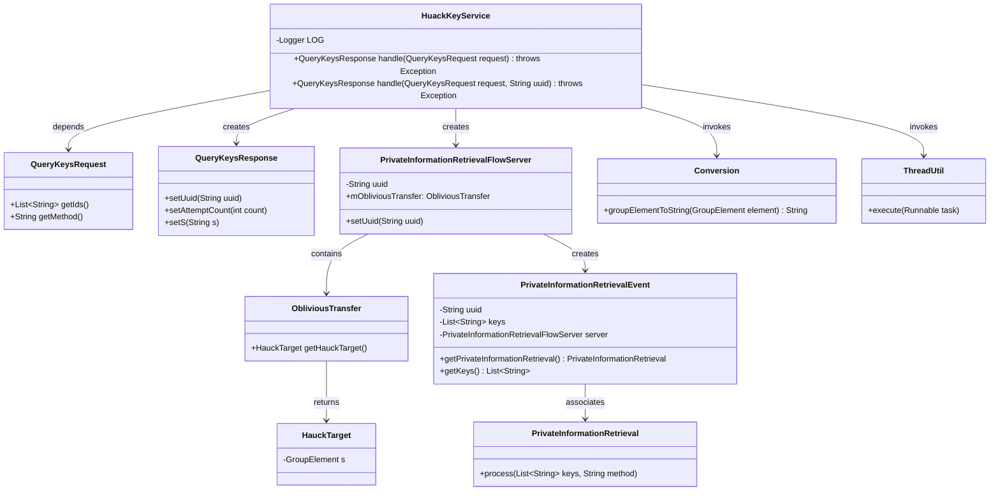
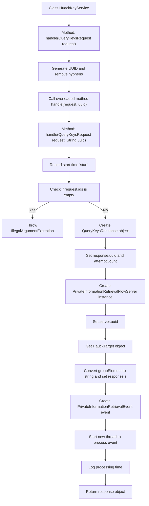

# Basic Information

|      |      |
|------|------|
| Name | HuackKeyService |
| Language | .java |
| Code Path | WeFe/mpc/mpc-pir/mpc-pir-server/src/main/java/com/welab/wefe/mpc/pir/server/service/HuackKeyService.java |
| Package Name | com.welab.wefe.mpc.pir.server.service |
| Dependencies | ['cn.hutool.core.thread.ThreadUtil', 'com.welab.wefe.mpc.commom.Conversion', 'com.welab.wefe.mpc.pir.protocol.ot.hauck.HauckTarget', 'com.welab.wefe.mpc.pir.request.QueryKeysRequest', 'com.welab.wefe.mpc.pir.request.QueryKeysResponse', 'com.welab.wefe.mpc.pir.server.event.PrivateInformationRetrievalEvent', 'com.welab.wefe.mpc.pir.server.flow.PrivateInformationRetrievalFlowServer', 'org.slf4j.Logger', 'org.slf4j.LoggerFactory', 'java.util.UUID'] |
| Brief Description | The HuackKeyService class handles key query requests, generates a UUID, and verifies that the request ID is not empty. It processes the request through the PrivateInformationRetrievalFlowServer, records the time taken, and returns the response. |

# Description

The HuackKeyService class is a service class that handles key query requests. It contains two main methods: one generates a random UUID and invokes the other method, while the other method executes the specific processing logic. This method first verifies whether the request ID is empty, then creates a response object and sets the UUID and attempt count. Next, it initializes the PrivateInformationRetrievalFlowServer, retrieves the HauckTarget object, converts its S attribute to a string, and sets it in the response. Finally, it creates an asynchronous processing event, executes the key processing task via a thread pool, and logs the processing time. The entire process involves key operations such as UUID generation, parameter validation, server initialization, asynchronous task processing, and performance monitoring.

# Class Summary

| Name   | Type  | Description |
|-------|------|-------------|
| HuackKeyService | class | The HuackKeyService class handles key query requests, generates UUIDs, validates that the request ID is not empty, initializes the response and sets parameters, processes the request through the PrivateInformationRetrievalFlowServer, records the time consumed, and then returns the response. |

## Class HuackKeyService

|      |      |
|------|------|
| Access Modifier | public |
| Type | class |
| Name | HuackKeyService |
| Description | The HuackKeyService class handles key query requests, generates UUIDs, validates that the request ID is not empty, initializes the response and sets parameters, processes the request through the PrivateInformationRetrievalFlowServer, records the time consumed, and then returns the response. |

### UML Class Diagram

This class diagram illustrates the core structure and dependencies of HuackKeyService. The service processes QueryKeysRequest via handle methods to generate QueryKeysResponse, involving collaboration with components like PrivateInformationRetrievalFlowServer and ObliviousTransfer. The workflow includes key operations such as UUID generation, parameter validation, and asynchronous processing, ultimately executing core business logic through PrivateInformationRetrieval. Each component has clearly defined responsibilities, forming a complete processing chain through method invocations and data transfers.

### Internal Method Call Graph

This code flowchart illustrates the invocation process of two main methods in the HuackKeyService class. The first handle method generates a UUID and then calls the second overloaded method, which first validates request parameters, creates a response object and initializes relevant attributes, then performs key processing through PrivateInformationRetrievalFlowServer, and finally asynchronously processes the event in a new thread before returning the response. The entire process includes key steps such as parameter validation, object initialization, service invocation, and asynchronous processing, demonstrating the complete workflow of the key query service.

### Field List

| Name  | Type  | Description |
|-------|-------|------|
| LOG = LoggerFactory.getLogger(HuackKeyService.class) | Logger | The HuackKeyService class defines a static immutable logger LOG. |

### Method List

| Name  | Type  | Description |
|-------|-------|------|
| handle | QueryKeysResponse | This method processes the query key request, generates a random UUID with hyphens removed, invokes another processing method, and returns the response. |
| handle | QueryKeysResponse | Process the query request, verify that the ID is not empty, generate a response, initialize the private information retrieval service and set parameters, asynchronously handle the retrieval event, record the time consumption, and then return the response. |

