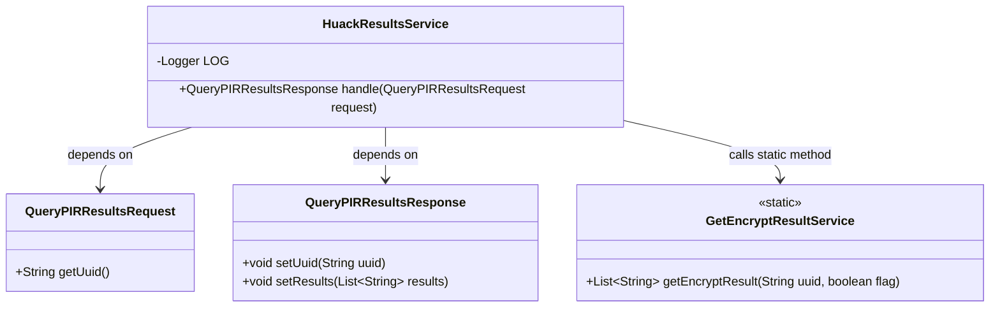
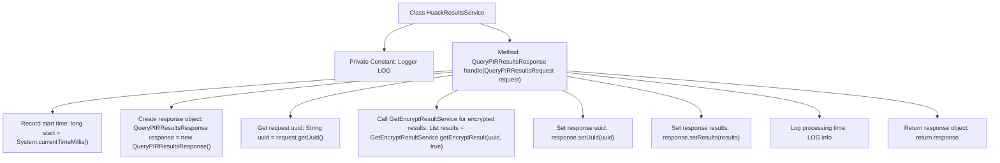

# Basic Information

|      |      |
|------|------|
| Name | HuackResultsService |
| Language | .java |
| Code Path | WeFe/mpc/mpc-pir/mpc-pir-server/src/main/java/com/welab/wefe/mpc/pir/server/service/HuackResultsService.java |
| Package Name | com.welab.wefe.mpc.pir.server.service |
| Dependencies | ['com.welab.wefe.mpc.pir.request.QueryPIRResultsRequest', 'com.welab.wefe.mpc.pir.request.QueryPIRResultsResponse', 'org.slf4j.Logger', 'org.slf4j.LoggerFactory', 'java.util.List'] |
| Brief Description | The HuackResultsService class processes query requests, retrieves encrypted results while recording time consumption, and returns a response containing UUID and results. |

# Description

The HuackResultsService class is a Java service class that handles PIR query results. It contains a handle method which accepts a QueryPIRResultsRequest request object and returns a QueryPIRResultsResponse response object. The method first records the start time, creates a response object, retrieves the uuid parameter from the request, invokes GetEncryptResultService to obtain the encrypted result list, sets the uuid and results into the response object, and finally logs the processing time before returning the response. The entire process logs the uuid and processing time via LOG.

# Class Summary

| Name   | Type  | Description |
|-------|------|-------------|
| HuackResultsService | class | The HuackResultsService class processes query requests, retrieves encrypted results while recording time consumption, and returns responses containing UUIDs and results. |

## Class HuackResultsService

|      |      |
|------|------|
| Access Modifier | public |
| Type | class |
| Name | HuackResultsService |
| Description | The HuackResultsService class processes query requests, retrieves encrypted results while recording time consumption, and returns responses containing UUIDs and results. |

### UML Class Diagram

This code demonstrates a service class HuackResultsService for processing PIR query results. It receives QueryPIRResultsRequest requests, retrieves encrypted results via GetEncryptResultService, populates the QueryPIRResultsResponse response object, and logs processing time. The class diagram clearly presents core classes and their relationships, including the structure of request/response objects and the invocation pattern of static utility classes, reflecting a typical service-layer processing flow.

### Internal Method Call Graph

This code flowchart illustrates the core processing flow of the HuackResultsService class. The class receives query requests through the handle method, retrieves encrypted results, constructs a response object, and finally logs processing time. Key steps include: initializing a timer, creating a response object, obtaining request parameters, invoking an external service for encrypted data, populating response content, recording performance logs, and returning results. The entire process demonstrates a typical request-response pattern with performance monitoring capabilities.

### Field List

| Name  | Type  | Description |
|-------|-------|------|
| LOG = LoggerFactory.getLogger(HuackResultsService.class) | Logger | The private static constant LOG defined in the class HuackResultsService is used for logging. |

### Method List

| Name  | Type  | Description |
|-------|-------|------|
| handle | QueryPIRResultsResponse | Process query requests, retrieve encrypted results and return responses, record time consumption. |

