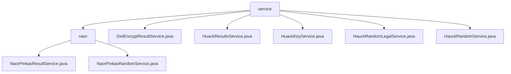

# Basic Information

|      |      |
|------|------|
| Name | service |
| Language | .java |
| Code Path | WeFe/mpc/mpc-pir/mpc-pir-server/src/main/java/com/welab/wefe/mpc/pir/server/service |
| Package Name | docs.mpc.mpc-pir.mpc-pir-server.src.main.java.com.welab.wefe.mpc.pir.server.service |
| Brief Description | This module implements secure multi-party computation queries based on the Naor-Pinkas protocol, incorporating random number generation and result encryption services. It employs asynchronous processing and UUID tracking, relies on the JCE encryption library and thread pools, and supports key generation, multi-layer AES encryption, and cache operations. |

# Description

## Overview  
This module implements a secure multi-party computation query service based on the Naor-Pinkas protocol. Its core responsibilities include generating encrypted random numbers and processing encrypted query results. It adopts an asynchronous processing model and UUID tracking mechanism, with key data structures comprising Diffie-Hellman key pairs, random number lists, and AES encryption keys. It relies on the JCE encryption library and thread pools. For instance, the NaorPinkasRandomService generates random numbers in parallel, functioning similarly to a key distribution center, while the NaorPinkasResultService combines DH key exchange with symmetric encryption, akin to a hybrid encryption gateway.

## Key Business Scenarios  
The typical workflow is divided into a generation phase and a query phase: First, DH parameters and a random number pool are generated and cached, such as processing QueryKeysRequest to generate hexadecimal random numbers. In the query phase, keys are derived and results are encrypted, such as performing multi-layer AES encryption using k0 and a random number key chain. The interaction model employs a "pre-generation-consumption" mechanism, similar to a one-time pad. APIs cover key generation and result encryption interfaces. For example, HuackKeyService asynchronously processes key tasks via a thread pool, while HauckRandomService retrieves results cyclically through caching.

### Package Internal Structure View

This flowchart illustrates the hierarchical structure of the MPC-PIR service module, with the root node being the service directory, which contains the naor subdirectory and five service class files. The naor directory further includes two concrete implementation classes, NaorPinkasResultService and NaorPinkasRandomService, presenting a clear tree-like service architecture overall.

# File List

| Name   | Type  | Description |
|-------|------|-------------|
| [GetEncryptResultService.java](GetEncryptResultService.md) | file | Static method to obtain encrypted results, supporting timeout and mandatory return data parameters, with cached operations to query the results. |
| [HuackResultsService.java](HuackResultsService.md) | file | The HuackResultsService class processes query requests, retrieves encrypted results, records time consumption, and returns a response containing UUID and results. |
| [HuackKeyService.java](HuackKeyService.md) | file | The HuackKeyService class handles key query requests, generates a UUID, and verifies that the request ID is not empty. It processes the request through the PrivateInformationRetrievalFlowServer, records the time consumed, and returns the response. |
| [HauckRandomLegalService.java](HauckRandomLegalService.md) | file | HauckRandomLegalService processes random legal requests, saves UUID and attempt counts to cache, retrieves encrypted results, and returns the response. |
| [HauckRandomService.java](HauckRandomService.md) | file | The HauckRandomService class processes random query requests, retrieves results through cache operations, and enters a loop waiting if the result is empty, ultimately returning a response containing the UUID and the result. |
| [naor](naor/_module.md) | package | The NaorPinkasResultService processes queries, generates encrypted results, and employs Diffie-Hellman and AES encryption. The NaorPinkasRandomService implements the Naor-Pinkas protocol to generate random numbers and DH keys, handling operations asynchronously with caching. |

